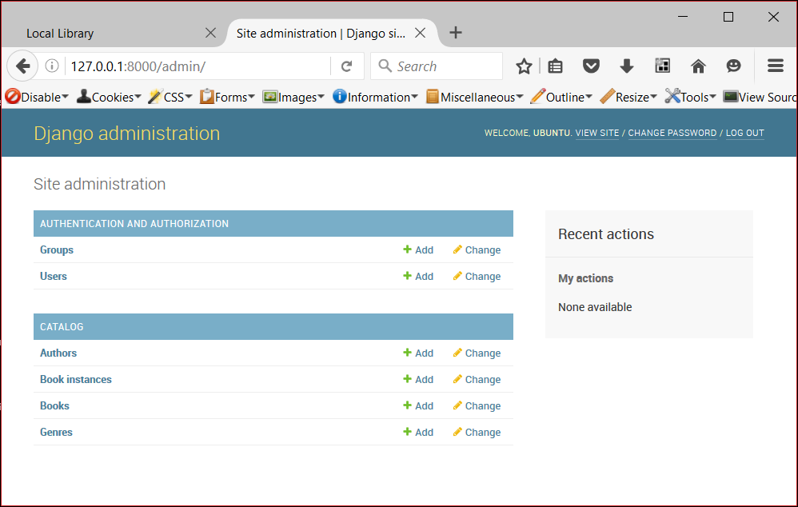
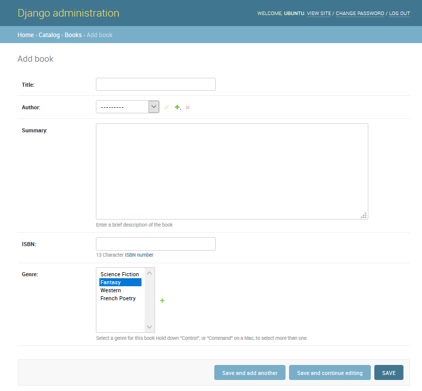
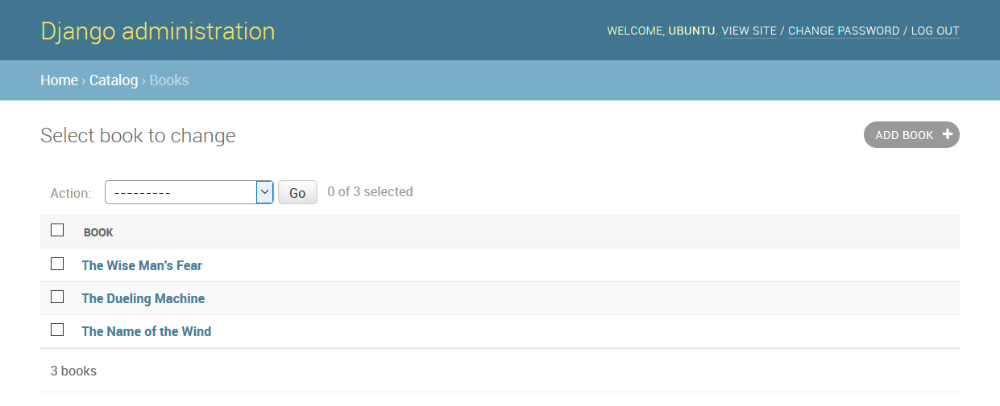
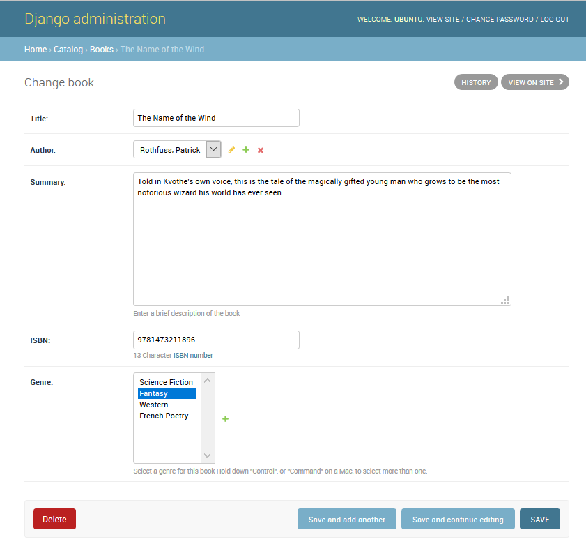
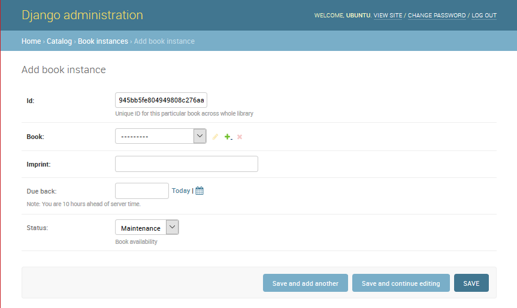
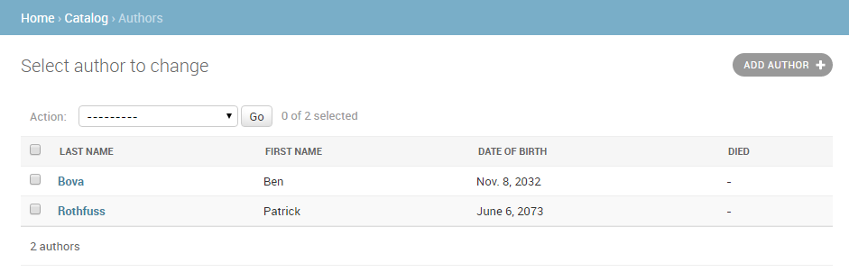
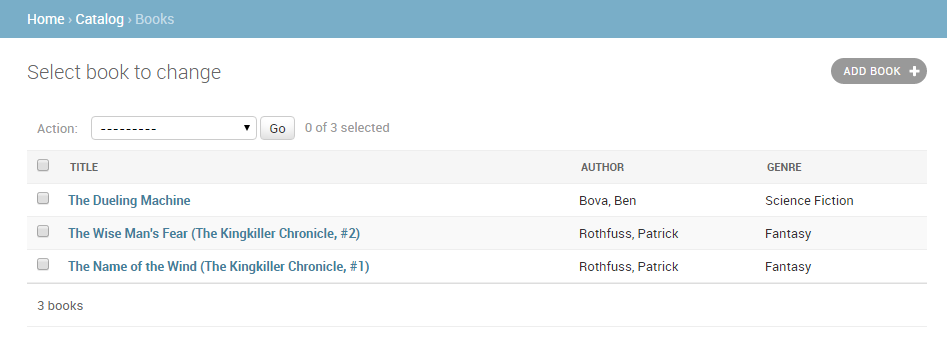
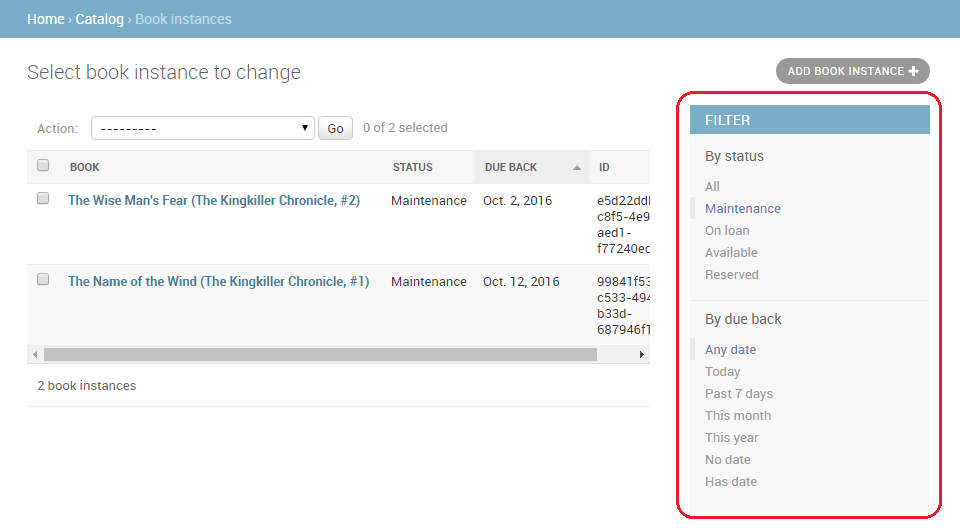
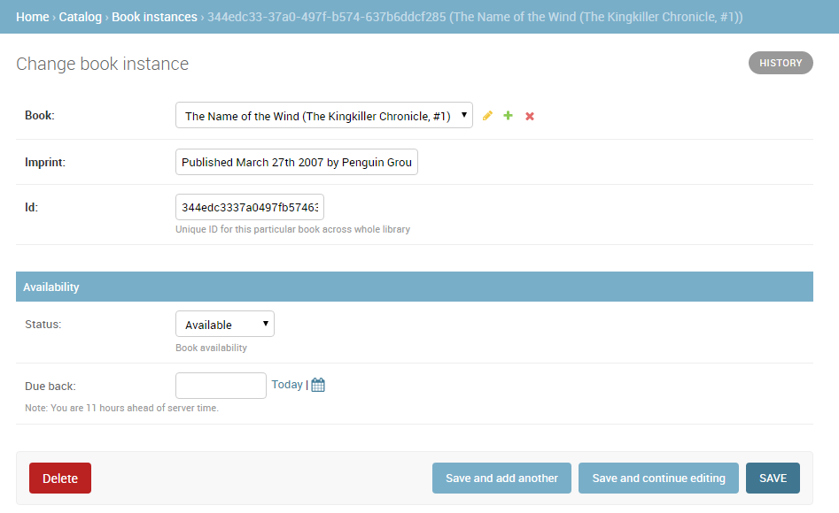
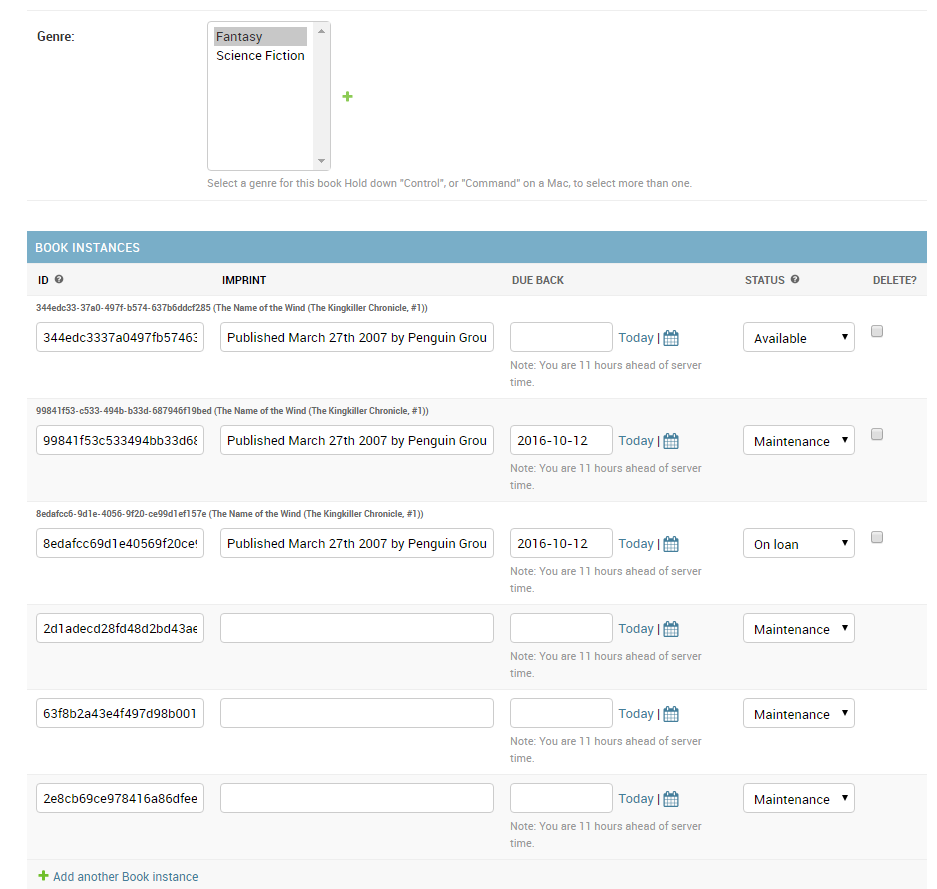

Django 튜토리얼 4부: Django admin 사이트
----------------------------------------

[LocalLibrary](tutorialLocallibraryWebsite.md) 웹사이트를 위하여 모델을 만들었습니다. Django Admin 사이트에서 "실제" 책 데이터를 추가합니다. 먼저 관리자 사이트에 모델을 등록하는 방법을 보이고, 다음 로그인하여 데이터를 만드는 방법을 보입니다. 이 단계 마지막에서 Admin 사이트의 UI를 향상시킬 수있는 방법들을 보일 것입니다.

> 선수지식: [Django 튜토리얼 3부: 모델](models.md)를 숙지하여야 합니다.
>
> 목표: Django 도구를 사용하여 새로운 웹사이트 프로젝트를 시작할 수 있습니다.

---

### 개요

Django admin <i>어플리케이션</i>은 모델을 사용하여 레코드를 삽입, 검색, 업데이트 및 삭제할 수있는 사이트를 자동으로 구축할 수 있습니다. 모델을 테스트하고 데이터의 <i>정확성</i> 파악이 매우 용이하여 개발 기간을 단축할 수 있습니다. admin 어플리케이션은 웹사이트에 따라 운영 중에도 데이터 관리에 유용할 수 있습니다. Django 프로젝트는 모델 중심 접근 방식이 반드시 모든 사용자에게 최상의 인터페이스는 아닐 수도 있고, 불필요하게 세부 사항을 노출할 수 있기 때문에 (관리자 또는 내부 조직의 사용자만 사용하는) 내부 데이터 관리를 위하여만 사용을 권장합니다.

[프로젝트 골조](skeletonWebsite.md)를 만들 때 모든 웹사이트에서 admin 어플리케이션이 포함되도록 자동으로 설정됩니다. (필요한 실제 종속성에 대한 정보는 [Django 문서](https://docs.djangoproject.com/en/2.1/ref/contrib/admin/)를 참조하십시오.) 따라서 admin 어플리케이션에 모델을 추가할 때마다 <b><i>등록</i>을 해야</b> 합니다. 이 단원의 끝 부분에서 모델 데이터를 잘 보여줄 수 있도록 관리 영역을 구성하는 방법에 대한 간단한 데모를 제공합니다.

모델을 등록한 다음 새로운 "수퍼유저"를 만들고, 사이트에 로그인하고, 도서, 저자, 책 및 장르를 만드는 방법을 보입니다. 다음 단원에서 작성하는 뷰와 템플리트 테스트에 이들이 유용할 것입니다.

---

### 모델 등록

먼저 카탈로그 폴더(<b>/locallibrary/catalog/admin.py</b>)내의 <b>admin.py</b>를 열면 아래와 같습니다. 이미 <code>django.contrib.admin</code>을 import하였습니다.

```python
from django.contrib import admin

# Register your models here.
```

다음 텍스트를 파일의 끝에 복사하여 모델을 등록합니다. 이는 단순히 모델을 import하여 admin.site.register를 호출하는 것입니다.

```python
from catalog.models import Author, Genre, Book, BookInstance

admin.site.register(Book)
admin.site.register(Author)
admin.site.register(Genre)
admin.site.register(BookInstance)
```

> <b>Note</b>: 책의 언어를 나타내는 모델이 있으면 ([모델 튜토리얼](models.md) 참조), 그 모델을 import하고 등록합니다.

이는 사이트에 모델을 등록하는 가장 간단한 방법입니다. admin 사이트는 사용자 정의가 가능하며 모델을 등록하는 다른 방법에 대해 자세히 설명할 것입니다.

---

### 수퍼유저 생성

admin 사이트에 로그인하려면 현재 <i>Staff</i> 역활의 사용자 계정이 필요합니다. 레코드의 검색과 생성을 위하여 이 사용자는 모든 개체를 관리할 수있는 권한을 갖어야 합니다. <b>manage.py</b>를 사용하여 사이트에 대한 모든 접근과 필요한 모든 승인 권한을 가진 "superuser"계정을 만들 수 있습니다.

수퍼유저를 만들려면 <b>manage.py</b>이 저장된 디렉토리에서 다음 명령을 수행합니다. 사용자 이름, 전자 메일 주소와 <i>안전한</i> 암호를 입력하라는 메시지가 표시될 것입니다.

```python
python3 manage.py createsuperuser
```

이 명령을 수행하면 새로운 수퍼유저를 데이터베이스에 추가합니다. 이제 로그인을 테스트할 수 있도록 개발 서버를 다시 시작합니다.

```python
python3 manage.py runserver
```

---

### 로그인과 사이트 사용

사이트에 로그인하려면 /admin URL(예: http://127.0.0.1:8000/admin)을 열고 새 수퍼유저 사용자 ID 및 비밀번호를 입력합니다 (로그인 페이지로 리디렉션되고 승인된 후 /admin URL 페이지로 되돌아옵니다).

이 사이트의 일부에서는 설치된 모든 어플리케이션별을 그룹핑하여 모든 모델들을 보여줍니다. 모델 이름을 클릭하면 연결된 모든 레코드를 보여주는 화면으로 이동하고 해당 레코드를 클릭하여 편집할 수 있습니다. 또한 각 모델 옆에 있는 <b>Add</b> 링크를 직접 클릭하여 모델에 레코드를 삽입할 수 있습니다.



<i>Books</i> 오른쪽에 있는 <b>Add</b> 링크를 클릭하면 새 책을 만들 수 있습니다 (아래 그림과 같은 대화 상자가 나타납니다). 각 필드의 제목, 사용된 위젯 유형과 (있다면) <code>help_text</code>들을 모델에서 지정한 값과 일치시키는 방식에 주의를 기울이십시오.

필드 값을 입력하십시오. 해당 필드 옆에있는 + 버튼을 눌러 새 author 또는 genre를 만들 수 있습니다. 이미 생성하였다면 목록에서 값을 선택할 수 있습니다. 작업이 끝나면 "<b>SAVE</b>", "<b>Save and add another</b>", 또는 "<b>Save and continue editing</b>"을 클릭하여 레코드를 저장할 수 있습니다.



> <b>Note</b>: 현재 어플리케이션에 몇몇 도서, 작가 및 장르 (예 : 판타지)를 추가하십시오. 각 author와 genre에 다른 책 두 권이 있는 지 확인하십시오 (목록과 상세 정보 뷰에 대하여는 이후 설명할 예정입니다).

도서를 추가하였다면 상단 북마크에서 <b>Home</b> 링크를 클릭하여 admin 시작 페이지로 돌아갑니다. 다음 <b>Books</b> 링크를 클릭하여 현재 도서 목록을 디스플레이하거나 다른 모델 목록을 볼 수 있는 링크 중 하나를 클릭하십시오. 도서를 추가 했으므로 아래 스크린 샷과 비슷할 것입니다. 도서 제목을 볼 수 있습니다. 이는 이전 단원에서 선언한 Book 모델의 메소드 <code>\_\_str\_\_()</code>가 반환하는 값입니다.



이 목록에서 책 옆에 있는 checkbox에 check하고 Action 드롭 다운 목록에서 <i>delete...</i>를 선택한 다음 <b>Go</b>를 클릭하여 원하지 않는 책을 삭제할 수 있습니다. <b>ADD BOOK</b>을 클릭하여 책을 추가할 수 있습니다.

링크에서 도서 이름을 선택하여 이를 수정할 수 있습니다. 아래에 표시된 도서 편집 페이지는 "Add" 페이지와 거의 동일합니다. 가장 큰 차이점은 페이지 제목(변경할 도서)과 <b>Delete</b>, <b>HISTORY</b>와 <b>VIEW ON SITE</b> 버튼이 추가된 것입니다. 모델에서 메소드 <code>get\_absolute\_url()</code>를 선언하였기 때문에 이 마지막 버튼이 나타나는 것입니다.



이제 <i>Home</i> 링크를 사용하여 <b>Home</b> 페이지로 돌아간 다음 <b>Author</b>와 <b>Genre</b> 목록을 살펴 봅니다. 도서를 새로이 추가할 때 이들은 이미 생성되었지만 더 추가할 수 있습니다.

<code>ForeignKey</code> 필드를 이용하여 <code>BookInstance</code>에서 <code>Book</code>을 추가할 수 있지만 Book에서 <i>Book Instance</i>를 만들 수 없으므로 이들이 보이지 않습니다. <i>Home</i> 페이지로 다시 이동하여 연관된 <b>Add</b>를 클릭하여 아래의 <i>Add book instance</i> 화면을 디스플레이하십시오. 출력된 긴 고유 ID는 도서관에서 책 한 권을 각각 개별적으로 식별하기 위한 것입니다.



책 각각에 대해 이 레코드를 생성합니다. 적어도 일부 레코드에 대하여 Available 상태로 설정하고 다른 레코드들은 On loan 상태로 설정하십시오. 상태가 Available이 아니면 Due back 날짜를 입력하십시오.

완료하였습니다! 이제 관리 사이트를 설정하고 사용하는 방법을 배웠습니다. Book, BookInstance, Genre와 Author에 대한 레코드를 만들었으므로 사용자 뷰와 템플리트를 만들면 사용할 수 있습니다.

---

### 고급 설정

Django는 등록된 모델의 정보를 사용하여 기본 admin 사이트를 생성하는 편리한 기능을 제공합니다.

-	모델의 메소드 <code>\_\_str\_\_()</code>로 만들어진 문자열로 식별되며, 모델은 편집을 위해 상세 뷰와 양식에 링크된 개별 레코드 목록을 갖고 있습니다. 기본적으로 이 뷰 맨 위에 레코드에 대한 대량 삭제를 위한 작업 메뉴가 있습니다.

-	레코드의 편집과 추가를 위한 모델 상세 레코드 양식에는 모델의 모든 필드를 선언 순서에 따라 세로로 배치되어 보여줍니다.

더욱 쉽게 사용할 수 있도록 인터페이스를 더 커스터마이징할 수 있습니다. 가능한 예는 다음과 같습니다.

-	리스트 뷰:

	-	각 레코드에 대해 추가로 디스플레이할 필드/정보를 추가할 수 있습니다.
	-	날짜 또는 다른 선택 값(예: Book loan 상태)에 따라 나열될 레코드를 선택할 수 있는 필터를 추가할 수 있습니다.
	-	list views 메뉴에 옵션을 추가하여 이 메뉴가 양식에 표시되는 위치를 선택할 수 있습니다.

-	상세 뷰:

	-	표시할 (또는 제외 할) 필드와 순서, 그룹화, 편집 가능 여부, 사용된 위젯, 방향 등을 선택할 수 있습니다.
	-	인라인 수정이 가능하도록 관련 필드를 레코드에 추가할 수 있습니다 (예: author 레코드를 작성하는 동안 서적 레코드를 추가하고 편집할 수있는 기능).

이 섹션에서는 <code>Book</code>과 <code>Author</code> 모델 목록에 정보를 추가할 수 있는 편집 뷰의 레이아웃을 개선하는 등과 같은 <i>LocalLibrary</i>의 인터페이스를 향상시킬 몇 가지 변경 사항을 살펴 보겠습니다. <code>Language</code>와 <code>Genre</code> 모델 프리젠테이션은 각각 하나의 필드만 있으므로 바꾸지 않을 것입니다. 변경 하는 것은 실제로 이익이 없기 때문입니다.

[Django Admin site](https://docs.djangoproject.com/en/2.1/ref/contrib/admin/) (Django Docs)에서 admin 사이트에 대한 모든 커스터마이징 방법을 참조할 수 있습니다.

#### ModelAdmin 클래스 등록

(레이아웃을 기술하는) [ModelAdmin](https://docs.djangoproject.com/en/dev/ref/contrib/admin/#modeladmin-objects) 클래스를 정의하고 모델에 등록하는 admin 인터페이스에서 모델의 디스플레이를 변경할 수 있습니다.

<code>Author</code> 모델부터 살펴 보겠습니다. catalog 어플리케이션 (<code>/locallibrary/catalog/admin.py</code>)에서 <b>admin.py</b>를 엽니다. <code>Author</code> 모델에 대한 원래 등록을 주석(# 접두어) 처리합니다.

```python
# admin.site.register(Author)
```

아래와 같이 새로운 <code>AuthorAdmin</code>과 등록을 추가합니다.

```python
# Define the admin class
class AuthorAdmin(admin.ModelAdmin):
    pass

# Register the admin class with the associated model
admin.site.register(Author, AuthorAdmin)
```

이제 <code>Book</code>와 <code>BookInstance</code>에 <code>ModelAdmin</code> 클래스를 추가합니다. 그리고 원래 등록을 주석 처리합니다.

```python
# admin.site.register(Book)
# admin.site.register(BookInstance)
```

이제 새 모델을 만들고 등록합니다. 이 데모에서는 대신 <code>@register</code> 데코레이터를 사용하여 모델을 등록합니다 (<code>admin.site.register()</code> 구문과 동일).

```python
# Register the Admin classes for Book using the decorator
@admin.register(Book)
class BookAdmin(admin.ModelAdmin):
    pass

# Register the Admin classes for BookInstance using the decorator
@admin.register(BookInstance)
class BookInstanceAdmin(admin.ModelAdmin):
    pass
```

현재 모든 admin 클래스는 비어 있으므로 (<code>pass</code> 참조) admin 기능은 변경되지 않았습니다. 이제 모델 고유의 admin 기능을 정의하기 위해 확장할 수 있습니다.

#### 리스트 뷰 구성

현재 <i>LocalLibrary</i>는 모델 메소드 <code>\_\_str\_\_()</code>에서 생성된 이름인 모든 저자들을 나열합니다. 저자가 많지 않을 때는 괜찮지만, 일단 저자가 많다면 중복이 있을 수 있습니다. 이들을 구별하거나 각 저자에 대해 다른 흥미로운 정보를 보여 주기를 원한다면 [list\_display](https://docs.djangoproject.com/en/dev/ref/contrib/admin/#django.contrib.admin.ModelAdmin.list_display)를 사용하여 뷰에 필드를 추가 할 수 있습니다.

<code>AuthorAdmin</code> 클래스를 아래 코드로 바꿉니다. 목록에 표시되는 필드 이름을 보이는 것처럼 <i>튜플</i>에 선언된 순서대로 디스플레이합니다 (원래 모델에서 정의한 것과 동일한 이름).

```python
class AuthorAdmin(admin.ModelAdmin):
    list_display = ('last_name', 'first_name', 'date_of_birth', 'date_of_death')
```

이제 웹 사이트에서 저자 목록으로 이동하십시오. 위의 필드가 다음과 같이 보여줍니다.



<code>Book</code> 모델의 경우 <code>author</code>와 <code>genre</code>를 추가로 보여줍니다. <code>author</code>는 <code>ForeignKey</code> 필드 (일대다 관계)이므로 연관 레코드에 대한 <code>\_\_str\_\_()</code> 값으로 표시됩니다. <code>BookAdmin</code> 클래스를 아래 버전으로 대체하십시오.

```python
class BookAdmin(admin.ModelAdmin):
    list_display = ('title', 'author', 'display_genre')
```

<code>genre</code> 필드는 <code>ManyToManyField</code>이기 때문에 <code>list\_display</code>에서 이를 지정할 수 없습니다 (큰 데이터베이스에서는 접근 "비용" 때문에 Django가 이를 방지합니다). 대신 문자열로 정보를 가져오는 <code>display\_genre</code> 함수를 정의합니다 (위에서 호출했던 함수이며 아래에서 정의합니다).

> <b>Note</b>: 데이터베이스의 접근 "비용"때문에 <code>genre</code> 값을 얻는 것은 바람직하지 않습니다. 모델의 함수를 호출하면 다른 이유로 매우 유용 할 수 있으므로 (예를 들어 목록의 모든 항목 옆에 Delete 링크를 추가) 이를 보여줍니다.

<code>Book</code> 모델 (<b>models.py</b>)에 다음 코드를 추가하십시오. 이것은 <code>genre</code> 필드의 (존재한다면) 첫 세 값으로부터 문자열을 만들고 이 메소드를 위하여 admin 사이트에서 사용할 수 있는 <code>short\_description</code>을 생성합니다.

```python
	def display_genre(self):
			"""Create a string for the Genre. This is required to display genre in Admin."""
			return ', '.join(genre.name for genre in self.genre.all()[:3])

	display_genre.short_description = 'Genre'
```

모델과 업데이트한 admin을 저장한 다음 웹사이트를 열고 Books 목록 페이지로 이동하면 책 목록을 아래와 같이 출력합니다.



<code>Genre</code> 모델 (과 (정의하였다면) <code>Language</code> 모델)은 단일 필드만 갖고 있으므로 추가 필드를 표시하기 위한 추가 모델을 만들지 않습니다.

> <b>Note</b>: <code>BookInstance</code> 모델 목록을 업데이트하여 최소한 상태와 예상 반납 날짜를 보여줄 필요가 있습니다. 이 단계 끝 부분에 도전 과제로 하겠습니다.

#### 리스트 필터 추가

목록에 항목이 많을 때 보여줄 항목을 필터링할 수 있다면 유용할 것입니다. 이는 <code>list_filter</code> 속성에 필드를 나열함으로써 수행할 수 있습니다. <code>BookInstanceAdmin</code> 클래스를 아래 코드로 대체합니다.

```python
class BookInstanceAdmin(admin.ModelAdmin):
    list_filter = ('status', 'due_back')
```

리스트 뷰는 오른쪽에 필터 상자를 포함하고 있습니다. 날짜 및 상태를 선택하여 값으로 필터링합니다.



#### 상세 뷰 레이아웃 구성

기본적으로 상세 뷰는 모든 필드를 모델에서의 선언 순서에 따라 세로로 배치합니다. 선언 순서, 보여주는 필드 (또는 제외하는 필드), 정보 구성을 위한 섹션의 사용 여부, 필드의 가로 또는 세로 디스플레이 및 admin 양식에서 사용되는 편집 위젯을 변경할 수 있습니다.

> <b>Note</b>: <i>LocalLibrary</i> 모델은 비교적 간단하여 레이아웃을 변경할 필요가 없습니다. 그러나 설명을 위하여 아래와 같이 변경할 것입니다.

##### 디스플레이할 필드 제어와 레이아웃

<code>AuthorAdmin</code> 클래스를 업데이트하여 <code>fields</code> 행을 아래와 같이 추가합니다.

```python
class AuthorAdmin(admin.ModelAdmin):
    list_display = ('last_name', 'first_name', 'date_of_birth', 'date_of_death')
    fields = ['first_name', 'last_name', ('date_of_birth', 'date_of_death')]
```

<code>fields</code> 속성은 양식에 디스플레이할 필드만을 순서대로 나열합니다. 필드는 기본적으로 세로로 디스플레이되지만 터플로 필드를 그룹화할 수 있다면 (위의 "날짜" 필드와 같이) 가로로 디스플레이할 수 있습니다.

웹사이트에서 author detail view 페이지로 이동하면 아래와 같이 나타날 것입니다.


> <b>Note</b>: <code>exclude</code> 속성을 사용하여 양식에서 제외할 속성 목록을 선언할 수 있습니다 (모델의 다른 애트리뷰트들은 디스플레이됩니다).

##### 상세 뷰 섹션

[fieldsets](https://docs.djangoproject.com/en/dev/ref/contrib/admin/#django.contrib.admin.ModelAdmin.fieldsets) 속성을 사용하여 세부 양식 내의 관련 모델 정보를 그룹화하는 "섹션"을 추가 할 수 있습니다.

<code>BookInstance</code> 모델에는 책의 내용 (<code>name</code>, <code>imprint</code>와 <code>id</code>),이용 여부 (<code>status</code>, <code>due_back</code>) 등 관련된 정보가 있습니다. <code>BookInstanceAdmin</code> 클래스에 주석 다음에 코드를 추가하여 다른 섹션에 이들을 추가할 수 있습니다.

```python
@admin.register(BookInstance)
class BookInstanceAdmin(admin.ModelAdmin):
    list_filter = ('status', 'due_back')

# add for the detail view of BookInstance
    fieldsets = (
        (None, {
            'fields': ('book', 'imprint', 'id')
        }),
        ('Availability', {
            'fields': ('status', 'due_back')
        }),
    )
```

각 섹션은 자체 제목(제목이 필요 없으면 <code>None</code>)과 사전에 있는 필드에 연관된 튜플을 가지고 있습니다. 형식은 설명하기가 복잡하지만 바로 위의 코드 스니팻을 보면 이해할 수 있습니다.

이제 웹사이트에서 book instance view 페이지로 이동하십시오. 양식이 아래와 같이 보여야 합니다.



#### 연관 레코드의 인라인 편집

때로는 연관된 레코드를 동시에 추가할 수 있는 것이 합리적일 수 있습니다. 예를 들어 도서 정보와 책(BookInstance)에 대한 세부 정보를 같은 페이지에 함께 보여주는 것이 좋습니다.

[TabularInline](https://docs.djangoproject.com/en/dev/ref/contrib/admin/#django.contrib.admin.TabularInline)(수평 레이아웃) 또는 [StackedInline](https://docs.djangoproject.com/en/dev/ref/contrib/admin/#django.contrib.admin.StackedInline)(기본 레이아웃과 같은 세로 레이아웃)으로 [인라인](https://docs.djangoproject.com/en/dev/ref/contrib/admin/#django.contrib.admin.ModelAdmin.inlines) 유형을 선언하여 이 작업을 수행 할 수 있습니다. 주석 다음 줄에 추가하여 아래와 같이 <code>BookInstance</code>의 인라인 정보를 추가 할 수 있습니다.

```python
class BooksInstanceInline(admin.TabularInline):
    model = BookInstance

@admin.register(Book)
class BookAdmin(admin.ModelAdmin):
    list_display = ('title', 'author', 'display_genre')
		# BookInstance inline information for Book
    inlines = [BooksInstanceInline]
```

이제 웹사이트에 있는 도서에 대한 뷰로 이동합니다. 하단에서 도서의 장르 필드 바로 아래에 이 도서와 관련된 책을 볼 수 있습니다.



이 경우 수행한 모든 작업은 표 형식의 인라인 클래스를 선언하는 것이며, 이는 단순히 <i>모델에서 인라인으로 사용할</i> 모든 필드를 추가하는 것입니다. 표시할 필드, 순서, 읽기 전용 여부 등을 포함하여 레이아웃에 대한 모든 추가 정보를 지정할 수 있습니다 (자세한 내용은 [TabularInline](https://docs.djangoproject.com/en/dev/ref/contrib/admin/#django.contrib.admin.TabularInline) 참조).

> <b>Note</b>: 이 기능에는 몇 가지 한계가 있습니다. 위의 스크린 샷에서 우리는 세 개의 기존 책 인스턴스와 새 책 인스턴스들을 위한 세 자리를 표시하고 있습니다 (이들은 매우 비슷하게 보입니다). 기본적으로 위의 그림과 다르게 예비적인 도서 인스턴스를 입력란 없이 <b>Add another Book instance</b> 링크를 추가하거나 여기에서 읽을 수 없는 링크로 <code>BookInstance</code>만을 나열하는 것이 좋습니다. <code>BooksInstanceInline</code> 모델에서 <code>extra</code> 애트리뷰트을 0으로 설정하여 첫 번째 옵션을 직접 시도할 수 있습니다.

---

### 도전

이 단계에서 많은 것을 배웠습니다. 이제 몇몇 새로운 시도를 해야 할 때입니다.

1.	<code>BookInstance</code> list view에 (기본 <code>\_\_str\_\_()</code> 텍스트가 아닌) book, status, due back date 및 id 를 표시하는 코드를 추가하십시오.

2.	<code>Book</code>/<code>BookInstance</code>에서 사용한 것과 동일한 접근 방식을 사용하여 <code>Author</code> detail view에 <code>Book</code> 항목의 인라인 목록을 추가하십시오.

---

### 요약

이제 끝났습니다. 지금까지 단순하고 향상된 양식으로 admin 사이트를 설정하는 방법, 수퍼유저를 만드는 방법과 admin 사이트에서 레코드를 탐색하고, 보여주고, 삭제하고, 그리고 업데이트하는 방법을 배웠습니다. 그 과정에서 사이트 고유의 뷰와 템플리트를 설정한 다음 나열하여 보여줄 수있는 Books, BookInstances, Genres와 Authors를 만들었습니다.

---

### 참고 문서

-	[Writing your first Django app, part 2: Introducing the Django Admin](https://docs.djangoproject.com/en/2.1/intro/tutorial02/#introducing-the-django-admin) (Django docs)
-	[The Django Admin site](https://docs.djangoproject.com/en/2.1/ref/contrib/admin/) (Django Docs)

---

### 이 튜토리얼은 다음과 같이 구성되어 있습니다.

-	[Django 소개](introduction.md)
-	[Django 개발 환경 설정](developmentEnvironment.md)
-	[Django 튜토리얼: The Local Library website](tutorialLocalLibraryWebsite.md)
-	[Django 튜토리얼 2부: 웹사이트 골조 만들기](skeletonWebsite.md)
-	[Django 튜토리얼 3부: 모델](models.md)
-	[Django 튜토리얼 4부: Django admin 사이트](adminSite.md)
-	[Django 튜토리얼 5부: 홈 페이지 만들기](homePage.md)
-	[Django 튜토리얼 6부: 일반 목록과 상세 보기](genericViews.md)
-	[Django 튜토리얼 7부: 세션 프레임워크](sessions.md)
-	[Django 튜토리얼 8부: 사용자 인증과 권한관리](authentication.md)
-	[Django 튜토리얼 9부: 양식](forms.md)
-	[Django 튜토리얼 10부: Django 웹 어플리케이션 테스팅](testing.md)
-	[Django 튜토리얼 11부: 프로덕션으로 Django 전개](deployment.md)
-	[Django 웹 어플리케이션 보안](webApplicationSecurity.md)
