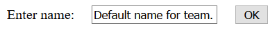
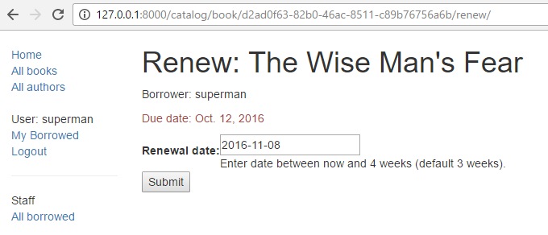
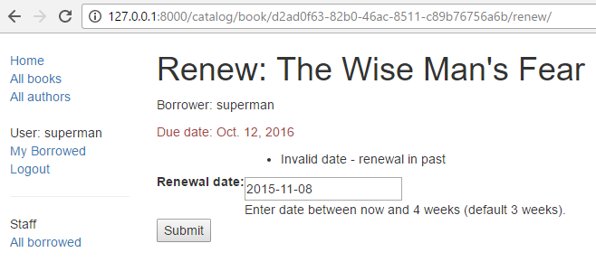
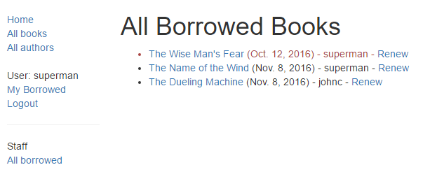
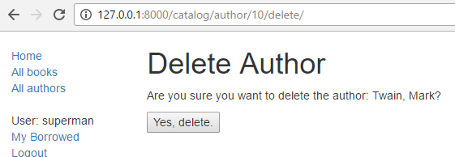
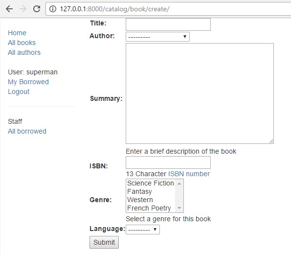

Django 튜토리얼 9부: 양식 작업
------------------------------

---

이 단원에서는 Django에서 HTML 양식을 사용하는 방법, 특히 모델 인스턴스를 생성, 수정 및 삭제하는 양식을 작성하는 가장 쉬운 방법을 설명합니다. 시연의 일환으로 관리 어플리케이션을 사용하는 대신 양식을 사용하여 사서가 도서를 갱신하고 작성, 수정 및 삭제할 수 있도록 LocalLibrary 웹 사이트를 확장할 것입니다.

> 선수지식: [Django 튜토리얼 8부: 사용자 인증 및 사용 권한](authentication.md)까지 모든 주제를 숙지하여야 합니다.
>
> 목표: 사용자로부터 정보를 얻고 데이터베이스를 업데이트할 수 있도록 양식을 작성하는 방법을 이해합니다. 제네릭 클래스 기반 양식 편집 뷰를 사용하여 단일 모델에 대한 작업 양식 작성을 크게 단순화시키는 방법을 이해합니다.

---

### 개요

[HTML 양식](https://developer.mozilla.org/en-US/docs/Web/Guide/HTML/Forms)은 웹 페이지에 있는 하나 이상의 필드/위젯 그룹으로 사용자가 서버에 제출할 수 있도록 정보를 수집하는 데 사용할 수 있습니다. 양식은 사용자 입력을 수집하는 유연한 메커니즘입니다. 왜냐하면, 양식에는 텍스트 박스, 체크박스, 라디오 버튼, 날짜 선택기 등 다양한 유형의 데이터 입력을 위한 적절한 위젯들이 있기 때문입니다. 크로스 사이트 요청 위조 방지 기능을 통해 POST 요청으로 데이터를 보낼 수 있어 양식은 서버와 데이터를 공유하는 비교적 안전한 방법입니다.

지금까지이 튜토리얼에서 양식을 생성하지 않았지만 Django Admin 사이트에서 이미 양식을 발견했습니다. 예를 들어, 아래 스크린 샷에는 여러 선택 목록으로 구성된 [Book](models.md) 모델 중 하나를 편집하기 위한 선택 목록과 텍스트 편집기로 구성되어 있는 양식이 있습니다.


양식 작업은 복잡할 수 있습니다. 개발자는 양식에 HTML을 작성하고 (브라우저에서도 가능하지만) 서버에 입력된 데이터의 유효성을 검사하며 정확성을 적절히 보장하고, 오류 메시지와 함꼐 양식을 다시 게시하여 유효하지 않은 필드를 사용자에게 알리고, 성공적으로 제출된 데이터를 처리해야 합니다. 마지막으로 사용자에게 응답을 표시하기 위해 다양한 방식으로 출력합니다. <i>Django Forms</i>는 양식과 필드를 프로그래밍 방식으로 정의할 수 있는 프레임워크를 제공함으로써 이 모든 단계의 많은 작업을 수행합니다. 그리고 이 객체들을 사용하여 HTML 코드 양식을 생성하고 유효성 검증과 사용자 상호 작용을 처리합니다.

이 단원에서는 양식을 만들고 작업할 수 있는 몇 가지 방법, 특히 제네릭한 편집 양식 뷰를 사용하여 모델을 조작하는 양식 작성에 필요한 작업량을 크게 줄일 수 있는 방법을 보여줍니다. 그 과정에서 도서관 사서가 도서관 도서를 갱신할 수 있는 양식을 추가하여 <i>LocalLibrary</i> 어플리케이션을 확장합니다. 또한 서적과 저자를 생성, 편집과 삭제할 수 있는 페이지를 만듭니다 (서적 편집을 위해 위 양식의 기본 버전을 재사용합니다)

---

### HTML 양식 {#html_form}

먼저 [HTML 양식](https://developer.mozilla.org/en-US/docs/Web/Guide/HTML/Forms)에 대한 간략한 개요입니다. "팀"의 이름을 입력하는 단일 텍스트 필드와 관련 레이블을 포함하는 아래와 같은 간단한 HTML 양식을 생각해 봅니다.



위 양식은 HTML <code>\<form> ... \</form></code> 태그 내의 요소 모음으로 정의되며 <code>type = "submit"</code>인 <code>input</code> 요소를 하나 이상 포함하고 있습니다.

```html
<form action="/team_name_url/" method="post">
    <label for="team_name">Enter name: </label>
    <input id="team_name" type="text" name="name_field" value="Default name for team.">
    <input type="submit" value="OK">
</form>
```

여기에는 팀 이름 입력을 위한 텍스트 필드 하나만 있지만 양식에는 다양한 입력 요소를 위한 레이블이 있을 수 있습니다. 필드의 <code>type</code> 애트리뷰트는 디스플레이할 위젯의 종류를 정의합니다. 필드의 <code>name</code>과 <code>id</code>는 JavaScript/CSS/HTML에서 필드를 식별하는 데 사용되고 <code>value</code>는 필드가 처음 디스플레이될 때 필드의 초기 값을 정의합니다. 일치하는 팀 레이블은 <code>label</code> 태그(위의 "Enter name"참조)로 지정되고, <code>for</code> 필드는 연관된 입력의 <code>id</code> 값입니다.

<code>submit</code> 입력은 양식의 다른 모든 입력 요소에 있는 모든 데이터를 서버(위의 경우 <code>team_name</code>)에 업로드하기 위해 사용자가 누를 수 있는 버튼(기본값)을 디스플레이합니다 . 양식 애트리뷰트는 서버에서 데이터와 데이터 도착지를 전송하는 HTTP <code>method</code>를 정의합니다 (<code>action</code>).

-	<code>action</code>: 양식을 제출할 때 처리를 위해 데이터를 보낼 resource/URL입니다. 이를 설정하지 않았다면 (빈 문자열로 설정된 경우), 현재 페이지 URL로 양식이 다시 제출됩니다.
-	<code>method</code>: 데이터를 보내기 위하여 사용되는 HTTP 메소드로 <i>post</i> 또는 <i>get</i>입니다.
	-	크로스 사이트 위조 요청 공격에 대한 보호을 위하여 데이터가 서버의 데이터베이스 변경을 초래하는 경우 <code>POST</code> 메소드를 항상 사용해야 합니다.
	-	<code>GET</code> 메소드는 사용자 데이터를 변경하지 않는 양식(예: 검색 양식)에만 사용해야 합니다. URL을 북마크하거나 공유할 수 있는 경우에 권장됩니다.

서버는 먼저 공백인 필드를 포함하는 초기 값이 미리 채워진 초기 양식을 렌더링합니다. 사용자가 제출 버튼을 누르면 서버는 웹 브라우저의 값으로 양식 데이터를 수신하고 정보의 유효성을 검사해야 합니다. 양식에 적절하지 않은 데이터가 포함되어 있으면 서버는 양식을 다시 디스플레이해야 합니다. 이때 입증된 필드에는 사용자가 입력한 데이터를 보여주며, 잘못 입력된 필드에는 문제를 설명하는 메시지를 표시합니다. 요청이 모두 유효한 양식 데이터로 서버에 전송되면 적절한 처리 (예: 데이터 저장, 검색 결과 반환, 파일 업로드 등)를 수행한 다음 사용자에게 알립니다.

"정확한" 수행을 위하여 HTML을 생성하고, 반환된 데이터의 유효성을 검사하고, 필요한 경우 오류 보고서와 함께 입력된 데이터를 다시 표시하고, 유효한 데이터로 원하는 작업을 수행하는 등의 많은 노력이 필요합니다. Django는 힘든 작업과 반복적인 코드를 제거함으로써 훨씬 이를 쉽게 합니다.

---

### Django 양식 처리 절차 {#django_form_handling_process}

Django의 양식 처리는 이전 단원에서 익힌 것과 동일한 기술(모델에 대한 정보를 표시하기 위해)을 사용합니다. 뷰는 요청을 받고, 모델에서 데이터를 읽는 것을 포함하여 필요한 모든 작업을 수행한 다음 (디스플레이할 데이터를 갖고 있는 컨텍스트를 전달 받은 템플리트로 부터) HTML 페이지를 생성하고 반환합니다 . 서버는 사용자가 제공 한 데이터를 처리 할 수 있어야 하고 오류가 있는 경우 페이지를 다시 표시해야 하기 때문에 처리가 더 복잡해 집니다.

Django가 (녹색으로 표시된) 양식이 포함된 페이지 요청부터 시작하려 양식 요청을 처리하는 프로세스 흐름도는 아래에 같습니다.


위의 다이어그램을 기반으로 Django의 양식 처리 주요 사항은 아래와 같습니다.

1.	사용자의 첫 요청을 위해 기본 양식을 디스플레이합니다.

	-	양식은 빈 필드가 있거나 (예: 새 레코드를 만드는 경우) 초기 값으로 미리 채워져있을 수 있습니다 (예: 레코드를 변경하거나 유용한 기본 초기 값이 있는 경우).
	-	(초기 값이 있어) 사용자 입력 데이터가 불필요한 경우 양식을 이 시점에서 <i>unbound</i>라고 합니다 .

2.	제출 요청으로 데이터를 수신하여 양식에 바인딩합니다.

	-	데이터를 양식에 바인딩한다는 것은 양식을 다시 디스플레이해야 할 때 사용자 입력 데이터와 이용 가능한 오류를 의미합니다.

3.	데이터를 정리하고 검증합니다.

	-	데이터의 정리는 것은 입력을 건전하게 하며 (예: 서버에 악의적인 콘텐츠를 보내는 데 사용할 수 있는 유효하지 않은 문자를 제거하는 등) 일관된 Python 유형으로 이들을 변환하는 것입니다.
	-	유효성 검사는 값이 해당 필드에 적합한 지를 (예: 올바른 날짜 범위에 있거나 너무 짧거나 길지 않음을) 확인합니다.

4.	데이터가 유효하지 않은 경우 양식을 다시 디스플레이합니다. 이때 사용자가 입력한 값과 문제 필드에 대한 오류 메시지도 같이 디스플레이합니다.

5.	모든 데이터가 유효하면 필요한 조치 (예: 데이터 저장, 이메일 보내기, 검색 결과 반환, 파일 업로드 등)를 수행합니다.

6.	모든 작업이 완료되면 사용자를 다른 페이지로 리디렉션합니다.

Django는 위에서 설명한 작업 수행에 도움을 줄 수 있는 다양한 도구와 방법을 제공합니다. 가장 기초적인 것으로는 양식 HTML의 생성과 데이터 정리/검증을 단순화하는 <code>Form</code> 클래스입니다. 다음 섹션에서는 사서가 도서를 갱신할 수 있는 페이지의 실용적인 예를 사용하여 양식의 작동을 설명합니다.

> <b>Note</b>: Django의 "상위 레벨" 양식 프레임워크 클래스를 논의할 때 <code>Form</code> 사용법을 이해하면 도움이 될 것입니다.

---

### 양식과 뷰 함수을 통한 도서 갱신 양식

다음으로 도서관 사서가 대출된 책의 정보를 갱신할 수 있는 페이지를 추가할 것입니다. 이를 위해 사용자가 날짜 값을 입력할 수있는 양식을 만듭니다. 현재 날짜로부터 3 주(일반 대여 기간)를 필드 값으로 초기화하고 사서가 과거 또는 최대 대여 기간 이후의 날짜를 입력할 수 없도록 유효성 검사를 추가합니다. 유효한 날짜가 입력되면 현재 레코드의 BookInstance.due_back 필드에 기록합니다.

이 예제는 함수 기반 뷰와 Form 클래스를 사용합니다. 다음 절에서는 양식의 작동하는 방식과 진행중인 <i>LocalLibrary</i> 프로젝트에 필요한 변경 사항을 설명합니다.

#### 양식

<code>Form</code> 클래스는 Django의 양식 핸들링 시스템의 핵심입니다. 양식의 필드, 레이아웃, 디스플레이 위젯, 레이블, 초기 값, 유효한 값, 유효성이 검증된 유효하지 않은 필드와 연관된 오류 메시지 등을 지정합니다. 클래스는 미리 정의된 형식(테이블, 목록 등)을 사용하거나 (세밀한 수동 렌더링을 가능하게 하는) 요소 값을 가져 오기 위해 템플리트에서 자체 렌더링하는 메소드를 제공합니다.

##### 양식 선언

<code>Form</code> 선언 구문은 <code>Model</code> 선언 구문과 매우 유사하며 동일한 필드 유형 (과 유사한 매개 변수)을 공유합니다. 이는 두 경우 모두 각 필드가 적절한 유형의 데이터를 처리하고 유효한 데이터로 제한하며 디스플레이 또는 문서에 대한 설명이 있어야 하므로 의미가 있습니다.

어플리케이션의 forms.py 파일은 어플리케이션 디렉토리에 양식 데이터를 저장합니다. <b>locallibrary/catalog/forms.py</b> 파일을 만들고 여십시오. <code>Form</b>을 만들려면 <code>forms</code> 라이브러리를 가져 와서 <code>Form</code> 클래스로 부터 상속 받아 서브클래스를 생성하고 양식 필드들을 선언합니다. 도서관 도서 갱신 양식을 위한 매우 기본적인 양식 클래스는 아래와 같습니다. 이 내용을 새 파일에 추가합니다.

```python
from django import forms

class RenewBookForm(forms.Form):
    renewal_date = forms.DateField(help_text="Enter a date between now and 4 weeks (default 3).")
```

##### 양식 필드

이 경우 빈 값, 기본 레이블 "Renewal date:"와 도움 텍스트 "Enter a date between now and 4 weeks (default 3 weeks)."를 렌더링하는 갱신일 입력을 위한 단일 [DateField](https://docs.djangoproject.com/en/2.1/ref/forms/fields/#datefield)가 있습니다. 다른 선택 인수가 지정되지 않았으므로 입력란에는 [input_formats](https://docs.djangoproject.com/en/2.1/ref/forms/fields/#django.forms.DateField.input_formats) YYYY-MM-DD (2016-11-06), MM/DD/YYYY (02/26/2016), MM/DD/YY (10/25/16)를 사용하여 날짜를 입력하고, 기본 [위젯](https://docs.djangoproject.com/en/2.1/ref/forms/fields/#widget)인 [DateInput](https://docs.djangoproject.com/en/2.1/ref/forms/widgets/#django.forms.DateInput)을 사용하여 렌더링할 것입니다.

[BooleanField](https://docs.djangoproject.com/en/2.1/ref/forms/fields/#booleanfield), [CharField](https://docs.djangoproject.com/en/2.1/ref/forms/fields/#charfield), [ChoiceField](https://docs.djangoproject.com/en/2.1/ref/forms/fields/#choicefield), [TypedChoiceField](https://docs.djangoproject.com/en/2.1/ref/forms/fields/#typedchoicefield), [DateField]https://docs.djangoproject.com/en/2.1/ref/forms/fields/#datefield, [DateTimeField](https://docs.djangoproject.com/en/2.1/ref/forms/fields/#datetimefield), [DecimalField](https://docs.djangoproject.com/en/2.1/ref/forms/fields/#decimalfield), [DurationField](https://docs.djangoproject.com/en/2.1/ref/forms/fields/#durationfield),[EmailField](https://docs.djangoproject.com/en/2.1/ref/forms/fields/#emailfield),[FileField](https://docs.djangoproject.com/en/2.1/ref/forms/fields/#filefield), [FilePathField](https://docs.djangoproject.com/en/2.1/ref/forms/fields/#filepathfield), [FloatField](https://docs.djangoproject.com/en/2.1/ref/forms/fields/#floatfield), [ImageField](https://docs.djangoproject.com/en/2.1/ref/forms/fields/#imagefield), [IntegerField](https://docs.djangoproject.com/en/2.1/ref/forms/fields/#integerfield), [GenericIPAddressField](https://docs.djangoproject.com/en/2.1/ref/forms/fields/#genericipaddressfield), [MultipleChoiceField](https://docs.djangoproject.com/en/2.1/ref/forms/fields/#miltiplechoicefield), [TypedMultipleChoiceField](https://docs.djangoproject.com/en/2.1/ref/forms/fields/#typedmultiplechoicefield), [NullBooleanField](https://docs.djangoproject.com/en/2.1/ref/forms/fields/#nullbooleanfield), [RegexField](https://docs.djangoproject.com/en/2.1/ref/forms/fields/#regexfield), [SlugField](https://docs.djangoproject.com/en/2.1/ref/forms/fields/#slugfield), [TimeField](https://docs.djangoproject.com/en/2.1/ref/forms/fields/#timefield), [URLField](https://docs.djangoproject.com/en/2.1/ref/forms/fields/#urlfield), [UUIDField](https://docs.djangoproject.com/en/2.1/ref/forms/fields/#uuidfield), [ComboField](https://docs.djangoproject.com/en/2.1/ref/forms/fields/#combofield), [MultiValueField](https://docs.djangoproject.com/en/2.1/ref/forms/fields/#multivaluefield), [SplitDateTimeField](https://docs.djangoproject.com/en/2.1/ref/forms/fields/#splitdatetimefield), [ModelMultipleChoiceField](https://docs.djangoproject.com/en/2.1/ref/forms/fields/#modelmultiplechoicefield), [ModelChoiceField](https://docs.djangoproject.com/en/2.1/ref/forms/fields/#modelchoicefield) 등 다양한 유형의 양식 필드가 있습니다. 양식 필드는 모델 필드 클래스와 유사하다고 생각할 수 있습니다.

대부분의 필드에 (타당한 기본값을 갖는) 공통적인 인수는 다음과 같습니다.

-	[required](https://docs.djangoproject.com/en/2.1/ref/forms/fields/#required): <code>True</code>이면 필드를 비워 두거나 <code>None</code> 값을 지정할 수 없습니다. 양식에서 필드는 기본적으로 필요하므로 빈 값을 허용하려면 <code>required = False</code>로 설정합니다.
-	[label](https://docs.djangoproject.com/en/2.1/ref/forms/fields/#label): HTML로 필드를 렌더링할 때 사용할 레이블입니다. [label](https://docs.djangoproject.com/en/2.1/ref/forms/fields/#label)을 지정하지 않으면 Django는 첫 문자를 대문자로하고 밑줄을 공백으로 바꿔 필드 이름에서 레이벨(예: Renewal date)을 생성합니다.
-	[label_suffix](https://docs.djangoproject.com/en/2.1/ref/forms/fields/#label_suffix): 기본적으로 레이블 뒤에 콜론을 표시합니다 (예: Renewal date:). 이 인수를 사용하여 다른 문자로 이루어진 접미사를 지정할 수 있습니다.
-	[initial](https://docs.djangoproject.com/en/2.1/ref/forms/fields/#initial): 양식을 디스플레이할 때 필드의 초기 값입니다.
-	[widget](https://docs.djangoproject.com/en/2.1/ref/forms/fields/#widget): 사용할 위젯입니다.
-	[help_text](https://docs.djangoproject.com/en/2.1/ref/forms/fields/#help_text) (위의 예에서 보인 것과 같은): 양식에서 필드를 입력 값을 설명하기 위하여 디스플레이할 텍스트입니다.
-	[error_messages](https//docs.djangoproject.com/en/2.1/ref/forms/fields/#error_messages): 필드에 대한 오류 메시지 목록이며, 필요한 경우 사용자 고유 메시지로 이를 오버라이드할 수 있습니다.
-	[validators](https://docs.djangoproject.com/en/2.1/ref/forms/fields/#validators): 필드의 유효성을 검사할 때 필드에서 호출할 함수 목록입니다.
-	[localize](https://docs.djangoproject.com/en/2.1/ref/forms/fields/#localize): 양식 데이터 입력의 현지화를 활성화합니다 (자세한 내용은 링크를 참조).
-	[disabled](https://docs.djangoproject.com/en/2.1/ref/forms/fields/#disabled): 필드를 디스플레이하지만 <code>True</code>이면 필드 값을 편집할 수 없으며 기본값은 <code>False</code>입니다.

##### 유효성 검사

Django는 임의의 필드에서 데이터의 유효성을 검사할 수 있습니다. 단일 필드의 유효성을 검사하는 가장 쉬운 방법은 확인할 필드에 <code>clean\_\<fieldname>()</code> 메서드를 오버라이드하는 것입니다. 예를 들어 아래에서 처럼 <code>clean_renewal_date()</code>를 구현하여 입력한 <code>renewal_date</code> 값이 현재와 4주 사이에 있는지 확인할 수 있습니다.

아래과 같이 forms.py 파일을 업데이트하십시오.

```python
import datetime

from django import forms
from django.core.exceptions import ValidationError
from django.utils.translation import ugettext_lazy as _

class RenewBookForm(forms.Form):
    renewal_date = forms.DateField(help_text="Enter a date between now and 4 weeks (default 3).")

    def clean_renewal_date(self):
        data = self.cleaned_data['renewal_date']

        # Check if a date is not in the past.
        if data < datetime.date.today():
            raise ValidationError(_('Invalid date - renewal in past'))

        # Check if a date is in the allowed range (+4 weeks from today).
        if data > datetime.date.today() + datetime.timedelta(weeks=4):
            raise ValidationError(_('Invalid date - renewal more than 4 weeks ahead'))

        # Remember to always return the cleaned data.
        return data
```

유의해야 할 두 가지 주요 사항이 있습니다. 첫 번째는 <code>self.cleaned\_data[ 'renewal\_date' ]</code>를 사용하여 데이터를 얻고 함수의 끝에서 데이터 변경 여부에 무관하게 이를 반환한다는 것입니다. 이 단계에서 기본 유효성 검사기를 사용하여 잠재적으로 안전하지 않은 입력을 "정리"하고 유효한 데이터를 가져 와서 데이터의 올바른 표준 유형 (이 경우 Python <code>datetime.datetime</code> 객체)으로 변환합니다.

두 번째는 값이 범위를 벗어나 유효하지 않은 값이 입력될 경우 양식에 표시할 오류 텍스트를 지정하여 <code>ValidationError</code>를 발생시키는 것입니다. 위의 예제는 [Django 번역 함수](https://docs.djangoproject.com/en/2.1/topics/i18n/translation/) <code>ugettext\_lazy()</code> (<code>\_()</code>로 임포트) 중 하나에 이 텍스트를 래핑합니다. 이는 향후 사이트를 번역하는 경우 적합합니다.

> <b>Note</b>: [Form and field validation](https://docs.djangoproject.com/en/2.1/ref/forms/validation/) (Django docs)에서 양식의 유효성을 검증하는 다양한 방법과 예제가를 찾을 수 있습니다. 예를 들어 서로 종속된 여러 필드가 있을 경우 [Form.clean()](https://docs.djangoproject.com/en/2.1/ref/forms/api/#django.forms.Form.clean) 함수를 재정의하여 <code>ValidationError</code>를 다시 발생시킬 수 있습니다.

이상 이 예제에서 양식에 필요한 모든 것입니다.

#### URL 설정

뷰를 만들기 전에 renew-books 페이지의 URL 구성을 추가해 보겠습니다. 다음 구성을 <b>locallibrary/catalog/urls.py</b>의 끝에 복사하십시오.

```python
urlpatterns += [
    path('book/<uuid:pk>/renew/', views.renew_book_librarian, name='renew-book-librarian'),
]
```

URL 설정은 <b>/catalog/book/\<<i>bookinstance id</i>>/renew/</b> 형식의 URL을 <b>views.py</b>의 <code>renew_book_librarian()</code> 함수로 리디렉션하고 <code>pk</code>라는 매개 변수로 <code>BookInstance</code> id를 보냅니다. <code>pk</code>가 올바르게 형식화된 <code>uuid</code>일 경우에만 패턴과 일치합니다.

> <b>Note</b>: 추출된 URL 데이터를 "<code>pk</code>"라는 이름으로 지정할 수 있습니다. 왜냐하면 뷰 함수를 완벽하게 제어할 수 있기 때문입니다 (특정 이름의 매개 변수를 필요로 하는 제네릭 상세 뷰 클래스를 사용하지 않습니다). 그러나, "프라이머리 키(primary key)"를 줄여 <code>pk</code>로 사용하는 것은 합당합니다.

#### 뷰

위의 [Django 양식 처리 절차](#django_form_handling_process)에서 설명한 것처럼 뷰는 처음 호출될 때 기본 폼을 렌더링한 다음 데이터가 유효하지 않은 경우 오류 메시지와 함께 다시 렌더링하거나 데이터가 유효하면 데이터를 처리하고 새 페이지로 리디렉션해야 합니다. 이러한 작업들을 수행하려면 뷰는 기본 양식을 레더링하는 것이 처음 호출되는 것인지 아니면 데이터 유효성 확인 후 호출되는 것인지를 알 수 있어야 합니다.

<code>POST</code> 요청을 사용하여 서버에 정보를 제출하는 양식의 경우 가장 일반적인 패턴은 뷰는 <code>POST</code> 요청 유형(<code>request.method == 'POST' :</code>)에 대해 양식 검증 요청을 식별하고 (<code>else</code> 조건을 사용하는) GET으로 초기 양식 생성 요청을 식별합니다. <code>GET</code> 요청을 사용하여 데이터를 제출하려는 경우 첫 번째 또는 이후 뷰 호출인지 여부를 식별할 수 있는 일반적인 방법은 양식 데이터(예: 양식에 숨겨진 값)를 읽는 것입니다.

책 갱신 절차는 데이터베이스에 작성되므로 관례상 POST 요청 방식을 사용합니다. 아래의 코드는 이같은 함수 뷰의 (매우 표준적인) 패턴을 보여줍니다.

```python
import datetime

from django.shortcuts import render, get_object_or_404
from django.http import HttpResponseRedirect
from django.urls import reverse

from catalog.forms import RenewBookForm

def renew_book_librarian(request, pk):
    book_instance = get_object_or_404(BookInstance, pk=pk)

    # If this is a POST request then process the Form data
    if request.method == 'POST':

        # Create a form instance and populate it with data from the request (binding):
        form = RenewBookForm(request.POST)

        # Check if the form is valid:
        if form.is_valid():
            # process the data in form.cleaned_data as required (here we just write it to the model due_back field)
            book_instance.due_back = form.cleaned_data['renewal_date']
            book_instance.save()

            # redirect to a new URL:
            return HttpResponseRedirect(reverse('all-borrowed') )

    # If this is a GET (or any other method) create the default form.
    else:
        proposed_renewal_date = datetime.date.today() + datetime.timedelta(weeks=3)
        form = RenewBookForm(initial={'renewal_date': proposed_renewal_date})

    context = {
        'form': form,
        'book_instance': book_instance,
    }

    return render(request, 'catalog/book_renew_librarian.html', context)
```

첫째, 양식(<code>RenewBookForm</code>)과 뷰 함수 본문에 사용되는 다른 유용한 객체/메소드를 임포트합니다.

-	[get_object_or_404()](https://docs.djangoproject.com/en/2.1/topics/http/shortcuts/#get-object-or-404): 프라이머리 키 값을 기반으로 모델에서 지정된 객체를 반환하고 레코드가 존재하지 않으면 <code>Http404</code> 예외(발견되지 않음)를 발생시킵니다.
-	[HttpResponseRedirect](https://docs.djangoproject.com/en/2.1/ref/request-response/#django.http.HttpResponseRedirect): 이렇게 하면 지정된 URL(HTTP 상태 코드 302)로 리디렉션됩니다.
-	[reverse()](https://docs.djangoproject.com/en/2.1/ref/urlresolvers/#django.urls.reverse): 이는 URL 설정 이름과 인수 세트로부터 URL을 생성합니다. 템플리트에서 사용해온 url 태그는 Python에서 동등합니다.
-	[datetime](https://docs.python.org/3/library/datetime.html): 날짜와 시간을 조작하기 위한 Python 라이브러리입니다.

뷰는 먼저 <code>get_object_or_404()</code>에서 <code>pk</code> 인수를 사용하여 현재 <code>BookInstance</code>를 가져옵니다 (없으면 뷰가 즉시 종료되고 페이지에 "찾을 수 없음" 오류가 나타납니다). (<code>else</code> 절에 의해 처리된) <code>POST</code> 요청이 <i>아니면</i> <code>renewal_date</code> 필드의 초기 값(아래 표시된 것처럼 현재 날짜로부터 3 주)을 전달하는 기본 양식을 만듭니다.

```python
book_instance = get_object_or_404(BookInstance, pk=pk)

    # If this is a GET (or any other method) create the default form
    else:
        proposed_renewal_date = datetime.date.today() + datetime.timedelta(weeks=3)
        form = RenewBookForm(initial={'renewal_date': proposed_renewal_date})

    context = {
        'form': form,
        'book_instance': book_instance,
    }

    return render(request, 'catalog/book_renew_librarian.html', context)
```

양식을 생성한 후 <code>render()</code>를 호출하여 양식을 포함하는 템플리트와 컨텍스트를 지정하여 HTML 페이지를 만듭니다. 이 경우 컨텍스트에는 <code>BookInstance</code>도 포함합니다. 템플리트는 갱신할 책에 대한 정보를 제공합니다.

그러나 <code>POST</code> 요청인 경우 <code>form</code> 객체를 만들고 입력된 데이터로 객체를 채웁니다. 이 과정을 "바인딩"이라고 하며 이를 통해 양식의 유효성을 확인할 수 있습니다. 다음, 양식이 유효한지 확인합니다. 이는 모든 필드에서 모든 유효성 검사 코드를 실행하는 것입니다. 여기에는 날짜 필드가 실제로 유효한 날짜인지 확인하는 제네릭 코드와 맞는 범위에 있는 날짜인가를 확인하기 위한 특정 양식의 함수 <code>clean_renewal_date()</code> 모두를 포함합니다.

```python
book_instance = get_object_or_404(BookInstance, pk=pk)

    # If this is a POST request then process the Form data
    if request.method == 'POST':

        # Create a form instance and populate it with data from the request (binding):
        form = RenewBookForm(request.POST)

        # Check if the form is valid:
        if form.is_valid():
            # process the data in form.cleaned_data as required (here we just write it to the model due_back field)
            book_instance.due_back = form.cleaned_data['renewal_date']
            book_instance.save()

            # redirect to a new URL:
            return HttpResponseRedirect(reverse('all-borrowed') )

    context = {
        'form': form,
        'book_instance': book_instance,
    }

    return render(request, 'catalog/book_renew_librarian.html', context)
```

양식이 유효하지 않은 경우 <code>render()</code>를 다시 호출하지만 이번에는 컨텍스트에서 전달된 양식 값이 오류 메시지를 포함하고 있습니다.

양식이 유효하면 속성 <code>form.cleaned_data</code> (예: <code>data = form.cleaned_data['renewal_date']</code>)를 통해 데이터에 접근하여 데이터를 사용할 수 있습니다. 여기서는 관련된 <code>BookInstance</code> 객체의 <code>due_back</code> 값에 데이터를 저장합니다

> <b>Important</b>: 요청을 통해 양식 데이터에 직접 액세스할 수도 있지만 (예: <code>request.POST['renewal_date']</code> 또는 GET 요청을 사용하는 경우 <code>request.GET['renewal_date']</code>) 권장하지 않습니다. 정리된 데이터는 세정되고 유효성이 검사되며 Python 유형으로 변환됩니다.

뷰의 양식 처리 부분의 마지막 단계는 다른 페이지, 일반적으로 "성공" 페이지로 리디렉션하는 것입니다. 이 경우 <code>HttpResponseRedirect</code>와 <code>reverse()</code>를 사용하여 '<code>all-borrowed</code>'라는 이름의 뷰로 리디렉션합니다 ([Django 튜튜리얼 8부 : 사용자 인증 및 사용 권한](authentication.md)에서 "도전" 절로 작성되었습니다). 해당 페이지를 만들지 않았다면 URL '/'의 홈 페이지로 리디렉션하는 것이 좋습니다).

그것이 양식 처리 자체에 필요한 모든 것이지만 사서에게 뷰에 대한 액세스를 제한해야 합니다. <code>BookInstance</code> ("<code>can_renew</code>")에 새로운 권한을 만들어야 하지만 여기서는 간단히 기존의 <code>can_mark_returned</code> 권한에 <code>@permission_required</code> 함수 데코레이터를 사용합니다.

그러므로 최종 뷰는 아래와 같습니다. 이것을 <b>locallibrary/catalog/views.py</b>의 끝에 복사하십시오.

```python
import datetime

from django.contrib.auth.decorators import permission_required
from django.shortcuts import get_object_or_404
from django.http import HttpResponseRedirect
from django.urls import reverse

from catalog.forms import RenewBookForm

@permission_required('catalog.can_mark_returned')
def renew_book_librarian(request, pk):
    """View function for renewing a specific BookInstance by librarian."""
    book_instance = get_object_or_404(BookInstance, pk=pk)

    # If this is a POST request then process the Form data
    if request.method == 'POST':

        # Create a form instance and populate it with data from the request (binding):
        form = RenewBookForm(request.POST)

        # Check if the form is valid:
        if form.is_valid():
            # process the data in form.cleaned_data as required (here we just write it to the model due_back field)
            book_instance.due_back = form.cleaned_data['renewal_date']
            book_instance.save()

            # redirect to a new URL:
            return HttpResponseRedirect(reverse('all-borrowed') )

    # If this is a GET (or any other method) create the default form.
    else:
        proposed_renewal_date = datetime.date.today() + datetime.timedelta(weeks=3)
        form = RenewBookForm(initial={'renewal_date': proposed_renewal_date})

    context = {
        'form': form,
        'book_instance': book_instance,
    }

    return render(request, 'catalog/book_renew_librarian.html', context)
```

#### 템플리트

뷰에서 참조하는 템플리트(/catalog/templates/catalog/book_renew_librarian.html)를 만들고 아래 코드를 복사하십시오.

```html



  <h1>Renew: {{ book_instance.book.title }}</h1>
  <p>Borrower: {{ book_instance.borrower }}</p>
  <p class="text-danger">Due date: {{ book_instance.due_back }}</p>

  <form action="" method="post">
    
    <table>
    {{ form.as_table }}
    </table>
    <input type="submit" value="Submit">
  </form>

```

대부분이 이전 튜토리얼에서 익숙한 것들입니다. 기본 템플리트를 확장한 다음 내용 블록을 다시 정의합니다. <code>{{ book_instance }}</code>를 <code>render()</code> 함수의 컨텍스트 객체로 전달하였기 때문에 <code>{{ book_instance }}</code>(와 변수들)를 참조할 수 있으며 도서 제목, 대여자와 원래 만기일을 나열하는 데 사용합니다.

양식 코드는 비교적 간단합니다. 먼저 <code>form</code> 태그를 선언하고 양식 제출 위치 (<code>action</code>)와 데이터 제출 <code>method</code> (이 경우 "HTTP POST")을 지정합니다. 이 단계 시작에 [HTML 양식](#html_form) 개요를 기억한다면, 보여준 빈 <code>action</code>은 양식 데이터를 페이지의 현재 URL (우리가 원하는 것)에 다시 게시함을 의미합니다. 태그 안에는 사용자가 제출할 수 있는 <code>submit</code> 입력을 정의합니다. 양식 태그 내부에 추가된 <code></code>은 Django의 교차 사이트 위조 방지 기능의 일부입니다.

> <b>Note</b>: POST를 사용하여 데이터를 제출하는 모든 Django 템플리트에 <code></code>을(를) 추가하십시오. 양식이 악의적인 사용자에 의해 도용될 가능성이 줄어듭니다.

나머지는 <code>{{ form }}</code> 템플리트 변수이며 컨텍스트 사전의 템플리트로 전달됩니다. 놀랄 필요없이, 보이는 대로 사용하도록 레이블, 위젯, 도움말 텍스트 등 모든 양식 필드의 기본 렌더링을 제공합니다. 그 렌더링은 아래와 같습니다.

```html
<tr>
  <th><label for="id_renewal_date">Renewal date:</label></th>
  <td>
    <input id="id_renewal_date" name="renewal_date" type="text" value="2016-11-08" required>
    <br>
    <span class="helptext">Enter date between now and 4 weeks (default 3 weeks).</span>
  </td>
</tr>
```

> <b>Note</b>: 필드가 하나만 있기 때문에 분명하지는 않지만 기본적으로 자체 테이블 행에 모든 필드를 정의합니다. 템플리트 변수 <code>{{ form.as_table }}</code>을 참조하면 동일한 렌더링을 제공합니다.

유효하지 않은 날짜를 입력한 경우 페이지에서 렌더링된 오류 목록 (아래 <code>\<ul class="errorlist"></code> 요소)을 추가로 얻습니다.

```html
<tr>
  <th><label for="id_renewal_date">Renewal date:</label></th>
    <td>
      <ul class="errorlist">
        <li>Invalid date - renewal in past</li>
      </ul>
      <input id="id_renewal_date" name="renewal_date" type="text" value="2015-11-08" required>
      <br>
      <span class="helptext">Enter date between now and 4 weeks (default 3 weeks).</span>
    </td>
</tr>
```

##### 양식 템플리트 변수의 다른 사용법

위에서 처럼 <code>{{ form.as_table }}</code>을 사용하면 테이블 행으로 각 필드를 렌더링합니다. 각 필드를 목록 항목(<code>{{ form.as_ul }}</code> 사용) 또는 단락 (<code>{{ form.as_p}}</code> 사용)으로 렌더링할 수도 있습니다.

점 표기법을 사용하여 속성을 인덱싱하여 양식의 각 부분의 렌더링을 완벽하게 제어할 수 있습니다. 예를 들어, <code>renewal_date</code> 필드의 개별 항목들을 접근할 수 있습니다.

-	<code>{{ form.renewal_date }}</code>: 전체 필드.
-	<code>{{ form.renewal_date.errors }}</code>: 오류 목록.
-	<code>{{ form.renewal_date.id_for_label }}</code>: 레이블 id.
-	<code>{{ form.renewal_date.help_text }}</code>: 필드 도움말.

템플리트의 양식을 수동으로 렌더링하고 템플리트 필드를 동적으로 반복하는 방법에 대한 자세한 예제는 [Working with forms > Rendering fields manually](https://docs.djangoproject.com/en/2.1/topics/forms/#rendering-fields-manually) (Django docs)을 참고하십시오.

#### 페이지 테스팅

[Django 튜토리얼 8부: 사용자 인증과 권한관리](authentication.md)에서 "도전 과제"를 하였다면 도서관 직원에게만 보이는 대출 도서 목록이 있습니다. 아래 템플리트 코드를 사용하여 각 항목 옆에 갱신 페이지 링크를 추가할 수 있습니다.

```html
- <a href="">Renew</a>  
```

> <b>Note</b>: 갱신된 책 페이지를 접근하려면 테스트 로그인에 "<code>catalog.can_mark_returned</code>" 권한이 있어야 합니다 (수퍼 유저 계정 사용).

또는 `http://127.0.0.1:8000/catalog/book/<bookinstance_id>/renew/`와 같은 테스트 URL을 수동으로 구성할 수 있습닏다 (라이브러리의 책 세부 정보 페이지로 이동하여 <i>id</i> 필드 복사함으로써 유효한 bookinstance id를 얻을 수 있습니다).

#### 시연

성공하면 기본 양식은 아래와 같습니다.



유효하지 않은 값을 입력한 양식은 아래와 같습니다.



갱신 링크가 있는 도서 목록은 아래와 같습니다.



---

### 모델양식 (ModelForms)

위에 설명한 접근 방식을 사용하여 `Form` 클래스를 만드는 것은 매우 융통성이 있어 원하는 모든 종류의 양식 페이지를 만들고 이를 모델과 연결할 수 있습니다.

그러나 단일 모델의 필드를 매핑하는 양식이 필요한 경우 모델은 양식에서 필요한 대부분의 정보(필드, 레이블, 도움말 등)를 이미 정의하였을 것입니다. 모델 정의를 다시 작성하는 대신 도우미 클래스 [ModelForm](https://docs.djangoproject.com/en/2.1/topics/forms/modelforms/)을 사용하여 모델로부터 양식을 만드는 것이 더 쉽습니다. 보통 `Form`과 정확히 같은 방식으로 이 `ModelForm`을 뷰에서 사용할 수 있습니다.

원래의 `RenewBookForm`과 동일한 필드를 포함하는 기본 `ModelForm`은 아래와 같습니다. 양식을 작성하기 위해 해야 할 일은 연관된 `model`\(`BookInstance`)과 양식에 포함할 모델 `fields` 목록을 `class Meta`에 추가하는 것입니다 (`fields = '\_\_all\_\_'`을 사용하여 모든 필드를 포함시키거나 `exclude`\(`fields` 대신)를 이용하여 모델에서 포함하지 <i>않을</i> 필드를 지정할 수 있습니다).

```python
from django.forms import ModelForm

from catalog.models import BookInstance

class RenewBookModelForm(ModelForm):
    class Meta:
        model = BookInstance
        fields = ['due_back']
```

> <b>Note</b>: (이 경우에는 하나의 필드 만 있기 때문에) Form을 사용하는 것이 보다 훨씬 간단하게 보일 수 있습니다. 그러나 필드가 많으면 코드 양을 상당히 줄일 수 있습니다.

나머지 정보는 모델 필드 정보(예: 라벨, 위젯, 도움말 텍스트, 오류 메시지)에서 가져옵니다. 이것들이 옳지 않다면 변경할 필드와 새로운 값을 포함하는 사전을 지정하여 `class Meta`에서 그것들을 오버라이드할 수 있습니다 . 예를 들어, 이 양식에서 필드의 레이블을 (필드 이름을 기반으로 한 기본값인 Due Back 대신) "*Renewal date*"로 그리고 도움말 텍스트를 이 사용 사례에 특정한 것으로 변경하기를 원하면 아래의 `Meta`는 이러한 필드를 오버라이드하는 방법을 보여줍니다. 기본값이 충분하지 않으면 `widgets`과 `error_messages`를 유사하게 설정할 수 있습니다.

```python
class Meta:
    model = BookInstance
    fields = ['due_back']
    labels = {'due_back': _('New renewal date')}
    help_texts = {'due_back': _('Enter a date between now and 4 weeks (default 3).')}
```

유효성 검사를 추가하려면 일반 `Form`과 동일한 접근 방법을 사용할 수 있습니다. <code>clean\_*field*\_name()</code>이라는 함수를 정의하고 유효하지 않은 값에 대해 `ValidationError` 예외를 발생시킵니다. 원래 양식과 유일한 차이점은 모델 필드의 이름이 `due_back`이지 "`renewal_date`"가 아니라는 것입니다. `BookInstance`의 해당 필드가 `due_back`이므로 변경이 필요한 것입니다.

```python
from django.forms import ModelForm

from catalog.models import BookInstance

class RenewBookModelForm(ModelForm):
    def clean_due_back(self):
       data = self.cleaned_data['due_back']

       # Check if a date is not in the past.
       if data < datetime.date.today():
           raise ValidationError(_('Invalid date - renewal in past'))

       # Check if a date is in the allowed range (+4 weeks from today).
       if data > datetime.date.today() + datetime.timedelta(weeks=4):
           raise ValidationError(_('Invalid date - renewal more than 4 weeks ahead'))

       # Remember to always return the cleaned data.
       return data

    class Meta:
        model = BookInstance
        fields = ['due_back']
        labels = {'due_back': _('Renewal date')}
        help_texts = {'due_back': _('Enter a date between now and 4 weeks (default 3).')}

```

위의 `RenewBookModelForm` 클래스는 원래 `RenewBookForm`과 기능적으로 동일합니다. 두 번째 형식 선언 <code>RenewBookModelForm (initial={'due_back' : proposed_renewal_date})</code>에서와 같이 해당 양식 변수 이름을 `renewal_date`에서 `due_back`으로 업데이트하는 경우 `RenewBookForm`을 사용하는 모든 곳에서 임포트하여 이를 사용할 수 있습니다.

---

### 제네릭 편집 뷰

위의 뷰 함수 예제에서 사용한 양식 처리 알고리즘은 양식 편집 뷰에서 매우 일반적으로 볼 수 있는 패턴입니다. Django는 모델을 기반으로 뷰를 생성, 편집 및 삭제하기 위한 [generic editing views](https://docs.djangoproject.com/en/2.1/ref/class-based-views/generic-editing/)를 생성하여 이 "boilerplate"의 대부분을 추상화합니다. 이들은 "view" 작업를 처리할뿐만 아니라 모델로부터 자동으로 양식 클래스(`ModelForm`)를 생성합니다.

> **Note**: 여기에 설명된 편집 뷰 외에도 "유연성"과 "코딩 노력" 측면에서 뷰 함수와 다른 일반 뷰 사이에있는 [FormView](https://docs.djangoproject.com/en/2.1/ref/class-based-views/generic-editing/#formview) 클래스가 있습니다. `FormView`를 사용하면 여전히 양식을 만들어야 하지만 모든 표준 양식 처리 패턴을 구현할 필요는 없습니다. 대신 제출된 데이터가 유효할 때 호출할 함수를 제공하면 됩니다.

라이브러리에 `Author` 레코드를 작성, 편집 및 삭제하는 기능을 추가하는 페이지를 작성하기 위하여 이 절에서는 일반적인 편집 뷰를 사용하고자 합니다. 이를 효과적으로 제공하려면 Admin 사이트 일부분을 재구현하여야 합니다 (관리 사이트에서 보다 유연하게 관리 기능을 제공할 수 있다면 유용할 수 있습니다).

#### 뷰

뷰 파일(**locallibrary/catalog/views.py**)을 열고 아래 코드 블록을 추가하십시오.

```python
from django.views.generic.edit import CreateView, UpdateView, DeleteView
from django.urls import reverse_lazy

from catalog.models import Author

class AuthorCreate(CreateView):
    model = Author
    fields = '__all__'
    initial = {'date_of_death': '05/01/2018'}

class AuthorUpdate(UpdateView):
    model = Author
    fields = ['first_name', 'last_name', 'date_of_birth', 'date_of_death']

class AuthorDelete(DeleteView):
    model = Author
    success_url = reverse_lazy('authors')
```

보시다시피 뷰를 생성, 업데이트 또는 삭제하기 위하여는 `CreateView`, `UpdateView` 및 `DeleteView`로 부터 각각 파생시킨 다음 관련 모델을 정의할 수 있습니다.

"create"와 "update"의 경우 (`ModelForm`과 동일한 구문을 사용하여) 양식에 디스플레이할 필드를 지정해야 합니다. 이 경우 "모든" 필드를 디스플레이하는 구문과 필드들을 개별적으로 나열하는 방법 모두를 보여줍니다. *field_name/value* 쌍의 사전을 사용하여 각 필드에 대한 초기 값을 지정할 수도 있습니다 (여기에서는 제거하고 싶을 수도 있겠지만 시연을 위하여 임의로 사망 날짜를 설정합니다). 기본적으로 이러한 뷰는 새로이 생성 또는 편집된 모델 항목을 디스플레이하는 페이지로 리디렉션될 것입니다. 이는 이전 단원에서 작성한 저자 상세 뷰입니다. `AuthorDelete` 클래스에서와 같이 매개 변수 `success_url`을 명시적으로 선언하여 다른 리디렉션 위치를 지정할 수 있습니다.

`AuthorDelete` 클래스는 어떤 필드도 디스플레이할 필요가 없으므로 필드를 지정할 필요도 없습니다. 그러나 Django가 사용할 기본값이 없으므로 `success_url`을 지정해야 합니다. 이 경우 저자가 삭제된 후 [reverse_lazy()](https://docs.djangoproject.com/en/2.1/ref/urlresolvers/#reverse-lazy) 함수를 사용하여 저자 목록으로 리디렉션합니다. `reverse_lazy()`는 여기에서 클래스 기반 뷰 애트리뷰트에 URL을 제공하려고 사용되는 `reverse()`의 지연 버전입니다.

#### 템플리트

"create"및 "update" 뷰는 기본적으로 동일한 템플리트를 사용합니다. 이 템플리트의 모델 이름은 <i>model\_name</i>\_<b>form.html</b>입니다 (뷰에서 <code>template_name_suffix = ' \_other_suffix '</code>와 같이 template_name_suffix 필드를 사용하여 **\_form** 이외의 다른 접미사로 변경할 수 있습니다).

**locallibrary/catalog/templates/catalog/author_form.html** 템플리트 파일을 작성하고 아래 텍스트를 복사하십시오.

```html



  <form action="" method="post">
    
    <table>
    {{ form.as_table }}
    </table>
    <input type="submit" value="Submit">
  </form>

```

위 양식은 이전 양식과 유사하며 테이블을 사용하여 필드를 렌더링합니다. 또한 양식이 CSRF 공격에 대비하여 <code></code> 선언하는 방법에 유의하십시오.

"삭제" 뷰는 <i>model_name</i><b>\_confirm_delete.html</b> 형식으로 명명된 템플리트를 찾습니다 (뷰에서 <code>template_name_suffix</code>를 사용하여 접미사를 변경할 수 있습니다). <b>locallibrary/catalog/templates/catalog/author_confirm_delete.html</b> 템플리트 파일을 작성하고 아래 텍스트를 복사하십시오.

```html




<h1>Delete Author</h1>

<p>Are you sure you want to delete the author: {{ author }}?</p>

<form action="" method="POST">
  
  <input type="submit" value="Yes, delete.">
</form>


```

URL 설정 파일(locallibrary/catalog/urls.py)을 열고 다음 설정을 파일의 끝에 추가하십시오.

```python
urlpatterns += [  
    path('author/create/', views.AuthorCreate.as_view(), name='author_create'),
    path('author/<int:pk>/update/', views.AuthorUpdate.as_view(), name='author_update'),
    path('author/<int:pk>/delete/', views.AuthorDelete.as_view(), name='author_delete'),
]
```

#### URL 설정

위에 특별히 새로운 것은 없습니다. 뷰는 클래스이므로 .as_view()를 통해 호출해야하며 각 경우에 URL 패턴을 인식할 수 있어야 합니다. 뷰 클래스에서 예상하는 매개 변수 이름이므로 사용해야 하는 것처럼 캡처된 프라이머리 키 값의 이름으로 pk를 사용해야 합니다.

저자 생성, 업데이트와 삭제 페이지를 테스트할 준비가 되었습니다 (원한다면 이 작업을 수행할 수 있지만 이 경우 사이트 사이드바에 연결하지 않아도 됩니다).

> **Note**: 관찰자가 권한 없는 페이지에 접근하지 못하도록 하기 위해 아무 것도하지 않았음을 알수 있습니다. 이를 연습으로 남겨 둡니다 (힌트: `PermissionRequiredMixin`을 사용하여 새로운 권한을 생성하거나 <code>can_mark_returned</code> 권한을 재사용할 수 있습니다).

#### 페이지 테스트

먼저 저자 편집 페이지에 접근 권한이 있는 계정으로 사이트에 로그인하십시오.

다음 저자 작성 페이지(http://127.0.0.1:8000/catalog/author/create/)로 이동하십시오. 이 스크린 샷은 아래와 같습니다.


입력 필드에 값을 입력하고 <b>Submit</b>를 눌러 author 레코드를 저장하십시오. 이제 <i>http://127.0.0.1:8000/catalog/author/10</i>과 같은 URL을 사용하여 새 저자의 세부 뷰로 이동해야 합니다.

상세 뷰 URL의 끝에 <i>/update/</i>를 추가하여 레코드 편집을 테스트 할 수 있습니다 (예: <i>http://127.0.0.1:8000/catalog/author/10/update/</i>). 위 "create" 페이지와 유사하여 스크린 샷을 표시하지 않았습니다.

마지막으로 저자 세부 뷰 URL 끝에 delete를 추가하여 페이지를 삭제할 수 있습니다 (예: <i>http://127.0.0.1:8000/catalog/author/10/delete/</i>). Django는 아래와 같이 삭제 페이지를 디스플레이합니다. <b>Yes</b>를 누르고 <b>remove</b>하십시오. 레코드를 삭제하고 저자 목록으로 이동합니다.



---

### 도전 과제

양식을 작성하여 `Book` 레코드를 생성, 편집 및 삭제하십시오. `Authors`와 동일한 구조를 사용할 수 있습니다. 템플리트 <b>book_form.html</b>가 템플리트 <b>author_form.html</b>를 복사하여 변경한 버전이라면 새로운 'create book' 페이지 스크린샷은 아래처럼 보일 것입니다.



---

### 요약

양식을 만들고 처리하는 것은 복잡한 과정일 수 있습니다. Django는 양식을 선언하고, 렌더링하고 그리고 유효성 검사를 하기 위한 프로그래밍 메커니즘을 제공함으로써 이를 훨씬 쉽게 합니다. 또한 Django는 거의 모든 작업을 수행할 수있는 제네릭 양식 편집 뷰를 제공하여 단일 모델의 인스턴스 레코드를 생성, 편집과 삭제할 수 있는 페이지를 정의합니다.

양식을 사용하여 더 많은 작업을 수행할 수 있지만 (아래의 참조 목록도 확인하십시오) 기본 양식과 양식 처리 코드를 자신의 웹 사이트에 추가하는 방법을 이제는 이해해야 합니다.

---

### 참고 문서

-	[Working with forms](https://docs.djangoproject.com/en/2.1/topics/forms/) (Django docs)
-	[Writing your first Django app, part 4 > Writing a simple form](https://docs.djangoproject.com/en/2.1/intro/tutorial04/#write-a-simple-form) (Django docs)
-	[The Forms API](https://docs.djangoproject.com/en/2.1/ref/forms/api/) (Django docs)
-	[Form fields](https://docs.djangoproject.com/en/2.1/ref/forms/fields/) (Django docs)
-	[Form and field validation](https://docs.djangoproject.com/en/2.1/ref/forms/validation/) (Django docs)
-	[Form handling with class-based views](https://docs.djangoproject.com/en/2.1/topics/class-based-views/generic-editing/) (Django docs)
-	[Creating forms from models](https://docs.djangoproject.com/en/2.1/topics/forms/modelforms/) (Django docs)
-	[Generic editing views](https://docs.djangoproject.com/en/2.1/ref/class-based-views/generic-editing/) (Django docs)

---

### 이 튜토리얼은 다음과 같이 구성되어 있습니다.

-	[Django 소개](introduction.md)
-	[Django 개발 환경 설정](developmentEnvironment.md)
-	[Django 튜토리얼: The Local Library website](tutorialLocalLibraryWebsite.md)
-	[Django 튜토리얼 2부: 웹사이트 골조 만들기](skeletonWebsite.md)
-	[Django 튜토리얼 3부: 모델](models.md)
-	[Django 튜토리얼 4부: Django admin 사이트](adminSite.md)
-	[Django 튜토리얼 5부: 홈 페이지 만들기](homePage.md)
-	[Django 튜토리얼 6부: 일반 목록과 상세 보기](genericViews.md)
-	[Django 튜토리얼 7부: 세션 프레임워크](sessions.md)
-	[Django 튜토리얼 8부: 사용자 인증과 권한관리](authentication.md)
-	[Django 튜토리얼 9부: 양식](forms.md)
-	[Django 튜토리얼 10부: Django 웹 어플리케이션 테스팅](testing.md)
-	[Django 튜토리얼 11부: 프로덕션으로 Django 전개](deployment.md)
-	[Django 웹 어플리케이션 보안](webApplicationSecurity.md)
