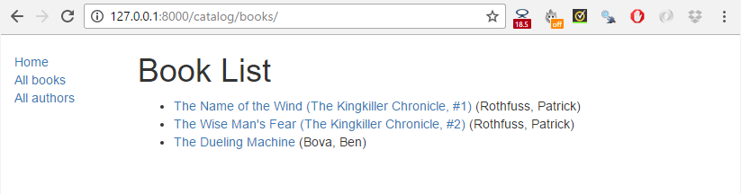
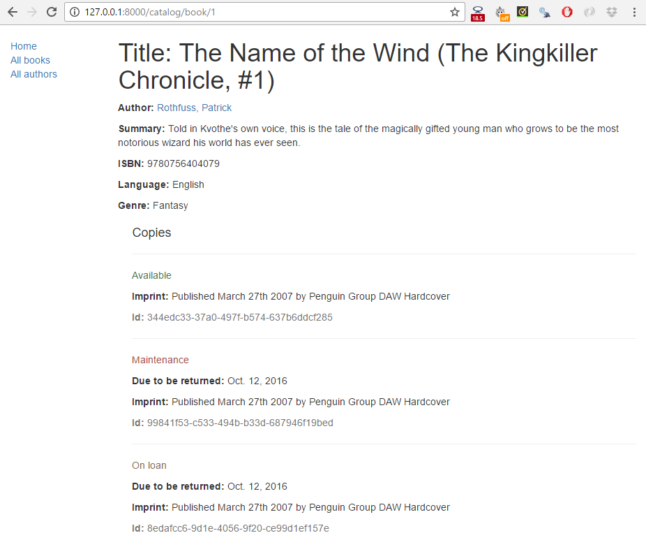
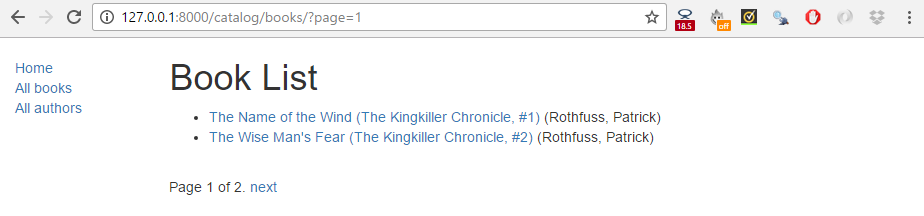
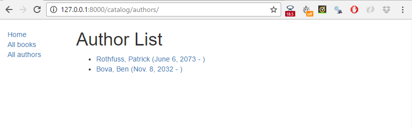
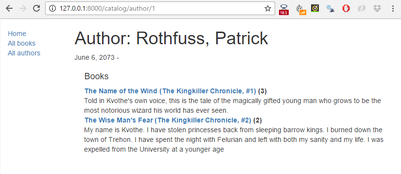

Django 튜토리얼 6부: 일반 목록과 상세 보기
------------------------------------------

---

이 단원에서는 도서와 저자의 목록과 상세 정보 페이지를 추가하여 [LocalLibrary](tutorialLocalLibraryWebsite.md) 웹사이트를 확장합니다. 여기서는 일반적인 클래스 기반 뷰에 대해 공부하고 일반 사용 사례에서 작성해야 하는 코드의 양을 줄일 수 있는 방법을 보여줍니다. 또한 기본 패턴 일치를 수행하는 방법을 설명함으로써 URL 처리에 대해 자세히 설명합니다.

> 선수지식: [Django 튜토리얼 5부: 홈 페이지 만들기](homePage.md)까지 모든 튜토리얼들을 숙지하고 있어야 합니다.
>
> 목표: 일반 클래스 기반 뷰를 사용하는 때와 방법 및 URL에서 패턴을 추출하여 뷰에 정보를 전달하는 방법을 배웁니다.

---

### 개요

이 단원에서는 도서과 저자에 대한 목록과 상세 정보 페이지를 추가하여 [LocalLibrary](tutorialLocalLibraryWebsite.md) 웹사이트의 첫 번째 버전을 완성합니다 (더 정확하게는 도서 페이지를 구현하는 방법을 보여주고 개발자가 저자 페이지를 직접 작성합니다.)

이 과정은 이전 단원에서 설명한 index 페이지를 만드는 것과 비슷합니다. URL 맵, 뷰 및 템플리트를 만들어야 합니다. 세부 정보 페이지의 경우 URL 패턴에서 정보를 추출하여 뷰로 전달하는 것이 큰 차이점입니다. 이 페이지에서는 완전히 다른 형태의 뷰인 일반 클래스 기반 목록과 상세 보기를 보여줍니다. 이렇게함으로써 필요한 뷰 코드의 양을 크게 줄일 수 있어 코드 작성과 유지 관리가 보다 용이해집니다.

이 단원 마지막 부분에서는 일반 클래스 기반 목록 뷰를 사용할 때 데이터에 페이지 수를 매기는 방법을 설명합니다.

---

### 도서 목록 페이지

도서 목록 페이지는 URL: <code>catalog/books/</code>으로 접근할 수 있는 페이지에 가용한 모든 도서 레코드 목록을 디스플레이합니다. 페이지에는 각 도서 레코드의 제목과 저자가 표시되며, 제목은 도서 세부 정보 페이지로 연결되는 하이퍼 링크입니다. 페이지는 사이트의 모든 페이지와 동일한 구조를 이루고 있으며 탐색을 지원합니다. 그러므로 이전 단계에서 작성한 기본 템플리트(<b>base_generic.html</b>)을 확장하여 사용할 수 있습니다.

#### URL 매핑

<b>/catalog/urls.py</b>를 열고 아래의 줄(<code>path('books/', views.BookListView.as_view(), name='books'),</code>)을 복사합니다. index 페이지의 경우 <code>path()</code> 함수는 URL(<b>'books/'</b>)과 일치하는 패턴, URL이 일치하였을 때 호출할 뷰 함수(<code>views.BookListView.as_view()</code>)로 이 매펭을 정의합니다.

```python
urlpatterns = [
    path('', views.index, name='index'),
    path('books/', views.BookListView.as_view(), name='books'),
]
```

앞 단원에서 설명한 것처럼 URL은 <code>/catalog</code>와 이미 일치했으므로 뷰는 실제로 URL:<code>/catalog/books/</code>를 호출합니다.

뷰 함수는 이전과 다른 형식을 갖고 있습니다. 왜냐하면 이 뷰는 실제로 클래스로 구현되기 때문입니다. 개발자가 처음부터 작성하기 보다는 이 뷰 함수가 수행할 대부분 기능을 기존의 제네릭 뷰 기능으로 부터 상속받아 작성합니다.

Django 클래스 기반 뷰의 경우 클래스 메소드 <code>as_view ()</code>를 호출하여 적절한 뷰 기능을 수행합니다. 이렇게 하면 클래스의 인스턴스를 만들어 입력되는 HTTP 요청에 대해 해당 처리 메서드를 호출하여 작업을 처리할 수 있기 때문입니다.

#### (클래스 기반) 뷰

모든 도서에 대해 데이터베이스를 검색하여 지정된 템플리트로 목록을 전달하기 위해 <code>render()</code>를 호출합니다. 그러나 대신 기존 뷰로부터 상속받은 클래스 기반 일반 목록 뷰(<code>ListView</code>)를 사용할 것입니다. 제네릭 뷰는 이미 필요한 대부분의 기능을 지원하며 Django 모범 사례를 따르기 때문에 코드가 작고 반복 횟수가 적어 궁극적으로 유지 관리 비용이 줄어드는 목록 뷰를 위한 보다 견고한 코드를 만들 수 있습니다.

<b>catalog/views.py</b>를 열고 다음 코드를 파일의 끝에 복사하십시오.

```python
from django.views import generic

class BookListView(generic.ListView):
    model = Book
```

끝입니다. 제네릭 뷰는 데이터베이스를 검색하여 지정된 모델(<code>Book</code>)의 모든 레코드를 가져온 다음 <b>/locallibrary/catalog/templates/catalog/book_list.html</b> (아래에서 만들 예정)에 있는 템플리트을 렌더링합니다. 템플리트 내에서 <code>object_list</code> 또는 <code>book_list</code> 템플리트 변수(예: 일반적으로 "<code>the_model_name_list</code>")를 사용하여 도서 목록에 접근할 수 있습니다.

> <b>Note</b>: 템플리트 위치에 대한 이 어색한 경로는 잘못된 것이 아닙니다. 제네릭 뷰는 <code>/application's/appiclation_name/templates/</code> 디렉토리 (<code>/catalog/templates</code>)의 <code>/application_name/the_model_name_list.html</code> (이 경우 <code>/catalog/book_list.html</code>)에서 템플리트를 찾습니다.

애트리뷰트를 추가하여 위의 기본 동작을 변경할 수 있습니다. 예를 들어 동일한 모델을 사용하는 여러 뷰가 필요할 경우 다른 템플리트 파일을 지정하거나 <code>book_list</code>가 특정 템플리트 유스 케이스에 대해 직관적이지 않은 경우 다른 템플리트 변수 이름을 사용할 수 있습니다. 아마도 가장 유용한 대안은 반환된 결과의 부분집합을 변경하거나 필터링하는 것입니다. 따라서 모든 책을 나열하는 대신 많은 사용자들이 읽은 상위 5 권의 책을 나열할 수 있습니다.

```python
class BookListView(generic.ListView):
    model = Book
    context_object_name = 'my_book_list'   # your own name for the list as a template variable
    queryset = Book.objects.filter(title__icontains='war')[:5] # Get 5 books containing the title war
    template_name = 'books/my_arbitrary_template_name_list.html'  # Specify your own template name/location
```

##### 클래스 기반 뷰에서 메소드 오버라이딩

여기서 필요하지 않지만 클래스 메서드의 일부를 오버라이드할 수 있습니다.

예를 들어, <code>get_queryset()</code> 메소드를 오버라이드(override)하여 반환된 레코드 리스트를 변경할 수 있습니다. 이것은 앞의 코드에서 했던 것처럼 <code>queryset</code> 애트리뷰트를 설정하는 것보다 (이 경우 실제 이점은 없을지라도) 융통성이 있습니다.

```python
class BookListView(generic.ListView):
    model = Book

    def get_queryset(self):
        return Book.objects.filter(title__icontains='war')[:5] # Get 5 books containing the title war
```

템플리트에 추가 context 변수를 전달하기 위해 <code>get_context_data()</code>를 오버라이드할 수도 있습니다 (예: 도서 목록을 기본적으로 전달함). 아래 코드는 "<code>some_data</code>"라는 변수를 context에 추가하는 방법을 보여줍니다 (템플리트 변수로 사용할 수 있음).

```python
class BookListView(generic.ListView):
    model = Book

    def get_context_data(self, **kwargs):
        # Call the base implementation first to get the context
        context = super(BookListView, self).get_context_data(**kwargs)
        # Create any data and add it to the context
        context['some_data'] = 'This is just some data'
        return context
```

이렇게 할 때 위에 사용된 패턴을 따르는 것이 중요합니다.

-	먼저 슈퍼 클래스에서 기존 context를 가져옵니다.
-	다음 새 context 정보를 추가하십시오.
-	다음 새로운 (업데이트 된) context를 반환합니다.

> <b>Note</b>: 할 수 있는 더 많은 예제를 위해 [Built-in class-based generic views](https://docs.djangoproject.com/en/2.1/topics/class-based-views/generic-display/) (Django docs)를 확인하십시오.

#### 목록 뷰 템플리트 생성

HTML 파일 <b>/locallibrary/catalog/templates/catalog/book_list.html</b>을 만들고 아래 코드를 복사하십시오. 위에서 설명했듯이 이 클래스는 (응용 프로그램 <code>catalog</code>에서 모델 <code>Book</code>에 대한) 제네릭 클래스 기반 목록 뷰가 필요로 하는 기본 템플리트 파일입니다.

제네릭 뷰의 템플리트는 (물론 템플리트에 전달된 컨텍스트나 정보가 다를 수 있지만) 다른 템플리트와 동일합니다. <i>index</i> 템플리트와 마찬가지로 기본 템플리트 첫 줄을 확장한 다음 블록 <code>content</code>를 대체합니다.

```html



  <h1>Book List</h1>
  
  <ul>
    
      <li>
        <a href="{{ book.get_absolute_url }}">{{ book.title }}</a> ({{book.author}})
      </li>
    
  </ul>
  
    <p>There are no books in the library.</p>
  

```

뷰는 기본적으로 <code>object_list</code>와 <code>book_list</code>를 연결하여 컨텍스트(도서 목록)를 전달합니다. 둘 중 하나가 작동합니다.

##### 조건부 실행

<code>[if](https://docs.djangoproject.com/en/2.1/ref/templates/builtins/#if)</code>, <code>else</code> 및 <code>endif</code> 템플리트 태그를 사용하여 <code>book_list</code>가 정의되었고 비어 있는지 확인합니다. <code>book_list</code>가 비어 있으면 <code>else</code> 절은 나열할 책이 없음을 설명하는 텍스트를 출력합니다. <code>book_list</code>가 비어 있지 않으면 도서 리스트에서 반복 수행합니다.

```html

  <!-- code here to list the books -->

  <p>There are no books in the library.</p>

```

위의 조건은 사례 하나만 확인하였지만 <code>elif</code> 템플리트 태그(예: <code></code>)를 사용하여 추가 조건을 테스트할 수 있습니다. 조건 연산자에 대한 더 자세한 정보는 [Built-in template tags and filters](https://docs.djangoproject.com/en/2.1/ref/templates/builtins)의 [if](https://docs.djangoproject.com/en/2.1/ref/templates/builtins/#if), [ifequal/ifnotequal](https://docs.djangoproject.com/en/2.1/ref/templates/builtins/#ifequal-and-ifnotequal)와 [ifchanged](https://docs.djangoproject.com/en/2.1/ref/templates/builtins/#ifchanged)를 참조하십시오 (Django Docs).

##### For 루프

아래와 같이 도서 리스트를 반복하기 위하여 템플리트는 <code>[for](https://docs.djangoproject.com/en/2.1/ref/templates/builtins/#for)</code>와 <code>endfor</code> 템플리트 태그를 사용합니다. 각 반복마다 현재 리스트 항목으로 <code>book</code> 템플리트 변수를 지정합니다.

```html

  <li> <!-- code here get information from each book item --> </li>

```

여기서는 사용하지 않지만 Django에서는 루프 내에서 반복을 추적하는 데 사용할 수 있는 변수를 사용할 수 있습니다. 예를 들어, 루프를 마지막으로 실행할 때 조건 확인을 위해 <code>forloop.last</code> 변수를 테스트할 수 있습니다.

##### 변수 접근

루프 내부 코드는 제목(작성된 상세 정보 보기에 대한 링크)과 저자를 모두 보여주는 각 도서에 대한 리스트 항목을 만듭니다.

```html
<a href="{{ book.get_absolute_url }}">{{ book.title }}</a> ({{book.author}})
```

"dot notation"(예: <code>book.title</code>과 <code>book.author</code>)을 사용하여 연결된 도서 레코드의 필드에 접근합니다. (모델에 정의된) 필드 명은 <code>book</code> 항목 다음에 보입니다.

템플리트에서 모델의 <i>함수</i>를 호출할 수도 있습니다. 이 경우 <code>Book.get_absolute_url()</code>을 호출하여 연결된 상세 레코드 표시를 위하여 사용할 수 있는 URL을 얻습니다. (인자를 넘길 방법이 없기 때문에) 인자 없는 함수만 사용할 수 있습니다 .

> <b>Note</b>: 템플리트에서 함수를 호출 할 때 "부작용(side effects)"에 주의해야 합니다. 여기에서는 표시할 URL을 얻었지만 함수는 거의 많은 것을 수행할 수 있습니다. (예를 들어) 템플리트를 렌더링하여 데이터베이스를 삭제하기를 바라지 않을 것입니다.

##### 베이스 템플리트 변경

아래와 같이 베이스 템플릿(<b>/locallibrary/catalog/templates/base_generic.html</b>)을 열고 <b></b>을 <b>All books</b>의 URL 링크를 삽입하십시오. 이렇게하면 모든 페이지에서 링크가 활성화됩니다 ("books" URL 매퍼를 이미 만들었으므로 이제 이를 성공적으로 넣을 수 있습니다).

```html
<li><a href="">Home</a></li>
<li><a href="">All books</a></li>
<li><a href="">All authors</a></li>
```

#### 도서 목록 데모

도서 각각에 대한 하이퍼링크를 만드는 데 필요한 도서 상세 정보 페이지를 위한 URL 맵이 없어 아직 도서 목록을 작성할 수 없습니다. 다음 섹션 이후에는 목록와 상세 뷰 모두를 볼 수 있을 것입니다.

---

### 도서 상세 페이지

URL <code>catalog/book/\<id\></code> (<code>\<<i>id</i>\></code>는 도서의 프라이머리 키)를 사용하여 접근할 수 있는 지정된 도서 정보를 세부 정보 페이지에 디스플레이합니다. <code>Book</code> 모델의 필드 (author, summary, ISBN, language와 genre) 외에도 status, expected return date, imprint, id 등 사용 가능한 책(<code>BookInstances</code>)의 상세 정보를 나열합니다. 이를 통해 사용자는 도서에 대한 정보뿐만 아니라 책의 가용 여부를 확인할 수 있습니다.

#### URL 매핑

<b>/catalog/urls.py</b>를 열고 아래에 표시된 '<b>book-detail</b>' URL 매퍼를 추가하십시오. 이 path() 함수는 패턴, 연관된 제네릭 클래스 기반 상세 뷰와 이름을 정의합니다.

```python
urlpatterns = [
    path('', views.index, name='index'),
    path('books/', views.BookListView.as_view(), name='books'),
    path('book/<int:pk>', views.BookDetailView.as_view(), name='book-detail'),
]
```

<i>book-detail</i> 경로의 경우 URL 패턴은 특수 문법을 사용하여 보고자 하는 책의 특정 id를 캡처합니다. 문법은 매우 간단합니다. '< >'는 캡처할 데이터를 접근하기 위해 뷰에서 사용할 수 있는 변수의 이름을 포함하여 캡처할 URL 부분을 선언합니다. 예를 들어 표시된 패턴 <b>\<something></b>을 캡처하여 값을 변수 "something"으로 뷰에 전달합니다. 변수 명 앞에 데이터 형식 (int, str, slug, uuid, path)을 정의하는 [변환기 지정](https://docs.djangoproject.com/en/2.1/topics/http/urls/#path-converters)을 선택적으로 할 수 있습니다.

이 경우 '<code>\<int:pk></code>'를 사용하여 도서 id를 캡처합니다. 도서 id는 특별한 형식의 문자열이어야 하며 뷰에 <code>pk</code>(프라이머리 키의 약자)라는 매개 변수로 전달되어야 합니다. Book 모델의 정의에 따라 데이터베이스에서 도서를 고유하게 식별 저장하는 데 사용되는 id입니다.

> <b>Note</b>: 앞에서 설명한 것처럼 일치된 URL은 실제로 <code>catalog/book/\<digits></code>입니다 (<b>catalog</b> 응용 프로그램에 있기 때문에 <code>/catalog/</code>로 가정합니다).
>
> <b>Important</b>: 제네릭 클래스 기반 상세 뷰에는 <b>pk</b>라는 매개 변수가 전달되어야 합니다. 자신 만의 함수 뷰를 작성하는 경우 원하는 매개 변수명을 사용할 수 있으며 실제로 이름없는 인수로도 정보를 전달할 수 있습니다.

##### 고급 경로 일치와 기초 정규 표현식

> <b>Note</b>: Django 튜토리얼과는 무관합니다. 그러나 이를 알면 Django 중심의 미래 경력에 유익할 수 있기에 기초를 이곳에서 설명합니다.

<code>path()</code>에서 사용되는 패턴 매칭은 간단하고 어떤 문자열이나 정수를 캡처할 때 (매우 일반적으로) 유용합니다. 정교한 필터링이 필요한 경우 (예를 들면 주어진 길이의 문자열만을 필터링) [re_path()](https://docs.djangoproject.com/en/2.1/ref/urls/#django.urls.re_path) 메서드를 사용할 수 있습니다.

이 메소드는 [정규 표현식(Regular expression)](https://docs.python.org/3/library/re.html)을 사용하여 패턴을 지정할 수 있다는 점을 제외하고는 <code>path()</code>와 같이 사용됩니다. 예를 들어 경로가 다음과 같이 이전에 작성되었을 수 있습니다.

```python
re_path(r'^book/(?P<pk>\d+)$', views.BookDetailView.as_view(), name='book-detail'),
```

<i>정규 표현식</i>은 매우 강력한 패턴 매핑 도구입니다. 솔직히 말해서 초보자들에게는 매우 직관력이 없고 어렵습니다. 아래는 아주 간단한 입문서입니다.

가장 먼저 알아야 할 점은 정규식은 일반적으로 원시 문자열 리터럴 문법을 사용하여 선언해야 한다는 것입니다 (예: <b>r'<정규 표현식 텍스트는 여기에>'</b>처럼 정규식을 표현합니다).

패턴 일치를 선언하기 위해 알아야 할 주요 문법은 다음과 같습니다.

| 심볼             | 의미                                                                                                                                                                      |
|------------------|---------------------------------------------------------------------------------------------------------------------------------------------------------------------------|
| ^                | 텍스트 시작부터 일치                                                                                                                                                      |
| $                | 텍스트 끝부터 일치                                                                                                                                                        |
| \d               | 한 숫자 (0, 1, 2, ... 9)와 일치                                                                                                                                           |
| \w               | 한 문자와 일치 (예: 알파벳의 대소문자, 숫자 또는 밑줄 문자(_)                                                                                                             |
| \+               | 앞의 문자 중 하나 이상과 일치. 예를 들어, 하나 이상의 숫자를 일치 시키려면 <code>\d+</code>를 사용하고, 하나 이상의 "a"문자와 일치 시키려면 <code>a+</code>를 사용합니다. |
| \*               | 앞의 문자 중 0 개 이상을 찾습니다. 예를 들어, 없거나 한 문자 이상과 일치시키려면 <code>\w\*</code>를 사용합니다.                                                                  |
| ( )              | 괄호 안 패턴 부분을 캡처합니다. 캡처된 값은 이름없는 매개 변수로 뷰에 전달됩니다 (여러 패턴이 캡처되면 캡처된 순서대로 연결된 매개 변수로 제공됩니다).                    |
| (? P\<name> ...) | 변수명(이 경우 "name")으로 (... 으로 표시되는) 패턴을 캡처합니다. 캡처된 값은 지정된 이름으로 뷰에 전달됩니다. 따라서 뷰에서는 같은 이름의 인수를 선언해야합니다.         |
| [ ]              | 집합의 한 문자와 일치시킵니다. 예를 들어 [abc]는 'a'또는 'b'또는 'c'와 일치시킵니다. [-\w]는 문자 '-' 또는 단어 문자와 일치시킵니다.                                    |

대부분의 다른 문자는 그대로 사용할 수 있습니다.

패턴의 몇 가지 실제 예를 살펴 보겠습니다.

| 패턴                              | 설명                                                                                                                                                                                                                                                                                                                                                                                                                                                                         |
|-----------------------------------|------------------------------------------------------------------------------------------------------------------------------------------------------------------------------------------------------------------------------------------------------------------------------------------------------------------------------------------------------------------------------------------------------------------------------------------------------------------------------|
| <b>r'^book/(?P\<pk>\d+)$'</b>      | 이것은 URL 매퍼에서 사용되는 RE입니다. 행의 시작이 <code>book/</code>인 문자열과 일치하고(<b>^book/</b>), 다음 하나 이상의 숫자 (<code>\d+</code>)로 끝납니다 (줄 끝 표시 문자 앞에는 숫자 문자가 아닌 문자가 없음). <br>또한 모든 숫자(<b>?P\<pk>\d+</b>)를 캡처하여 'pk'라는 매개 변수로 뷰에 전달합니다. <b>캡쳐된 값은 항상 문자열로 전달됩니다.</b> <br>예를 들어, 이것은 <code>book/1234</code>와 일치할 것이며, 변수 <code>pk='1234'</code>를 뷰로 보냅니다. |
| <b>r'^book/(\d+)$'</b>            | 앞의 경우와 동일하게 URL과 일치시킵니다. 캡처된 정보는 이름 없이 인수로 보기에 전송됩니다.                                                                                                                                                                                                                                                                                                                                                                                   |
| <b>r'^book/(?P\<stub>[-\w]+)$'</b> | 이 명령은 행이 <code>book/</code>으로 시작하고(<b>^book/</b>), '-' <i>또는</i> 하나 이상 단어 문자(<b>[-\w]+</b>)로 끝납니다. 또한 이 문자 집합을 캡처하여 'stub'라는 매개 변수로 뷰에 전달합니다. <br>"stub"에 대한 상당히 전형적인 패턴입니다. stub은 데이터의 URL 친화적인 단어 기반 프라이머리 키입니다. 도서 URL에 보다 많은 정보를 주려면 stub을 사용할 수 있습니다. <code>/catalog/book/33</code>보다는 <code>/catalog/book/the-secret-garden</code>을 예로 들 수 있습니다.   |

한 일치 항목에서 여러 패턴을 캡처할 수 있으므로 URL에 많은 정보를 인코딩할 수 있습니다.

> <b>Note</b>: 특정한 년, 월, 일에 발표된 모든 도서를 나열하기 위해 URL을 인코딩하는 방법과 특정한 년, 월, 일과 일치시킬 수있는 RE를 도전 과제로 고려하여 보십시오.

##### URL 맵에 추가 옵션 전달

[추가 옵션](https://docs.djangoproject.com/en/2.1/topics/http/urls/#views-extra-options)을 뷰에 선언하고 전달하는 기능은 여기에서 사용하지 않았지만 유용합니다. <code>path()</code> 함수의 세 번째 이름없는 인수로 전달되도록 옵션으로 사전을 선언합니다. 이 방법은 여러 리소스에 대해 동일한 뷰를 적용하고 각각의 경우에 해당 동작을 구성하기 위해 데이터를 전달하려는 경우 유용할 수 있습니다 (각 경우에 다른 템플리트를 제공합니다).

```python
path('url/', views.my_reused_view, {'my_template_name': 'some_path'}, name='aurl'),
path('anotherurl/', views.my_reused_view, {'my_template_name': 'another_path'}, name='anotherurl'),
```

> <b>Note</b>: 추가 옵션과 명명된 캡처 패턴은 모두 명명된 인수로 뷰에 전달됩니다. 캡처된 패턴과 추가 옵션 모두에 <b>동일한 이름</b>을 사용하면 캡처한 패턴 값만 뷰로 전송됩니다 (추가 옵션에 지정된 값은 삭제됨).

#### (클래스 기반) 뷰

<b>catalog/views.py</b>를 열고 다음 코드를 파일의 아래쪽에 복사하십시오.

```python
class BookDetailView(generic.DetailView):
    model = Book
```

이것이 전부입니다. 이제 <b>/locallibrary/catalog/templates/catalog/book_detail.html</b>이라는 템플리트를을 작성하기만 하면 됩니다. 뷰는 URL 매퍼가 추출한 특정 <code>Book</code> 레코드의 데이터베이스 정보를 템플리트에 전달합니다. 템플리트 내에서 <code>object</code> 또는 <code>book</code>이라는 템플리트 변수(일반적으로 "<code>the_model_name</code>")로 도서 목록에 접근할 수 있습니다.

필요한 경우 템플리트에서 도서을 참조하는 데 사용된 context 객체의 이름과 사용된 템플리트를 변경할 수 있습니다. 메소드를 오버라이드하여 (예: context에 정보를 추가할 수도 있습니다).

##### 레코드가 없다면?

요청된 레코드가 존재하지 않으면 제네릭 클래스 기반 상세 정보 뷰가 자동으로 <code>Http404</code> 예외를 발생시킵니다. 프로덕션 환경에서는 적절한 "resource not found" 페이지를 자동으로 표시하며 원하다면 개발자가 사용 환경에 맞게 변경할 수 있습니다.

이 작업 방법에 대한 아이디어를 보이기 위하여 아래 코드는 일반적인 클래스 기반 상세 뷰를 사용하지 않고 함수로 클래스 기반 뷰를 구현하는 방법을 보입니다.

```python
def book_detail_view(request, primary_key):
    try:
        book = Book.objects.get(pk=primary_key)
    except Book.DoesNotExist:
        raise Http404('Book does not exist')

    return render(request, 'catalog/book_detail.html', context={'book': book})
```

뷰는 먼저 모델에서 특정 book 레코드를 가져 오려고 시도합니다. 이것이 실패하면 뷰는 book이 "not found"임을 알리는 <code>Http404</code> 예외를 발생시킵니다. 마지막 단계는 (사전처럼) 평소와 같이 <code>context</code> 매개 변수에 템플리트 이름과 book 데이터로 <code>render()</code>를 호출하는 것입니다.

또는 레코드를 찾을 수없는 <code>Http404</code> 예외를 발생시키는 바로 가기 함수로 <code>get_object_or_404()</code>를 사용할 수 있습니다.

```python
from django.shortcuts import get_object_or_404

def book_detail_view(request, primary_key):
    book = get_object_or_404(Book, pk=primary_key)
    return render(request, 'catalog/book_detail.html', context={'book': book})
```

#### 상세 뷰 템플리트 생성

HTML 파일 <b>/locallibrary/catalog/templates/catalog/book_detail.html</b>을 만들고 아래 내용으로 작성합니다. 위에서 설명한 것처럼 (응용 프로그램 catalog의 모델 Book을 위한) generic 클래스 기반 상세 뷰의 기본 템플릿 파일 이름입니다.

```html



  <h1>Title: {{ book.title }}</h1>

  <p><strong>Author:</strong> <a href="">{{ book.author }}</a></p> <!-- author detail link not yet defined -->
  <p><strong>Summary:</strong> {{ book.summary }}</p>
  <p><strong>ISBN:</strong> {{ book.isbn }}</p>
  <p><strong>Language:</strong> {{ book.language }}</p>
  <p><strong>Genre:</strong>  {{ genre }}, </p>

  <div style="margin-left:20px;margin-top:20px">
    <h4>Copies</h4>

    
      <hr>
      <p class="text-successtext-dangertext-warning">{{ copy.get_status_display }}</p>
      
        <p><strong>Due to be returned:</strong> {{copy.due_back}}</p>
      
      <p><strong>Imprint:</strong> {{copy.imprint}}</p>
      <p class="text-muted"><strong>Id:</strong> {{copy.id}}</p>
    
  </div>

```

> <b>Note</b>: 위 템플릿의 저자 상세 정보 페이지가 아직 없으므로 author 링크는 빈 URL입니다. 그런 URL이 있다면 다음과 같이 URL을 업데이트해야 합니다.

```html
<a href="">{{ book.author }}</a>
```

템플리트 대부분을 이전에 설명하였습니다.

-	베이스 템플리트를 확장하고 "content"블록을 오버라이드합니다.
-	조건부 처리를 사용하여 특정 콘텐츠의 디스플레이 여부를 결정합니다.
-	for 루프를 사용하여 객체 목록의 객체을 반복합니다.
-	닷 노테이션(dot notation)을 사용하여 context 필드에 접근합니다 (상세 제네릭 뷰를 사용했기 때문에 context 이름이 <code>book</code>이고 "<code>object</code>"로 할 수도 있습니다).

이전에 보지 못한 흥미로운 점은 <code>book.bookinstance_set.all()</code> 함수입니다. 특정 <code>Book</code>과 관련된 <code>BookInstance</code> 레코드 집합을 반환하기 위해 Django가 이 메소드를 "자동으로" 생성합니다.

```html

  <!-- code to iterate across each copy/instance of a book -->

```

이 방법은 관계의 "한 쪽"에 <code>ForeignKey</code> (one-to-many) 필드를 선언하였기 때문에 필요합니다. 다른 ("many") 모델에서 관계를 선언하는 데 아무 것도하지 않으므로 관련 레코드 집합을 가져올 필드가 없습니다. 이 문제를 극복하기 위해 Django는 사용할 수 있는 적절한 "reverse lookup"기능을 생성합니다. <code>ForeignKey</code>가 선언된 모델 이름 뒤에 <code>\_set</code> (즉, <code>Book</code>에서 작성된 함수가 <code>bookinstance_set()</code>임)을 붙여 함수 이름을 만듭니다.

> <b>Note</b>: 여기에서는 <code>all()</code>을 사용하여 모든 레코드를 검색합니다 (기본). <code>filter()</code> 메소드를 사용하여 코드에서 레코드의 부분 집합을 가져올 수 있지만 함수에 인수를 지정할 수 없으므로 템플리트에서 직접 이를 수행 할 수는 없습니다.
>
> 또한 클래스 기반 뷰 또는 모델에서 주문을 정의하지 않으면 다음과 같은 개발 서버의 오류도 볼 수 있습니다.

```bash
[29/May/2017 18:37:53] "GET /catalog/books/?page=1 HTTP/1.1" 200 1637
/foo/local_library/venv/lib/python3.5/site-packages/django/views/generic/list.py:99: UnorderedObjectListWarning: Pagination may yield inconsistent results with an unordered object_list: <QuerySet [<Author: Ortiz, David>, <Author: H. McRaven, William>, <Author: Leigh, Melinda>]>
  allow_empty_first_page=allow_empty_first_page, **kwargs)
```

> 이것은 [paginator 객체](https://docs.djangoproject.com/en/2.1/topics/pagination/#paginator-objects)가 데이터베이스에서 실행되는 ORDER BY 결과를 볼 것으로 예상하기 때문에 발생합니다. 그것없이 반환되는 레코드가 실제 올바른 순서인지 확신할 수 없습니다.
>
> 이 단원에서 <b>페이지 매김(Pagination)</b>까지 도달하지 못했지만 (아직은 충분하지만) <code>sort_by()</code>를 사용하고 매개 변수(위에서 설명한 <code>filter()</code>와 동일)를 전달할 수 없으므로 다음 세 가지 중에서 하나를 선택해야 합니다.
>
> 1.	모델에 <code>class Meta</code> 선언 내의 `순서`를 추가합니다.
>
> 2.	<code>order_by()</code>를 지정하여 사용자 정의 클래스 기반 뷰에 <code>queryset</code> 애트리뷰트를 추가합니다.
>
> 3.	사용자 정의 클래스 기반 뷰에 <code>get_queryset</code> 메소드를 추가하고 <code>order_by()</code>를 지정합니다.
>
> <code>Author</code> 모델의 <code>class Meta</code>를 사용하기로 결정하였다면 (클래스 기반 뷰는 사용자가 정의하는 것처럼 융통성이 없을 수도 있지만 충분히 쉽습니다) 다음과 같이 끝낼 것입니다.

```python
class Author(models.Model):
    first_name = models.CharField(max_length=100)
    last_name = models.CharField(max_length=100)
    date_of_birth = models.DateField(null=True, blank=True)
    date_of_death = models.DateField('Died', null=True, blank=True)

    def get_absolute_url(self):
        return reverse('author-detail', args=[str(self.id)])

    def __str__(self):
        return f'{self.last_name}, {self.first_name}'

    class Meta:
        ordering = ['last_name']
```

> 물론 필드기 <code>last_name</code>일 필요는 없습니다. 다른 필드일 수도 있습니다.
>
> 마지막으로 성능 문제를 피하기 위해 데이터베이스에 실제로 인덱스를 선언한 애트리뷰트를 기준으로 정렬해야 합니다. 물론, 예처럼 작은 데이터베이스에서는 필요하지 않으며, 향후 프로젝트에서 염두에 두어야 할 사항입니다.

---

### 도서 페이지 데모

이 시점에서 책 목록과 책 상세 정보 페이지 디스플레이에 필요한 모든 것을 만들어야 합니다. 서버 (<code>python3 manage.py runserver</code>)를 실행하고 브라우저에서 [http://127.0.0.1:8000/](http://127.0.0.1:8000/)를 엽니다.

> <b>Warning</b>: 아직 author 또는 author detail 링크를 클릭하지 마십시오. 도전에서 이들을 작성합니다.

<b>All book</b> 링크를 클릭하여 책 목록을 출력합니다.



그런 다음 도서 중 하나에 대한 링크를 클릭하십시오. 모든 것이 정확하게 설정되어 있다면 다음과 같은 스크린 샷이 보일 것입니다.



---

### 페이지 매김(Pagination)

소수의 레코드가 있는 경우 책 목록 페이지는 잘 작동합니다. 그러나 출력할 레코드가 수십 또는 수백 개이면 페이지를 로드하는 데 점점 시간이 오래 걸릴 것입니다. 이에 대한 해결책은 목록 뷰에 페이지 매김을 추가하여 각 페이지에 표시되는 항목 수를 줄이는 것입니다.

Django는 페이지 매김 기능을 내장하여 지원합니다. 더 좋은 점은 제네릭 클래스 기반 목록 뷰에 내장되어 있으므로 기본적으로 사용할 수 있다는 것입니다.

#### 뷰

<b>catalog/views.py</b>를 열고 아래 <code>paginate_by</code> 문을 추가하십시오.

```python
class BookListView(generic.ListView):
    model = Book
    paginate_by = 10
```

이 기능을 추가하면 레코드가 10 개를 넘으면 뷰는 템플리트로 보내는 데이터의 페이지 매김을 시작합니다. 다른 페이지는 GET 매개 변수를 사용하여 접근할 수 있습니다. <code>URL:/catalog/books/?page=2</code>를 사용하여 2 페이지에 접근합니다.

#### 템플리트

이제 데이터의 페이지가 매겨 졌으므로 템플리트에 대한 지원을 추가하여 결과를 스크롤해야 합니다. 모든 목록 뷰에서 이 작업을 수행할 수 있도록 기본 템플리트에 추가하는 방식으로 합니다.

<b>/locallibrary/catalog/templates/<i>base_generic.html</i></b>을 열고 콘텐츠 블록 아래에 다음 페이지 매김 블록(<code> ... </code>)을 복사합니다. 코드는 먼저 현재 페이지에서 페이지 매김이 활성화되어 있는지 확인합니다. 그렇다면 다음과 이전 패이지 링크를 적절히 추가합니다.

```python


  
    
        <div class="pagination">
            <span class="page-links">
                
                    <a href="{{ request.path }}?page={{ page_obj.previous_page_number }}">previous</a>
                
                <span class="page-current">
                    Page {{ page_obj.number }} of {{ page_obj.paginator.num_pages }}.
                </span>
                
                    <a href="{{ request.path }}?page={{ page_obj.next_page_number }}">next</a>
                
            </span>
        </div>
    
  
```

<code>page_obj</code>는 현재 페이지에서 페이지 매김을 한다면 존재해야 하는 [Paginator](https://docs.djangoproject.com/en/2.1/topics/pagination/#paginator-objects) 객체입니다. 현재 페이지, 이전 페이지, 몇 페이지가 있는지 등과 같은 정보를 얻을 수 있습니다.

<code>{{ request.path }}</code>를 사용하여 페이지 매김 링크를 생성하기 위한 현재 페이지 URL을 얻습니다. 이것은 페이지 매김하는 객체와 독립적이기 때문에 유용합니다.

끝입니다.

#### 데모

아래의 스크린 샷은 페이지 매김이 어떠한 지를 보여줍니다. 데이터베이스에 10 개 이상의 제목을 입력할 수 없다면 <b>catalog/views.py</b> 파일의 <code>paginate_by</code> 문에 지정된 번호를 낮추면 더 쉽게 테스트 할 수 있습니다. 아래 결과를 얻으려고 <code>paginate_by = 2</code>로 변경했습니다.

페이지 매김 링크는 하단에 표시되며 현재 페이지에 따라 next/previous 링크를 보여줍니다.



---

### 도전

도전 과제는 프로젝트에 필요한 author 상세 사항 및 목록 뷰를 작성하는 것입니다. 이는 다음 URL으로 사용 가능하여야 합니다.

<code>catalog/authors/</code> - 모든 저자 목록.

<code>catalog/author/<i>\<id></i></code> - 프라이머리 키 핃드 값이 <code><i>\<id></i></code>인 author의 상세 보기입니다.

URL 맵퍼와 뷰에 필요한 코드는 위에서 만든 Book 목록 및 상세 뷰와 사실상 동일해야 합니다. 템플리트는 다르지만 비슷한 작업을 공유합니다.

> <b>Note</b>:
>
> -	저자 목록 페이지의 URL 매퍼를 만든 다음 기본 템플리트의 모든 저자 링크를 업데이트해야 합니다. 모든 도서 링크를 업데이트할 때와 동일한 절차를 따르십시오.
> -	author detail page의 URL 매퍼를 만든 다음 author 링크가 새로운 author 빈 (없는 페이지의 URL보다는) detail page를 가리키도록 도서 상세 뷰 템플리트 (/locallibrary/catalog/templates/catalog/book_detail.html)를 업데이트해야 합니다. 아래처럼 템플리트 태그를 추가하여 문장을 변경합니다.

```html
<p><strong>Author:</strong> <a href="">{{ book.author }}</a></p>
```

작업이 끝나면 아래 스크린 샷과 같은 페이지를 볼 수 있습니다.





---

### 요약

축하합니다. 이제 라이브러리의 기본 기능이 완성되었습니다.

이 단원에서는 제네릭 클래스 기반 목록과 상세 뷰를 사용하여 도서와 저자를 볼 수 있는 페이지를 만드는 방법을 배웠습니다. 이를 위하여 정규 표현식과 패턴 일치와 URL에서 뷰로 의 데이터를 전달하는 방법에 대해 살펴 보았습니다. 또한 템플리트 사용에 대한 몇 가지 트릭을 배웠습니다. 마지막으로 많은 레코드가 있는 경우 목록 뷰의 페이지 매김 기능을 설정하여 목록을 관리할 수있는 방법을 보였습니다.

다음 단계에서는 라이브러리를 확장하여 사용자 계정을 지원함으로써 사용자 인증, 허가, 세션 및 양식을 지원하는 방법을 보일 것입니다.

---

### 참고 문서

-	[Built-in class-based generic views](https://docs.djangoproject.com/en/2.1/topics/class-based-views/generic-display/) (Django docs)
-	[Generic display views](https://docs.djangoproject.com/en/2.1/ref/class-based-views/generic-display/) (Django docs)
-	[Introduction to class-based views](https://docs.djangoproject.com/en/2.1/topics/class-based-views/intro/) (Django docs)
-	[Built-in template tags and filters](https://docs.djangoproject.com/en/2.1/ref/templates/builtins) (Django docs).
-	[Pagination](https://docs.djangoproject.com/en/2.1/topics/pagination/) (Django docs)

---

### 이 튜토리얼은 다음과 같이 구성되어 있습니다.

-	[Django 소개](introduction.md)
-	[Django 개발 환경 설정](developmentEnvironment.md)
-	[Django 튜토리얼: The Local Library website](tutorialLocalLibraryWebsite.md)
-	[Django 튜토리얼 2부: 웹사이트 골조 만들기](skeletonWebsite.md)
-	[Django 튜토리얼 3부: 모델](models.md)
-	[Django 튜토리얼 4부: Django admin 사이트](adminSite.md)
-	[Django 튜토리얼 5부: 홈 페이지 만들기](homePage.md)
-	[Django 튜토리얼 6부: 일반 목록과 상세 보기](genericViews.md)
-	[Django 튜토리얼 7부: 세션 프레임워크](sessions.md)
-	[Django 튜토리얼 8부: 사용자 인증과 권한관리](authentication.md)
-	[Django 튜토리얼 9부: 양식](forms.md)
-	[Django 튜토리얼 10부: Django 웹 어플리케이션 테스팅](testing.md)
-	[Django 튜토리얼 11부: 프로덕션으로 Django 전개](deployment.md)
-	[Django 웹 어플리케이션 보안](webApplicationSecurity.md)
