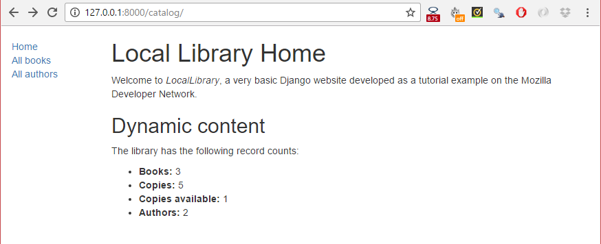

Django 튜토리얼 5부: 홈 페이지 만들기
-------------------------------------

이 문서는 저작자 동의없이 KAIST 대학정보화사업팀을 위하여 [Django Tutorial Part 5: Creating our home page](https://developer.mozilla.org/en-US/docs/Learn/Server-side/Django/Home_page)를 번역 편집하여 작성한 것입니다.

이제 [LocalLibrary](tutorialLocalLibraryWebsite.md) 웹 사이트의 홈 페이지인 첫 번째 페이지 전체를 보여주는 코드를 추가할 준비가 되었습니다. 홈 페이지에서 각 모델의 레코드 수를 표시하고 다른 페이지로 연결되는 사이드 바 탐색 링크를 제공합니다. 이 단계를 따라가면 기본 URL 맵 및 뷰 작성, 데이터베이스에서 레코드 탐색과 템플릿 사용의 실질적인 경험을 쌓을 수 있을 것입니다.

> 선수지식: [Django 소개](introduction.md)를 읽고 [Django 튜토리얼 4부: Django 관리 사이트](adminSite.md)까지 모든 튜토리얼들을 숙지하여야 합니다.
>
> 목표: (URL에 데이터 인코딩없는) 간단한 URL 맵 및 뷰를 만들고, 모델에서 데이터를 가져오고 그리고 템플릿 만드는 법을 배울 수 있습니다.

---

### 개요

모델을 정의하고 앞으로 필요한 초기 라이브러리 레코드들을 삽입한 다음, 사용자에게 저장된 정보를 보여주는 코드를 작성해야 합니다. 가장 먼저해야 할 일은 페이지에서 보여줄 정보를 결정하고 해당 리소스 반환에 사용할 URL을 정의하는 것입니다. 다음 페이지를 디스플레이하기 위한 URL 매퍼, 뷰와 템플릿을 생성합니다.

다음 다이어그램에서는 주요한 데이터 흐름과 HTTP 요청과 응답의 처리에 필요한 구성 요소들을 설명합니다. 이미 모델을 구현했으므로 작성할 주요 구성 요소는 다음과 같습니다.

-	지원되는 URL(과 URL에 인코딩된 정보)을 적절한 뷰 함수에 전달하는 URL 맵퍼.
-	뷰 함수를 사용하여 모델에서 요청된 데이터를 추출하여, 데이터를 표시할 HTML 페이지를 작성하고, 이를 브라우저에서 볼 수 있도록 페이지를 사용자에게 반환합니다.
-	뷰에서 데이터를 렌더링할 때 사용할 템플리트입니다.


다음 단계에서 볼 수 있지만, 5 페이지를 출력합니다. 이는 단일 단계에서 다루기에 너무 많은 내용입니다. 따라서 이 단계에서는 홈 페이지 구현 방법을 중점적으로 다루며 다음 단계에서 다른 페이지들을 다룰 것입니다. 그럼으로써 URL 매퍼, 뷰와 모델의 실제 작동을 완벽하게 이해할 수 있습니다.

---

### URL 리소스 정의

[LocalLibrary](tutorialLocalLibraryWebsite.md)의 이 버전은 기본적으로 최종 사용자에게 읽기 전용이므로 사이트 의 시작 페이지(홈 페이지)와 책과 저자 목록 및 상세보기를 보여주는 페이지를 제공하면 됩니다.

페이지들을 위한 URL은 다음과 같습니다.

-	<code>catalog/</code> — 홈 (인덱스) 페이지
-	<code>catalog/books/</code> — 모든 책 목록
-	<code>catalog/authors/</code> — 모든 저자 목록
-	<code>catalog/book/<i>\<id\></i></code> - 프라이머리 키 필드 값이 <i>\<id\></i>인 (기본값) 특정 책에 대한 세부 상세 뷰입니다. 예를 들어 목록의 세 번째 책의 URL은 <code>/catalog/book/3</code>입니다.
-	<code>catalog/author/<i>\<id\></i></code> - 프라이머리 키 필드 값이 <i>\<id\></i>인 (기본값) 특정 저자에 대한 세부 상세 뷰입니다. 예를 들어 목록의 11번째 저자의 URL은 <code>/catalog/author/11</code>입니다.

처음 세 URL은 인덱스 페이지, 도서 목록 및 저자 목록을 반환합니다. 이러한 URL에는 어떠한 추가 정보도 인코딩되어 있지 않으며 데이터베이스로부터 데이터를 검색하는 쿼리는 항상 같습니다. 그러나 쿼리 수행 결과는 데이터베이스의 내용에 따라 변합니다.

반대로 마지막 두 URL은 도서나 저자에 대한 자세한 정보를 표시합니다. 이 URL에는 표시할 항목을 (위에서 <id>로 표시된) ID로 인코딩합니다 . URL 매퍼는 인코딩된 정보를 추출하여 이를 뷰로 전달하며, 뷰는 데이터베이스를 검색하여 정보를 동적으로 결정합니다. URL에 정보를 인코딩함으로써 모든 도서 (또는 저자)를 처리하기 위한 URL 맵핑, 뷰와 템플리트의 단일 조합을 사용할 수 있습니다.

> <b>Note</b>: Django를 사용하여 위와 같이 URL 본문에 정보를 인코딩하거나 <code>/book/?id=6</code>와 같이 URL에 <code>GET</code> 매개 변수를 포함하여 URL을 작성할 수 있습니다. 어떤 방법을 택하든 [W3C 권장](https://www.w3.org/Provider/Style/URI)에 따라 URL을 깨끗하고 논리적이고 읽기 쉬운 상태로 유지해야 합니다.<br> Django 문서는 보다 나은 URL 디자인을 위해 URL 본문에 정보를 인코딩하는 방법을 권장합니다.

개요에서 언급했듯이 이 단계의 나머지 부분에서는 인덱스 페이지 작성 방법에 대해 설명합니다.

---

### 인덱스 페이지 작성

첫 번째 페이지는 인덱스 페이지 (catalog/)입니다. 인덱스 페이지에는 데이터베이스에 저장된 다른 레코드 "갯수"와 함께 일부 정적 HTML을 포함하고 있습니다. 이 작업을 수행하기 위해 URL 매핑, 뷰와 템플릿을 생성합니다.

> <b>Note</b>: 이 섹션에 약간의 주의를 기울이십시오. 대부분의 정보를 생성할 다른 페이지에도 적용할 수 있기 때문입니다.

#### URL 맵핑

[skeleton 웹사이트](skeletonWebsite.md)를 만들었을 때 <code>catalog/</code>로 시작하는 URL이 수신될 때마다 <i>URLConf</i> 모듈의 <code>catalog.urls</code>에서 나머지 부분 문자열을 처리하도록 <b>locallibrary/urls.py</b> 파일을 업데이트했습니다.

<code>catalog.urls</code> 모듈을 <b>locallibrary/urls.py</b>의 아래 코드에서 볼 수 있습니다.

```python3
urlpatterns += [
    path('catalog/', include('catalog.urls')),
]
```

> <b>Note</b>: Django는 import 함수 [django.urls.include()](https://docs.djangoproject.com/en/2.1/ref/urls/#django.urls.include)를 만날 때마다 지정된 끝 문자에서 URL 문자열을 분할하여, 추가 처리를 위해 include된 <i>URLconf</i> 모듈로 나머지 부분 문자열을 보냅니다.

<i>URLConf</i> 모듈에 <b>/catalog/urls.py</b>라는 플레이스홀더 파일도 만들었습니다. 그 파일에 아래 문장을 추가합니다.

```python3
urlpatterns = [
    path('', views.index, name='index'),
]
```

<code>path()</code> 함수는 다음을 정의합니다.

-	빈 문자열 <code>''</code>의 URL 패턴 : 다른 뷰를 다룰 때 URL 패턴에 대해 자세히 설명합니다.
-	URL 패턴이 감지되면 호출할 뷰 함수: <code>views.index</code>이며, 이는 <b>views.py</b> 파일의 <code>index()</code> 함수입니다.

path() 함수는 name 매개 변수도 지정합니다.이 매개 변수는 URL 매핑의 고유 식별자입니다. 이 이름을 사용하여 매퍼를 역으로 지정할 수 있습니다. 즉, 매퍼가 처리하도록 설계된 리소스를 가리키는 URL을 동적으로 만들 수 있습니다. 예를 들어 name 매개 변수를 사용하여 템플릿에 다음 링크를 추가하여 다른 페이지에서 홈 페이지로 연결할 수 있습니다.

```python3
<a href="">Home</a>.
```

> <b>Note</b>: <code><a href="/catalog/">Home</a></code>과 같이 링크를 하드 코딩할 수 있지만 홈 페이지의 패턴을 변경하면 (예 : <code>/catalog/index</code>) 템플릿은 정확하지 않은 링크를 갖게됩니다. 역방향 URL 매핑을 사용하면 훨씬 더 유연하고 영속성을 가질 수 있습니다.

#### <a name="View_(function-based)">(함수 기반) 뷰</a>

뷰는 HTTP 요청을 처리하고, 데이터베이스에서 요청된 데이터를 접근하여 HTML 템플리트를 사용하여 HTML 페이지에서 데이터를 렌더링한 다음 사용자에게 페이지를 보여주기 위하여 생성된 HTML을 HTTP 응답으로 반환하는 함수입니다. 인덱스 뷰는 이 모델을 따라 데이터베이스에 있는 <code>Book</code>, <code>BookInstance</code>, 이용 가능한 <code>BookInstance</code> 및 <code>Author</code>의 레코드 수에 대한 정보를 접근하여 이를 템플릿에 전달하여 표시합니다.

<b>catalog/views.py</b>를 열어 [render()](https://docs.djangoproject.com/en/2.1/topics/http/shortcuts/#django.shortcuts.render) 단축키 함수를 파일에서 이미 import하고 템플릿과 데이터를 사용하여 HTML 파일 생성을 확인합니다.

```python3
from django.shortcuts import render

# Create your views here.
```

파일의 끝에 다음 코드를 복사합니다.

```python3
from catalog.models import Book, Author, BookInstance, Genre

def index(request):
    """View function for home page of site."""

    # Generate counts of some of the main objects
    num_books = Book.objects.all().count()
    num_instances = BookInstance.objects.all().count()

    # Available books (status = 'a')
    num_instances_available = BookInstance.objects.filter(status__exact='a').count()

    # The 'all()' is implied by default.    
    num_authors = Author.objects.count()

    context = {
        'num_books': num_books,
        'num_instances': num_instances,
        'num_instances_available': num_instances_available,
        'num_authors': num_authors,
    }

    # Render the HTML template index.html with the data in the context variable
    return render(request, 'index.html', context=context)
```

첫 번째 줄은 모든 뷰에서 데이터에 액세스하는 데 사용할 모델 클래스를 import합니다.

뷰 함수의 첫 번째 부분은 모델 클래스의 <code>objects.all()</code> 애트리뷰트를 사용하여 레코드 수를 가져옵니다. 상태 필드 값이 'a'(Available)인 <code>BookInstance</code> 객체 목록도 가져옵니다. 이전 튜토리얼 [Django 튜토리얼 3부: 모델> 레코드 검색](models.md#Searching_for_records)(?)에서 모델 데이터를 액세스하는 방법에 대한 자세한 정보를 찾을 수 있습니다.

뷰 함수의 끝에서 <code>render()</code> 함수를 호출하여 HTML 페이지를 생성하고 페이지를 응답으로 반환합니다. 이 바로 가기 함수는 매우 일반적인 사용 사례들을 단순화하기 위해 여러 가지 다른 함수를 래핑합니다. <code>render()</code> 함수는 다음 매개 변수를 갖을 수 있습니다.

-	원래 <code>request</code> 객체인 <code>HttpRequest</code>
-	데이터에 대한 자리 표시자가 있는 HTML 템플리트
-	자리 표시자에 삽입할 데이터가 들어 있는 Python 사전인 <code>context</code> 변수

템플리트와 컨텍스트 변수에 대하여 다음 섹션에서 자세히 설명할 예정입이다. 사용자에게 실제로 뭔가를 보여줄 수 있도록 템플리트를 만들어 보겠습니다.

#### 템플레이트

템플리트는 파일(예: HTML 페이지)의 구조 또는 레이아웃을 정의하는 텍스트 파일로 실제 내용을 나타내는 자리 표시자로 이용됩니다. Django는 응용 프로그램의 '<b>templates</b>' 디렉토리에 있는 템플리트를 자동으로 찾습니다. 예를 들어 방금 추가한 인덱스 뷰의 <code>render()</code> 함수는 <b>/locallibrary/catalog/templates/</b>에 있는 <i><b>index.html</b></i> 파일을 찾으며 파일이 없으면 오류가 발생합니다. 이전 변경 사항을 저장하고 <code>127.0.0.1:8000</code>를 호출하여 브라우저에서 확인하면 매우 직관적인 오류 메시지인 "<code>TemplateDoesNotExist at /catalog/</code>"와 자세한 정보가 표시됩니다.

> <b>Note:</b>: Django는 프로젝트 설정 파일을 기반으로 기본적으로 설치된 응용 프로그램들을 검색하지만 여러 위치에서 템플리트를 찾습니다. Django가 템플리트를 찾는 방법과 지원하는 템플리트 형식에 대해 [Django 문서의 템플리트 섹션](https://docs.djangoproject.com/en/2.1/topics/templates/)에서 자세히 살펴볼 수 있습니다.

##### <a name="Extending_templates">템플리트 확장</a>

index 템플리트에는 헤드와 본문에 대한 표준 HTML 마크업과 함께 아직 작성하지 않은 사이트의 다른 페이지를 연결하는 탐색 섹션 및 소개 텍스트와 서적 데이터를 표시하는 섹션이 필요합니다. HTML 및 탐색 구조의 대부분은 사이트의 모든 페이지가 동일합니다. 모든 페이지에 표준 코드를 복제하는 대신 Django 템플리트 언어를 사용하여 기본 템플리트를 작성한 다음 확장하여 각 특정 페이지마다 다른 문구로 대체 할 수 있습니다.

다음 코드는 <b>base_generic.html</b> 파일의 기본 템플리트 샘플입니다. 샘플은 제목, 사이드바 및 <code></code>과 </code></code> 템플리트 태그로 표시된 본문이 있는 공통 HTML을 포함하고 있습니다. 블록을 비워 두거나 템플릿에서 파생 된 페이지를 렌더링할 때 사용할 기본 내용을 채울 수 있습니다.

> <b>Note</b>: 템플리트 <i>태그</i>는 템플리트에서 목록을 반복과 변수 값을 기반의 조건부 연산 수행 등에 사용할 수 있는 함수입니다. 템플리트 태그 이외에도 템플리트 구문을 사용하면 뷰에서 템플리트로 전달되는 변수를 참조하고 (예 : 문자열을 소문자로 변환하는 것과 같이) <i>템플리트 필터</i>를 사용하여 변수를 포맷할 수 있습니다.

```html
<!DOCTYPE html>
<html lang="en">
<head>
  <title>Local Library</title>
</head>
<body>
  <!-- insert default navigation text for every page -->
  <!-- default content text (typically empty) -->
</body>
</html>
```

특정 뷰에 대한 템플리트를 정의할 때 먼저 <code>extends</code> 템플리트 태그를 사용하여 기본 템플리트를 지정합니다. 아래 코드 샘플을 참조하십시오. 다음 기본 템플릿에서 처럼 <code>block/endblock</code> 섹션을 사용하여 대체할 템플리트 섹션(있는 경우)을 선언합니다.

예를 들어, 아래의 코드는 <code>extends</code> 템플리트 태그를 사용하여 <code>content</code> 블록을 다시 정의하는 방법을 보입니다. 생성된 HTML은 기본 템플리트에 정의된 코드와 구조를 갖고 있습니다. 아래 코드에서 <code>title</code> 블록은 정의한 기본 내용을 사용하지만, <code>content</code> 블록은 기본 내용 대신 새로운 내용으로 변경하였습니다.

```html



  <h1>Local Library Home</h1>
  <p>Welcome to LocalLibrary, a website developed by <em>Mozilla Developer Network</em>!</p>

```

##### <a name="The_LocalLibrary_base_template">LocalLibrary 기본 템플리트</a>

다음 코드를 <i>LocalLibrary</i> 웹사이트의 기본 템플리트으로 사용합니다. 보다시피, 여기에는 HTML 코드가 있으며, <code>title</code>, <code>sidebar</code>와 <code>comtemt</code> 블록들을 정의합니다. 모든 책과 저자의 목록에 대한 링크와 기본 제목과 기본 사이드바를 가지고 있으며, 이들을 나중에 쉽게 변경할 수 있도록 블록으로 구성합니다.

> <b>Note</b>: 다음 섹션에서 <code>url</code>과 <code>load static</code> 두 템플리트 태그를 추가로 소개합니다.

<b>allibrary/catalog/templates/</b>에 새 파일 <b>base\_generic.html</b>을 만들고 다음 코드를 파일에 복사합니다.

```html
<!DOCTYPE html>
<html lang="en">
<head>
  <title>Local Library</title>
  <meta charset="utf-8">
  <meta name="viewport" content="width=device-width, initial-scale=1">
  <link rel="stylesheet" href="https://stackpath.bootstrapcdn.com/bootstrap/4.1.3/css/bootstrap.min.css" integrity="sha384-MCw98/SFnGE8fJT3GXwEOngsV7Zt27NXFoaoApmYm81iuXoPkFOJwJ8ERdknLPMO" crossorigin="anonymous">
  <!-- Add additional CSS in static file -->
  
  <link rel="stylesheet" href="">
</head>
<body>
  <div class="container-fluid">
    <div class="row">
      <div class="col-sm-2">
      
        <ul class="sidebar-nav">
          <li><a href="">Home</a></li>
          <li><a href="">All books</a></li>
          <li><a href="">All authors</a></li>
        </ul>
     
      </div>
      <div class="col-sm-10 "></div>
    </div>
  </div>
</body>
</html>
```

템플리트에는 HTML 페이지의 레이아웃과 프리젠테이션을 개선하기 위한 [Bootstrap](http://getbootstrap.com/)인 CSS가 포함되어 있습니다. Bootstrap (또는 다른 클라이언트사이드 웹 프레임워크)을 사용하면 다양한 화면에서 적절히 표시되는 페이지를 빠르게 만들 수 있습니다.

또한 기본 템플리트는 추가로 스타일을 제공하는 로컬 CSS 파일(<b>styles.css</b>)을 참조합니다. <b>/locallibrary/catalog/static/css/</b>에 <b>styles.css</b> 파일을 만들고 다음 코드를 복사합니다.

```HTML
.sidebar-nav {
    margin-top: 20px;
    padding: 0;
    list-style: none;
}
```

##### <a name="The_index_template">index 템플리트</a>

<b>/locallibrary/catalog/templates/</b>에 새로운 HTML 파일 <b><i>index.html</i></b>을 만들고 다음 코드를 복사합니다. 이 코드는 기본 템플리트를 첫 줄을 확장하고, 템플리트의 기본 <code>content</code> 블록을 바꿔놓습니다.

```html



  <h1>Local Library Home</h1>
  <p>Welcome to LocalLibrary, a website developed by <em>Mozilla Developer Network</em>!</p>
  <h2>Dynamic content</h2>
  <p>The library has the following record counts:</p>
  <ul>
    <li><strong>Books:</strong> {{ num_books }}</li>
    <li><strong>Copies:</strong> {{ num_instances }}</li>
    <li><strong>Copies available:</strong> {{ num_instances_available }}</li>
    <li><strong>Authors:</strong> {{ num_authors }}</li>
  </ul>

```

<i>Dynamic content</i> 섹션에서 포함할 뷰 정보의 자리 표시자(<i>템플리트 변수</i>)를 선언합니다. 변수는 코드 샘플에 이중 중괄호(핸들바)로 묶은 부분입니다.

> <b>Note</b>: 템플리트 변수와 템플리트 태 (함수)를 쉽게 구별할 수 있습니다. 변수는 이중 중괄호(<code>{{num_books}}</code>)로 묶으며 태그는 퍼센트 기호(<code></code>)가 있는 단일 중괄호로 묶습니다.

뷰의 <code>render()</code> 함수 내의 <code>context</code> 사전에 전달하는 <i>키</i>를 지칭하는 변수들에 주목하여야 합니다 (아래 예제 참조). 템플리트가 렌더링될 때 변수들을 관련 값으로 대체합니다.

```python
context = {
    'num_books': num_books,
    'num_instances': num_instances,
    'num_instances_available': num_instances_available,
    'num_authors': num_authors,
}

return render(request, 'index.html', context=context)
```

##### 템플리트의 정적 파일 참조

프로젝트에서 JavaScript, CSS 및 이미지와 같은 정적 리소스를 사용하기도 합니다. 이 파일들의 위치가 알려지지 않았거나 변경될 수 있기 때문에 Django에서는 템플리트의 위치를 <code>STATIC_URL</code> 전역 설정의 상대 경로로 지정할 수 있습니다. 기본 골조 웹사이트에서 <code>STATIC_URL</code>의 값을 '<code>/static/</code>'로 설정하지만 CDN(content delivery network) 또는 다른 곳에서 호스팅할 수 있도록 선택할 수도 있습니다.

템플리트 내에서 아래 예제 코드와 같이 먼저 "static"으로 지정된 <code>load</code> 템플리트 태그를 호출하여 템플리트 라이브러리에 추가합니다. 그런 다음 <code>static</code> 템플리트 태그를 사용하여 요청하는 파일에 대한 상대 URL을 지정할 수 있습니다.

```html
<!-- Add additional CSS in static file -->

<link rel="stylesheet" href="">
```

비슷한 방법으로 페이지에 이미지를 추가할 수 있습니다. 예를 들면 다음과 같습니다.

```html


```

> <b>Note</b>: 위의 샘플은 파일의 위치를 지정하지만 Django는 기본적으로 이 정보를 제공하지 않습니다. [웹사이트 골조를 만들 때](skeletonWebsite.md) 글로벌 URL 매퍼(<code>/locallibrary/locallibrary/urls.py</code>)를 수정하여 파일을 제공하도록 개발 웹 서버를 구성하지만 운영할 때 파일이 서비스되도록 활성화해야 합니다. 나중에 이를 설명할 것입니다.

정적 파일에 대한 자세한 내용은 Django 문서의 [Managing static files](https://docs.djangoproject.com/en/2.1/howto/static-files/)를 참고하십시오.

##### URL 링크

아래 기본 템플리트에서 url 템플리트 태그를 사용했습니다.

```html
<li><a href="">Home</a></li>
```

이 태그는 <b>urls.py</b>에서 호출한 <code>path()</code> 함수의 이름과 해당 함수로 부터 연결된 뷰가 수신하는 인수 값들을 받아 리소스에 연결할 때 사용 가능한 URL을 반환합니다.

##### 템플리트의 저장 위치 구성

Django가 템플리트 폴더에서 템플리트를 검색할 수 있도록 알려주어야 합니다. 이를 위하여 다음 코드 샘플처럼 <b>settings.py</b> 파일을 편집하여 <code>TEMPLATES 'DIR'</code>에 <code>templates</code> 객체를 추가합니다.

```python
TEMPLATES = [
    {
        'BACKEND': 'django.template.backends.django.DjangoTemplates',
        'DIRS': [
            os.path.join(BASE_DIR, 'templates'),
        ],
        'APP_DIRS': True,
        'OPTIONS': {
            'context_processors': [
                'django.template.context_processors.debug',
                'django.template.context_processors.request',
                'django.contrib.auth.context_processors.auth',
                'django.contrib.messages.context_processors.messages',
            ],
        },
    },
]
```

---

### 홈 페이지 데모

이제 인덱스 페이지를 표시하는 데 필요한 모든 리소스를 만들었습니다. 서버(<code>python3 manage.py runserver</code>)를 실행하고 브라우저에서 [http://127.0.0.1:8000/](http://127.0.0.1:8000/)을 엽니다. 모든 것이 정확히 구성되어 있다면 다음 스크린 샷처럼 사이트를 볼 수 있습니다.



> <b>Note</b>: <b>All books</b>와 <b>All authors</b> 링크는 해당 페이지의 경로, 뷰와 템플리트가 정의되지 않았기 때문에 아직 작동하지 않습니다. <code>base\_generic.html</code> 템플릿에 해당 링크의 자리 표시자를 삽입했습니다.

---

### 도전

모델 쿼리, 뷰 및 템플리트에 익숙해 질 수 있기 위한 두 요청 사항이 있습니다.

1.	[LocalLibrary 기본 템플리트](#The_LocalLibrary_base_template)는 title 블록을 포함하고 있습니다. [index 템플리트](#The_index_template)에서 이 블록을 바꾸어 해당 페이지의 새로운 title 블록을 만들어보십시오.<br> ><b>Hint</b>: [템플리트 확장](#Extending_templates) 섹션에서는 블록을 만들고 다른 템플리트로 블록을 확장하는 방법을 설명합니다.
2.	특정 단어가 포함된 <i>genres</i>와 <i>books</i>의 갯수를 생성하고 (대소 문자를 구분하지 않음), 그 결과를 <code>context</code>에 전달할 수 있도록 [뷰](#View_(function-based))를 수정하십시오. <code>num_books</code>와 <code>num_instances_available</code>을 만들어 사용하는 것과 비슷한 방법으로 이를 수행합니다. 그런 다음 이러한 변수를 포함하도록 [index 템플리트](#The_index_template)를 갱신하십시오.

---

### 요약

데이터베이스의 여러 레코드와 아직 생성되지 않은 다른 페이지에 연결할 수 있는 링크를 보여주는 HTML 페이지인 사이트의 홈 페이지를 방금 만들었습니다. 이를 위하여 URL 매퍼, 뷰, 모델에서의 데이터베이스 검색, 뷰에서 템플리트로 정보 전달 및 템플리트 생성과 확장에 대한 기본적인 것들을 배웠습니다.

다음 단계에서는 이를 기반으로 웹사이트의 나머지 네 페이지를 작성합니다.

---

### 참고 문서

-	[Writing your first Django app, part 3: Views and Templates](https://docs.djangoproject.com/en/2.1/intro/tutorial03/) (Django docs)
-	[URL dispatcher](https://docs.djangoproject.com/en/2.1/topics/http/urls/) (Django docs)
-	[View functions](https://docs.djangoproject.com/en/2.1/topics/http/views/) (DJango docs)
-	[Templates](https://docs.djangoproject.com/en/2.1/topics/templates/) (Django docs)
-	[Managing static files](https://docs.djangoproject.com/en/2.1/howto/static-files/) (Django docs)
-	[Django shortcut functions](https://docs.djangoproject.com/en/2.1/topics/http/shortcuts/#django.shortcuts.render) (Django docs)

---

### 이 단원에서 아래 단계를 다룹니다.

-	[Django 소개](introduction.md)
-	[Django 개발 환경 설정](developmentEnvironment.md)
-	[Django 튜토리얼: The Local Library website](tutorialLocalLibraryWebsite.md)
-	[Django 튜토리얼 2부: 웹사이트 골조 만들기](skeletonWebsite.md)
-	[Django 튜토리얼 3부: 모델](models.md)
-	[Django 튜토리얼 4부: Django 관리 사이트](adminSite.md)
-	[Django 튜토리얼 5부: 홈 페이지 만들기](homePage.md)
-	[Django 튜토리얼 6부: 일반 목록과 상세 보기](genericViews.md)
-	[Django 튜토리얼 7부: 세션 프레임워크](sessions.md)
-	[Django 튜토리얼 8부: 사용자 인증 및 사용 권한](authentication.md)
-	[Django 튜토리얼 9부: 양식 작업](forms.md)
-	[Django 튜토리얼 10부: Django 웹 응용프로그램 테스팅](testing.md)
-	[Django 튜토리얼 11부: 운영으로 Django 전개](deployment.md)
-	[Django 웹 응용프로그램 보안](webApplicationSecurity.md)
