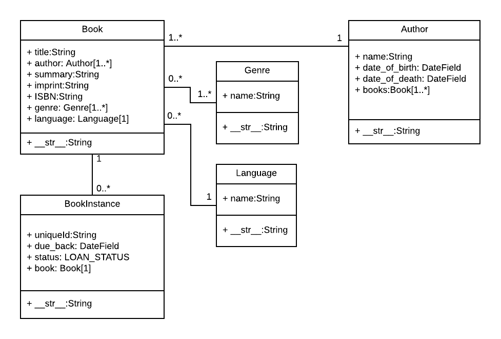

Django 튜토리얼 3부: 모델
-------------------------

이 단원에서 LocalLibrary 웹사이트의 모델을 정의하는 방법을 설명합니다. 모델이 무엇인지, 모델을 선언하는 방법 및 주요 필드 타입 중 일부를 설명합니다. 또한 모델 데이터를 접근할 수 있는 몇몇 주요 방법을 간략하게 보여줍니다.

> 선수지식: [Django 튜토리얼 2부: 웹사이트 골조 만들기](skeletonWebsite.md).
>
> 목표: 자신의 모델을 디자인하고 생성할 수 있도록 필드를 적절히 선택합니다.

---

### 개요

Django 웹 어플리케이션은 모델이라 하는 Python 객체를 통해 데이터를 접근하고 관리합니다. 모델은 필드 타입을 비롯하여 가능한 최대 길이, 기본값, 선택 목록 옵션, 문서의 도움말 텍스트, 양식의 텍스트 레이블 등 데이터 구조를 정의합니다. 모델의 정의는 사용하는 데이터베이스와는 독립적인 것입니다. 이는 프로젝트 설정의 일부로 여러 설정 항목 중 하나입니다. 특정 데이터베이스의 사용을 결정했다면, 데이터베이스와 직접적으로 상호작용할 필요는 없습니다. 즉 데이터베이스를 다루는 코드와 별개 코드로 모델 구조를 다루는 코드를 작성할 수 있습니다. Django는 개발자를 위하여 데이터베이스 접근에 필요한 모든 복잡한 작업을 처리합니다.

이 단원에서는 [LocalLibrary 웹사이트](tutorialLocalLibraryWebsite.md) 예제의 모델을 정의하고 접근하는 방법을 설명합니다.

---

### LocalLibrary 모델 설계

모델을 코딩을 시작하기 전에 저장해야 할 데이터와 다른 객체들 간의 관계에 대해 생각해 볼 필요가 있습니다.

(제목, 요약, 저자, 작성 언어, 카테고리, ISBN와 같은) 도서에 대한 정보를 저장해야 하며 같은 도서를 여러 권(책) 소장할 수 있어야 합니다 (도서관내에서 고유한 ID, 책의 가용 상태 등). 저자에 대하여 이름보다 더 많은 정보를 저장해야 합니다. 또한 동일하거나 유사한 이름의 저자가 여러 명 있을 수도 있습니다. 도서 제목, 저자, 작성 언어 및 범주에 따라 도서를 정렬 할 수 있어야 합니다.

모델을 설계할 때 모든 "객체"(관련되는 정보 그룹, 클래스)에 대해 별도의 모델을 만드는 것이 좋습니다. 이 경우 명백한 객체는 도서, 도서 인스턴스와 저자입니다.

선택 항목을 웹사이트 자체에 하드 코딩하는 대신 모델을 사용하여 선택 목록(예: 드롭다운 메뉴)으로 표현할 수 있습니다. 모든 옵션을 아직 결정하지 못하였거나 추후 변경될 수 있을 때 사용하기를 권장합니다. 이 경우 모델의 확실한 후보자로는 장르(예: 공상 과학 소설, 프랑스 시 등), 언어(예: 영어, 프랑스어, 일본어) 등을 들 수 있습니다.

모델과 필드를 결정한 다음, 관계에 대해 생각합니다. Django에서는 일대일(<code>OneToOneField</code>), 일대다(<code>ForeignKey</code>)와 다대다(<code>ManyToManyField</code>) 관계를 정의할 수 있습니다.

이를 염두에 두고, 아래 UML 연관(association) 다이어그램은 정의할 모델(사각형)들을 보여주고 있습니다. 위에서 설명하였듯이 (도서의 일반적인 세부 사항을 정의하는) 도서 모델, (시스템에서 사용할 수 있는 책의 특정 상태를 나타내는) 도서 인스턴스(책))와 저자를 생성합니다. 또한 장르에 대한 모델을 정의하기로 했기 때문에 관리 인터페이스를 통해 값을 직접 삽입하거나 선택할 수 있습니다. <code>BookInstance:status</code>에 대한 모델을 정의하지 않습니다. <code>LOAN_STATUS</code> 값은 변경되지 않을 것이므로 하드 코딩합니다. 각 사각형에서 모델 이름, 필드 이름, 타입 그리고 메소드 및 리턴 타입을 볼 수 있습니다.

다이어그램은 또한 관계의 다중성(cardinality)과 함께 모델간의 관계를 보여줍니다. 다중성은 다이어그램에 숫자로 표시되여, 관계에 나타날 수 있는 각 모델 인스탄스의 (최소와 최대) 수를 나타냅니다. 예를 들어 두 사각형 Book과 Genre를 연결하는 선은 도서와 장르가 관계가 있음을 표현합니다. Book-Genre 관계에서 Genre 모델에 표시된 숫자는 책은 적어도 하나 이상의 장르에 속하여야 함을 보여 주고 Book 모델에 표시된 숫자는 한 장르에 0 또는 다수의 도서가 속할 수 있음을 보여줍니다.



> <b>Note</b>: 다음 섹션은 모델을 정의하고 사용하는 방법을 설명하는 기본 입문서입니다. 읽으면서 위 다이어그램에서 각 모델을 어떻게 정의할 것인지 생각하여 봅니다.

---

### 모델 입문

이 섹션은 모델을 정의하는 방법과 더 중요한 모델의 필드 및 필드 인수에 대한 간략한 개요입니다.

#### 모델 정의

일반적으로 어플리케이션의 <b>models.py</b> 파일에서 모델을 정의합니다. 모델은 <code>django.db.models.Model</code>의 서브클래스로 구현되며 필드, 메소드와 메타 데이터로 이루어져 있습니다. 아래 코드는 <code>MyModelName</code>이라는 "전형적인" 모델을 보입니다.

```python
from django.db import models

class MyModelName(models.Model):
    """A typical class defining a model, derived from the Model class."""

    # Fields
    my_field_name = models.CharField(max_length=20, help_text='Enter field documentation')
    ...

    # Metadata
    class Meta:
        ordering = ['-my_field_name']

    # Methods
    def get_absolute_url(self):
        """Returns the url to access a particular instance of MyModelName."""
        return reverse('model-detail-view', args=[str(self.id)])

    def __str__(self):
        """String for representing the MyModelName object (in Admin site etc.)."""
        return self.my_field_name
```

아래에서 모델 내부의 각 기능에 대해 자세히 살펴 보겠습니다.

##### 필드 (Fields)

모델은 하나 이상의 필드를 가질 수 있습니다. 각 필드는 데이터베이스 테이블의 데이터 열을 나타냅니다. 데이터베이스 레코드(행)는 각 필드 값들로 이루어집니다. 아래의 예를 살펴 보겠습니다.

```python
my_field_name = models.CharField(max_length=20, help_text='Enter field documentation')
```

위 예제에는 <code>models.CharField</code> 타입의 <code>my_field_name</code>이라는 필드 하나만 있습니다. 이 필드 타입은 영숫자 문자열입니다. 특정 클래스를 사용하여 필드 타입을 정의할 수 있습니다. HTML 양식에서 값이 입력될 때 유효성 검증과 데이터베이스에 데이터를 삽입할 때 레코드 타입 판별에 이를 사용합니다. 필드 타입은 필드를 저장하거나 사용하는 방법을 더 자세히 지정하는 인수를 사용할 수도 있습니다. 이를 위하여 필드를 정의할 때 두 개의 인수를 갖을 수 있습니다.

-	<code>max_length = 20</code>: 필드의 최대 길이는 20 자입니다.
-	<code>help_text = 'Enter field documentation'</code>: 사용자가 HTML 양식에 값을 입력할 때 도움이 될 수 있는 레이블을 위한 텍스트입니다.

필드 이름은 쿼리와 템플리트에서 이를 참조하는 데 사용됩니다. 레이블을 사용하여 하나 이상의 필드를 참조할 수 있습니다. (verbose_name으로) 인수를 사용하거나 필드의 변수 이름의 첫 문자를 대문자로 바꾸고 밑줄을 공백으로 대체하여 레이블을 지정합니다 (예 : my_field_name으 기본 레이블은 My field name).

필드를 선언하는 순서는 양식에서 모델을 렌더링하는 경우 (예: admin 사이트) 기본 순서에 영향을 미치지만 이를 변경할 수 있습니다.

#### 공통 필드 인수

필드 타입을 선언할 때 공통적으로 많이 사용되는 인수는 다음과 같습니다.

-	[help_text](https://docs.djangoproject.com/en/2.1/ref/models/fields/#help-text): 위에서 설명하였듯이 HTML 양식(예: admin 사이트)에 레이블 텍스트를 제공합니다.
-	[verbose_name](https://docs.djangoproject.com/en/2.1/ref/models/fields/#verbose-name): 필드 레이블에 사용하는 사용자가 읽을 수 있는 필드 이름. 지정하지 않을 경우 Django는 필드 이름을 기본 상세 정보 이름으로 사용합니다.
-	[default](https://docs.djangoproject.com/en/2.1/ref/models/fields/#default): 필드의 기본값. 값 또는 호출 가능한 객체일 수 있습니다. 이 경우 새로운 레코드를 삽입할 때마다 객체를 호출합니다.
-	[null](https://docs.djangoproject.com/en/2.1/ref/models/fields/#null): <code>True</code>이면 데이터베이스에 해당되는 필드에 값이 없는 경우 Django는 <code>NULL</code> 값을 저장합니다. (<code>CharField</code>는 빈 문자열을 대신 저장합니다). 기본값은 <code>False</code>입니다.
-	[blank](https://docs.djangoproject.com/en/2.1/ref/models/fields/#blank): <code>True</code>이면 양식에서 값을 비운 채로 입력할 수 있습니다. 기본값은 <code>False</code>입니다. 즉, Django의 양식 유효성 검사는 값을 필히 입력하도록 합니다. 빈 값을 허용하려는 경우 데이터베이스에 적절하게 값을 표시할 수 있어야 하므로 이는 종종 <code>null=True</code>와 함께 사용됩니다.
-	[choices](https://docs.djangoproject.com/en/2.1/ref/models/fields/#choices): 필드 값 입력을 위한 선택 항목 그룹입니다. 이 옵션을 적용하면 기본 양식 필드 위젯은 표준 텍스트 필드 대신 이 선택 항목을 보여주는 선택 상자를 디스플레이합니다.
-	[primary_key](https://docs.djangoproject.com/en/2.1/ref/models/fields/#primary-key): <code>True</code>이면 현재 필드를 모델의 기본 키(primary key)로 설정합니다. (기본 키는 테이블 레코드를 고유하게 식별할 수 있도록 지정된 데이터베이스 열입니다. 기본 키를 지정하지 않으면 Django는 레코드를 고유하게 식별할 수 있는 필드를 자동으로 생성하여 추가합니다.

다른 여러 옵션이 있습니다. [여기에서 전체 필드 옵션 목록](https://docs.djangoproject.com/en/2.1/ref/models/fields/#field-options)을 볼 수 있습니다.

#### 공통 필드 타입

다음은 일반적으로 많이 사용되는 필드 타입에 대한 설명입니다.

-	[CharField](https://docs.djangoproject.com/en/2.1/ref/models/fields/#django.db.models.CharField)는 고정 길이 문자열을 정의하기 위하여 사용됩니다. 저장할 데이터의 최대 길이 <code>max_length</code>를 지정해야 합니다.
-	[TextField](https://docs.djangoproject.com/en/2.1/ref/models/fields/#django.db.models.TextField)는 임의의 길이의 문자열을 위하여 사용됩니다. 필드의 max_length를 지정할 수 있지만 필드를 양식에 표시할 때만 사용됩니다 (데이터베이스에는 적용되지 않음).
-	[IntegerField](https://docs.djangoproject.com/en/2.1/ref/models/fields/#django.db.models.IntegerField)는 정수 값을 저장하고 양식에 입력된 값이 정수임을 검사합니다.
-	[DateField](https://docs.djangoproject.com/en/2.1/ref/models/fields/#datefield) 와 [DateTimeField](https://docs.djangoproject.com/en/2.1/ref/models/fields/#datetimefield)는 (각각 <code>datetime.date</code>와 <code>datetime.datetime</code> Python 객체로) 날짜와 날짜 시간 정보를 저장하고 표시하는 데 사용됩니다. (상호 배타적인) 매개 변수 <code>auto_now = True</code> (모델을 저장할 때마다 필드를 현재 날짜로 설정), <code>auto_now_add</code> (모델이 처음 생성된 날짜만 설정) 또는 default (사용자가 재정의할 수 있는 기본 날짜로 설정)로 이 필드를 선언할 수 있습니다.
-	[EmailField](https://docs.djangoproject.com/en/2.1/ref/models/fields/#emailfield)는 전자 메일 주소를 저장하고 유효성을 검사하는 데 사용됩니다.
-	[FileField](https://docs.djangoproject.com/en/2.1/ref/models/fields/#filefield) 및 [ImageField](https://docs.djangoproject.com/en/2.1/ref/models/fields/#imagefield)는 각각 파일과 이미지를 업로드하는 데 사용됩니다 (<code>ImageField</code>에서는 업로드한 파일이 이미지라는 추가 유효성 검사만 추가합니다). 이 경우 업로드된 파일의 저장 방법과 위치를 정의하기 위하여 매개변수를 사용합니다.
-	[AutoField](https://docs.djangoproject.com/en/2.1/ref/models/fields/#autofield)는 자동으로 증가하는 <code>IntegerField</code>의 특수한 타입입니다. 명시적으로 기본 키를 지정하지 않으면 이 타입으로 기본 키를 모델에 자동으로 추가합니다.
-	[ForeignKey](https://docs.djangoproject.com/en/2.1/ref/models/fields/#foreignkey)는 다른 모델과 일대다 관계를 지정하는 데 사용됩니다 (예: 자동차의 제조업체는 하나이지만 제조업체는 많은 자동차를 생산한다). 관계의 "한쪽" 모델이 다른 모델의 기본 키를 갖는 모델입니다.
-	[ManyToManyField](https://docs.djangoproject.com/en/2.1/ref/models/fields/#manytomanyfield)는 다대다 관계를 지정하는 데 사용됩니다 (예: 책은 여러 장르에 속할 수 있으며 각 장르에는 여러 도서가 있음). 라이브러리 앱에서는 <code>ForeignKeys</code>와 매우 유사하게 사용하지만, 그룹간에 관계를 설명하는 경우 더 복잡한 방법으로 사용될 수 있습니다. 이 경우 <code>on_delete</code> 매개변수를 사용하여 연관된 레코드가 삭제될 때 수행되는 작업을 정의할 수 있습니다 (예: <code>models.SET_NULL</code>은 단순히 값을 <code>NULL</code>로 변경합니다).

다른 숫자 타입의 필드 (큰 정수, 작은 정수, 부동 소수점), 불리언, URL, 슬러그, 고유 ID, 기타 "시간 관련" 정보 (지속 시간, 시간 등) 등을 포함하여 많은 다른 타입이 있습니다. [여기에서 전체 목록](https://docs.djangoproject.com/en/2.1/ref/models/fields/#field-types)을 볼 수 있습니다.

##### 메타데이터

<code>Meta</code> 클래스를 선언하여 모델에 대한 모델 레벨 메타 데이터를 선언할 수 있습니다.

```python
class Meta:
    ordering = ['-my_field_name']
```

메타 데이터의 가장 유용한 기능 중 하나는 모델에 대하여 쿼리할 때 반환되는 레코드의 <i>기본 정렬 순서</i>를 제어하는 것입니다. <i>정렬 순서</i> 애트리뷰트와 일치하도록 필드 이름 순서를 지정하여 이 작업을 수행할 수 있습니다. 정렬 순서는 필드 타입에 따라 달라집니다 (문자 필드는 사전 순으로 정렬하고 날짜 필드는 시간 순으로 정렬합니다). 위의 예처럼 역순으로 정렬 순서를 바꾸려면 필드 이름 앞에 마이너스 기호 (-)를 붙입니다.

예를 들어, 기본적으로 책을 정렬하려면 아래와 같이 작성합니다.

```python
ordering = ['title', '-pubdate']
```

제목을 A-Z 알파벳 순으로, 그리고 제목이 깉으면 출판 날짜순으로 최신에서 가장 오래된 순서로 책을 정렬합니다.

또 다른 공통 애트리뷰트는 <code>verbose_name</code>으로, 단수 또는 복수로 양식에 나타나는 클래스에 대한 자세한 이름입니다.

```python
verbose_name = 'BetterName'
```

다른 유용한 애트리뷰트를 사용하면 모델에 대한 새로운 "접근 권한" (기본 권한을 자동으로 적용함)을 만들고 적용하거나, 다른 필드를 기반으로 정렬하거나 "추상" 클래스(레코드를 생성할 수 없지만 대신 다른 모델을 생성하기 위하여 속성을 상속할 수 있는 기본 클래스)를 선언할 수 있습니다.

다른 메타 데이터 옵션 중 대부분은 모델이 사용하는 데이터베이스와 데이터 저장 방법을 제어할 목적으로 사용합니다 (모델을 기존 데이터베이스에 매핑해야 하는 경우에만 유용합니다).

메타 데이터 옵션의 전체 목록은 [모델 메타 데이터 옵션](https://docs.djangoproject.com/en/2.1/ref/models/options/)(Django 문서)에서 확인할 수 있습니다.

##### 메소드

모델에는 메소드가 있을 수 있습니다.

<b>최소한 모든 모델에서 표준 Python 클래스 메소드 \_\_str \_\_()을 정의하여 각 객체에 대해 사람이 읽을 수 있는 문자열을 반환해야 합니다.</b> 이 문자열은 admin 사이트에서 개별 레코드를 나타내는 데 (그리고 모델 인스턴스를 참조해야 하는 모든 곳에) 사용됩니다. 종종 이는 모델로 부터 제목 또는 이름 필드를 반환합니다.

```python
def __str__(self):
    return self.field_name
```

Django 모델은 <code>get_absolute_url()</code>라는 또 다른 공통 메소드를 지원합니다. 이는 웹사이트에서 모델의 개별 레코드를 출력하기 위한 URL을 반환합니다 (이 방법을 정의하면 Django는 자동으로 admin 사이트의 모델 레코드 편집 화면에 "View on Site" 버튼을 추가합니다). <code>get_absolute_url()</code>의 일반적인 패턴은 다음과 같습니다.

```python
def get_absolute_url(self):
    """Returns the url to access a particular instance of the model."""
    return reverse('model-detail-view', args=[str(self.id)])
```

> <b>Note</b>: 모델의 개별 레코드를 출력하기 위해 <code>/myapplication/mymodelname/2</code>(여기서 "2"는 특정 레코드의 <code>id</code>임)와 같은 URL을 사용한다고 가정하면, 응답과 id를 (레코드를 출력하는 데 필요한 작업을 수행하는) "model detail view"로 보내기 위한 URL 매퍼를 만들어야 합니다. 위의 <code>reverse()</code> 함수는 정확한 포맷의 URL을 생성하기 위해 url mapper를 역으로 변환할 수 있습니다 (위의 경우 '<i>model-detail-view</i>')
>
> 물론 이를 작동시키려면 URL 매핑, 뷰 및 템플리트을 작성해야 합니다.

원하는 다른 메소드도 정의할 수 있으며 매개변수가 없다면 코드 또는 템플리트에서 메소드를 호출 할 수 있습니다.

#### 모델 관리

모델 클래스를 정의하였으면 레코드를 생성, 업데이트 또는 삭제하고, 쿼리를 실행하여 모든 레코드 또는 레코드 일부를 검색할 수 있습니다. 뷰를 정의할 때 이를 수행하는 방법을 자세히 설명하겠지만 여기서는 간단히 요약합니다.

##### 레코드의 생성과 변경

레코드를 생성하려면 모델 인스턴스를 정의한 다음 <code>save()</code>를 호출합니다.

```python
# Create a new record using the model's constructor.
record = MyModelName(my_field_name="Instance #1")

# Save the object into the database.
record.save()
```

> <b>Note</b>: primary_key를 선언하지 않은 경우 필드 <code>id</code>를 자동으로 추가하여 이를 기본 키로 지정합니다. 새로운 레코드를 삽입하면 필드 <code>id</code>을 자동으로 생성하여 함께 저장됩니다. 위의 레코드를 저장한 후, 이 필드를 검색할 수 있으며 값은 1입니다.

도트 구문을 사용하여 새로운 레코드의 필드에 접근하고 값을 변경할 수 있습니다. 수정된 값을 데이터베이스에 저장하려면 <code>save()</code>를 호출해야 합니다.

```python
# Access model field values using Python attributes.
print(record.id) # should return 1 for the first record.
print(record.my_field_name) # should print 'Instance #1'

# Change record by modifying the fields, then calling save().
record.my_field_name = "New Instance Name"
record.save()
```

##### 레코드 검색 {#Searching_for_records}

(베이스 클래스가 제공하는) 모델의 <code>objects</code> 애트리뷰트를 사용하여 주어진 조건을 만족하는 레코드를 검색할 수 있습니다.

> <b>Note</b>: "abstract" 모델과 필드 이름을 사용하여 레코드를 검색하는 방법을 설명하는 것은 다소 혼란스러울 수 있습니다. 아래의 설명에서 <code>title</code>과 <code>genre</code> 필드가 있는 <code>Book</code> 모델을 참조하며, 장르는 단일 필드 <code>name</code>만으로 이루어진 모델이기도 합니다.

<code>objects.all()</code>을 사용하여 모델에 대한 모든 레코드를 <code>QuerySet</code>으로 가져올 수 있습니다. <code>QuerySet</code>은 iterable 객체입니다. 즉, 반복과 루프에 사용할 수 있는 객체들로 이루어져 있습니다.

```python
all_books = Book.objects.all()
```

Django의 <code>filter()</code> 메소드가 반환하는 <code>QuerySet</code>은 특정 <b>텍스트</b> 또는 <b>숫자</b> 필드에 특정 조건을 사용하여 필터링할 수 있습니다. 예를 들어, 제목에 "wild"가 포함된 책을 필터링하고 그 갯수를 얻으려면 다음과 같이 합니다.

```python
wild_books = Book.objects.filter(title__contains='wild')
number_wild_books = Book.objects.filter(title__contains='wild').count()
```

<code>field\_name\_\_match_type</code> 형식을 사용하여 필터 매개변수 이름에 조건 검사 필드와 조건 유형을 정의합니다 (<code>title</code>과 <code>contains</code> 사이 <i>두 개의 밑줄</i>에 유의하십시오). 위의 예에서는 대소 문자를 구분하여 제목을 필터링하고 있습니다. <code>icontains</code> (대소 문자를 구분하지 않음), <code>iexact</code> (대소 문자를 구분하지 않는 일치), <code>exact</code> (대소 문자를 구별하는 일치) 및 <code>in</code>, <code>gt</code> (보다 큼), <code>startswith</code> 등 많은 다른 조건 연산자를 조건 유형에 사용할 수 있습니다. [여기에서 전체 목록](https://docs.djangoproject.com/en/2.1/ref/models/querysets/#field-lookups)을 볼 수 있습니다.

어떤 경우에는 다른 모델과 일대다 관계를 정의하는 필드(예 : <code>ForeignKey</code>)를 필터링합니다. 이 경우 두 개의 밑줄을 추가로 사용하여 관련 모델의 필드로 "인덱싱"할 수 있습니다. 예를 들어 특정 genre로 Book을 필터링하려면 다음과 같이 <code>genre</code> 필드를 통해 <code>name</code> 필드로 인덱싱할 수 있습니다.

```python
# Will match on: Fiction, Science fiction, non-fiction etc.
books_containing_genre = Book.objects.filter(genre__name__icontains='fiction')
```

밑줄 (\_\_)을 사용하여 원하는 만큼 여러 단계로 관계 (<code>ForeignKey</code>/<code>ManyToManyField</code>)를 탐색할 수 있습니다. 예를 들어, 다른 타입들을 갖고 "cover" 관계가 선언되어 있는 <code>Book</code>은 <code>type\_\_cover\_\_name\_\_exact = 'hard'</code>에서와 같이 매개변수 이름으로 사용할 수 있습니다.

관련 모델의 역방향 검색, 필터 연결, 더 적은 결과 집합 반환 등 쿼리를 통해 훨씬 더 많은 작업을 수행 할 수 있습니다. 자세한 내용은 [쿼리 작성](https://docs.djangoproject.com/en/2.1/topics/db/queries/) (Django Docs)를 참고하십시오.

---

### LocalLibrary 모델 정의

이 섹션에서 라이브러리 모델 정의를 시작합니다. (디렉토리 <i>/locallibrary/catalog/</i>에 있는) <i>models.py</i>를 엽니다. 페이지 상단의 문장들은 상속하는 모델 베이스 클래스 <code>models.Model</code>을 포함하는 모델 모듈을 import 합니다.

```python
from django.db import models

# Create your models here.
```

#### Genre 모델

아래 <code>Genre</code> 모델 코드를 <code>models.py</code> 파일의 맨 아래에 복사합니다. 이 모델은 픽션 또는 논픽션, 로맨스 또는 전쟁물 등 도서 카테고리에 대한 정보를 저장합니다. 위에서 언급하였듯이 가능한 값을 하드 코딩하지 않고 데이터베이스를 통해 관리할 수 있도록 Genre를 텍스트가 아닌 모델로 작성합니다.

```python
class Genre(models.Model):
    """Model representing a book genre."""
    name = models.CharField(max_length=200, help_text='Enter a book genre (e.g. Science Fiction)')

    def __str__(self):
        """String for representing the Model object."""
        return self.name
```

이 모델은 장르를 기술하기 위하여 단일 <code>CharField</code> 필드(<code>name</code>)만 정 정의합니다 (이 필드의 길이는 최대 200 자이며 <code>help\_text</code>가 있습니다.) 모델의 끝에 <code>\_\_str\_\_()</code> 메소드를 선언합니다. 이 메소드는 단순히 장르의 특정 레코드 필드 이름을 반환합니다. 상세한 이름을 특별히 정의하지 않았으므로 이 필드를 양식에서 <code>Name</code>이라고 합니다.

#### Book 모델

아래 <code>Book</code> 모델을 다시 파일 아래쪽에 복사합니다. 도서 모델은 일반적으로 소장한 도서에 대한 모든 정보를 나태내지만 대출에 사용할 수 있는 특정 물리적 "인스턴스" 또는 "책"은 아닙니다. 이 모델은 <code>CharField</code>를 사용하여 책의 <code>title</code>과 <code>isbn</code>을 선언합니다 (첫 번째 명명되지 않은 매개변수를 사용한다면 기본 레이블이 "Isbn"이므로 이를 사용하겠지만 <code>isbn</code>의 해당 레이블을 "ISBN"으로 지정하는 방법에 유의하십시오). 이 텍스트는 꽤 길 수 있기 때문에 모델은 <code>summary</code>을 위하여 <code>TextField</code>로 선언합니다.

```python
from django.urls import reverse # Used to generate URLs by reversing the URL patterns

class Book(models.Model):
    """Model representing a book (but not a specific copy of a book)."""
    title = models.CharField(max_length=200)

    # Foreign Key used because book can only have one author, but authors can have multiple books
    # Author as a string rather than object because it hasn't been declared yet in the file
    author = models.ForeignKey('Author', on_delete=models.SET_NULL, null=True)

    summary = models.TextField(max_length=1000, help_text='Enter a brief description of the book')
    isbn = models.CharField('ISBN', max_length=13, help_text='13 Character <a href="https://www.isbn-international.org/content/what-isbn">ISBN number</a>')

    # ManyToManyField used because genre can contain many books. Books can cover many genres.
    # Genre class has already been defined so we can specify the object above.
    genre = models.ManyToManyField(Genre, help_text='Select a genre for this book')

    def __str__(self):
        """String for representing the Model object."""
        return self.title

    def get_absolute_url(self):
        """Returns the url to access a detail record for this book."""
        return reverse('book-detail', args=[str(self.id)])
```

장르는 <code>ManyToManyField</code>이므로 도서는 여러 장르에 속할 수 있으며 또한 한 장르에는 많은 도서들이 있을 수 있습니다. 저자는 <code>ForeignKey</code>로 선언되므로 책에는 단 한 명의 저자가 있지만 저자는 많은 책을 쓸 수 있습니다 (실제로 책에는 여러 명의 저자가 있지만 여기에서는 고려하지 않습니다).

두 필드 타입 모두에서 관련 모델 클래스 또는 관련 모델의 이름을 포함하는 문자열을 사용하여 첫 번째 이름없는 매개변수로 모델 클래스를 선언합니다. 연관된 클래스가 참조되기 전에 이 파일에 아직 정의되지 않은 경우 모델 이름을 문자열로 사용해야합니다! <code>author</code> 필드에서 관심을 끄는 다른 매개변수는 <code>null=True</code>로, 저자가 선택되지 않은 경우 그리고 데이터베이스에 <code>Null</code> 값을 저장할 수 있으며, 연결된 저자 레코드를 삭제하였을 때 <code>on_delete=models.SET_NULL</code>은 저자 값을 <code>Null</code>로 설정합니다.

이 모델은 \_\_str\_\_()을 정의하여 도서의 <code>title</code> 필드를 사용하여 <code>Book</code> 레코드를 나타냅니다. 마지막 메소드인 <code>get\_absolute\_url()</code>은 이 모델의 레코드에 접근할 수 있도록 URL을 반환합니다 (이 작업을 수행하려면 <code>book-detail</code>이라는 이름의 URL 매핑을 정의하고 관련 뷰와 템플리트를 정의해야 합니다).

#### BookInsatance 모델

다음 <code>BookInstance</code> 모델(아래 참조)을 다른 모델 아래에 복사하십시오. <code>BookInstance</code>는 대출 가능한 도서의 특정 사본(책)을 나타내며 책이 열람 가능한지 또는 반납 예정 날짜, "인쇄물" 또는 버전 정보 및 도서관의 책 고유 id에 대한 정보를 저장합니다.

필드와 메소드 중 일부는 이미 설명한 것입니다. 모델에서 사용하는

-	연결된 <code>Book</code>을 식별하는 <code>ForeignKey</code>(도서의 여러 사본(책)들이 있을 수 있지만 책은 오직 한 <code>Book</code>에만 해당)와
-	도서의 imprint(특정 릴리스)를 나타내는 <code>CharField</code>입니다.

```python
import uuid # Required for unique book instances

class BookInstance(models.Model):
    """Model representing a specific copy of a book (i.e. that can be borrowed from the library)."""
    id = models.UUIDField(primary_key=True, default=uuid.uuid4, help_text='Unique ID for this particular book across whole library')
    book = models.ForeignKey('Book', on_delete=models.SET_NULL, null=True)
    imprint = models.CharField(max_length=200)
    due_back = models.DateField(null=True, blank=True)

    LOAN_STATUS = (
        ('m', 'Maintenance'),
        ('o', 'On loan'),
        ('a', 'Available'),
        ('r', 'Reserved'),
    )

    status = models.CharField(
        max_length=1,
        choices=LOAN_STATUS,
        blank=True,
        default='m',
        help_text='Book availability',
    )

    class Meta:
        ordering = ['due_back']

    def __str__(self):
        """String for representing the Model object."""
        return f'{self.id} ({self.book.title})'
```

또한 몇 가지 새로운 필드 타입을 선언합니다.

-	이 모델의 <code>primary_key</code>로 설정하기 위한 <code>id</code> 필드로 <code>UUIDField</code>를 사용합니다. 각 인스턴스에 대해 전역적으로 (라이브러리에 있는 모든 책에 대해 하나씩) 고유한 값을 이 필드 타입에 할당합니다.
-	<code>due\_back</code> 일(대출 또는 유지 관리 후 책이 가용 상태로 되는 예상 날짜)을 저장하기 위하여 <code>DateField</code>를 사용합니다. (책의 가용 상태를 나타내는) 이 값은 <code>blank</code> 또는 <code>null</code>일 수 있습니다. 모델 메타 데이터(Class Meta)는 이 필드를 사용하여 쿼리 결과로 반환할 레코드를 정렬합니다.
-	<code>status</code>는 선택 목록을 정의하는 <code>CharField</code>입니다. 보시다시피, key-value 쌍으로 튜플을 정의하고, 이를 선택 인수로 전달합니다. key-value 쌍의 값은 사용자가 선택할 수 있도록 보이는 값이며, 키는 옵션을 선택하면 실제로 저장되는 값입니다. 또한 서가에 정돈되기 전에는 가용하지 않는 책을 생성하여야 하므로 'm'(maintenance)을 기본값으로 설정합니다.

모델 \_\_str\_\_()은 고유 id와 연결된 <code>Book</code> 제목의 조합을 사용하여 <code>BookInstance</code> 객체를 나타냅니다.

> <b>Note</b>: Python
>
> -	Python 3.6부터는 <code>f'{self.id} ({self.book.title})'</code>와 같은 포맷 문자열 리터럴 (f-strings라고도 함)을 사용할 수 있습니다.
>
> -	이전 버전에서 [문자열 format 메소드](https://www.python.org/dev/peps/pep-3101/) 구문을 사용하고 있었으며, 이것은 Python에서 문자열을 포맷팅하는 방법이기도 합니다 (예 : <code>'{0} ({1})'.format(self.id, self.book.title))</code>.
>

#### Author 모델

<b>models.py</b>의 기존 코드 아래에 <code>Author</code> 모델(아래)을 복사합니다.

이제 필드와 메소드에 익숙해야 합니다. 이 모델은 이름, 성, 생년월일 및 사망일 (선택 사항으로)로 저자를 정의합니다. 기본적으로 <code>\_\_str\_\_()</code>은 <i>성</i>, <i>이름</i> 순서로 성명을 반환하도록 지정합니다. <code>get_absolute_url()</code> 메소드는 개별 저자의 디스플레이를 위한 <code>author-detail</code> URL의 역 매핑입니다.

```python
class Author(models.Model):
    """Model representing an author."""
    first_name = models.CharField(max_length=100)
    last_name = models.CharField(max_length=100)
    date_of_birth = models.DateField(null=True, blank=True)
    date_of_death = models.DateField('Died', null=True, blank=True)

    class Meta:
        ordering = ['last_name', 'first_name']

    def get_absolute_url(self):
        """Returns the url to access a particular author instance."""
        return reverse('author-detail', args=[str(self.id)])

    def __str__(self):
        """String for representing the Model object."""
        return f'{self.last_name}, {self.first_name}'
```

---

### 데이터베이스 마이그레이션 재수행

이제 모든 모델을 작성하였습니다. 이제 데이터베이스 마이그레이션을 다시 실행하여 모델을 데이터베이스에 추가하십시오.

```bash
python3 manage.py makemigrations
python3 manage.py migrate
```

---

### 도전! 언어 모델

지역의 후원자가 다른 언어(예: 페르시아어)로 쓰여진 책을 기부한다고 가정합니다. 문제는 도서관 웹사이트에서 이 책들을 잘 표현할 방법을 찾아 모델에 추가하는 것입니다.

고려해야 할 사항은 아래와 같습니다.

-	"언어"가 Book, BookInstance 또는 다른 객체와 연관되어야 합니까?
-	다른 언어를 지원하기 위하여 모델, 텍스트 필드 또는 하드 코딩된 선택옵션 중 어느 것을 사용하여야 합니까?

결정한 후에는 필드를 추가하십시오. 해답은 [여기 Github](https://github.com/mdn/django-locallibrary-tutorial/blob/master/catalog/models.py)를 찾아 보십시오.

모델을 변경 한 후 데이터베이스 마이그레이션을 다시 실행하여 변경 사항을 추가해야 합니다.

```bash
python3 manage.py makemigrations
python3 manage.py migrate
```

---

### 요약

이 단원에서는 모델을 정의하는 방법을 설명하고, 다음 이를 응용하여 <i>LocalLibrary</i> 웹사이트에 적합한 모델을 설계하고 구현했습니다.

이제 사이트 생성을 끝내고 Django Administration 사이트에 대하여 설명할 것입니다. 이 사이트는 라이브러리에 데이터를 추가할 수 있도록 하며, (아직 생성하지 않았지만) 뷰와 템플리트를 사용하여 데이터를 볼 수 있도록 합니다.

---

### 참고 문서

-	[Writing your first Django app - part 2](https://docs.djangoproject.com/en/2.1/intro/tutorial02/)(Django docs)
-	[질의어 작성](https://docs.djangoproject.com/en/2.1/topics/db/queries/)(Django docs)
-	[질의어집합 API Reference](https://docs.djangoproject.com/en/2.1/ref/models/querysets/) (Django docs)

---

### 이 튜토리얼은 다음과 같이 구성되어 있습니다.

-	[Django 소개](introduction.md)
-	[Django 개발 환경 설정](developmentEnvironment.md)
-	[Django 튜토리얼: The Local Library website](tutorialLocalLibraryWebsite.md)
-	[Django 튜토리얼 2부: 웹사이트 골조 만들기](skeletonWebsite.md)
-	[Django 튜토리얼 3부: 모델](models.md)
-	[Django 튜토리얼 4부: Django admin 사이트](adminSite.md)
-	[Django 튜토리얼 5부: 홈 페이지 만들기](homePage.md)
-	[Django 튜토리얼 6부: 일반 목록과 상세 보기](genericViews.md)
-	[Django 튜토리얼 7부: 세션 프레임워크](sessions.md)
-	[Django 튜토리얼 8부: 사용자 인증과 권한관리](authentication.md)
-	[Django 튜토리얼 9부: 양식](forms.md)
-	[Django 튜토리얼 10부: Django 웹 어플리케이션 테스팅](testing.md)
-	[Django 튜토리얼 11부: 프로덕션으로 Django 전개](deployment.md)
-	[Django 웹 어플리케이션 보안](webApplicationSecurity.md)
