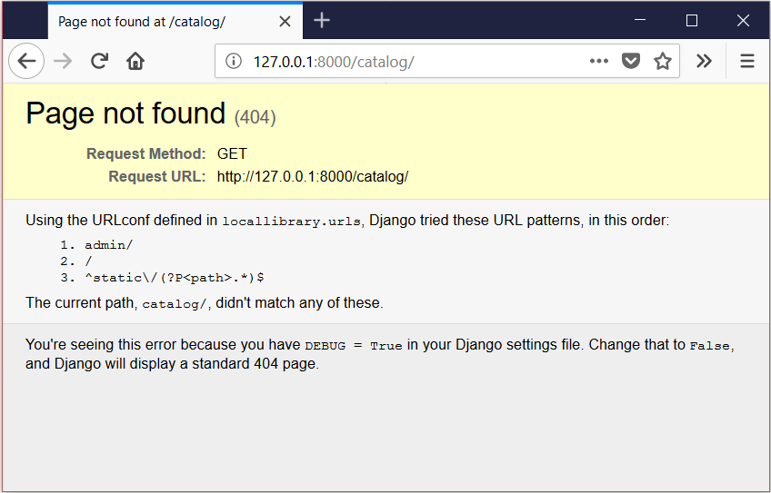

웹사이트 골조 만들기
--------------------

이 문서는 저작자 동의없이 KAIST 대학정보화사업팀을 위하여 [Django Tutorial Part 2: Creating a skeleton website](https://developer.mozilla.org/en-US/docs/Learn/Server-side/Django/skeleton_website)를 번역 편집하여 작성한 것입니다.

Django 튜토리얼의 두 번째 단계에서는 초석으로 "골조" 웹 사이트 프로젝트를 생성하는 방법을 보입니다. 계속하여 사이트별 설정, 경로, 모델, 뷰 및 템플릿 설정을 보여줍니다.

> 선수지식: [Django 개발 환경 설정](developmentEnvironment.md)하고 [Django 튜토리얼](tutorialLocalLibraryWebsite.md)를 복습힙니다.
>
> 목표: Django 도구를 사용하여 새로운 웹 사이트 프로젝트를 시작할 수 있습니다.

---

### 개요

이 단계에서는 사이트별 설정, 경로, 모델, 뷰 및 템플릿(이후 단계에서 다룰 예정)을 채울 수있는 "골조" 웹 사이트를 만드는 방법을 설명합니다.

이 과정은 간단합니다.

-	<code>django-admin</code> 도구를 사용하여 프로젝트 폴더, 기본 파일 템플리트 및 프로젝트 관리 스크립트(<b>manage.py</b>)를 작성합니다.
-	<b>manage.py</b>를 사용하여 하나 이상의 <i>응용프로그램</i>을 만듭니다.

> <b>Note</b>: 메인 페이지, 블로그, 위키, 다운로드 영역 등 하나 이상의 섹션으로 웹 사이트를 구성할 수 있습니다. Django는 이러한 구성 요소를 별도의 <i>응용프로그램</i>으로 개발할 것을 권장하며, 그러면 필요한 경우 다른 프로젝트에서 재사용할 수 있습니다.

-	새로운 응용프로그램을 프로젝트에 포함시킬 수 있도록 등록합니다.
-	각 응용프로그램을 url/path 맵퍼로 연결합니다.

[The Local Library website](tutorialLocalLibraryWebsite.md)의 경우 웹 사이트 폴더와 해당 프로젝트 폴더의 이름을 <i>locallibrary</i>로 지정하며, <i>catalog</i>라는 응용프로그램 하나만 있습니다. 따라서 최상위 폴더 구조는 아래와 같습니다.

```python
locallibrary/         # Website folder
    manage.py         # Script to run Django tools for this project (created using django-admin)
    locallibrary/     # Website/project folder (created using django-admin)
    catalog/          # Application folder (created using manage.py)
```

다음 섹션들에서 단계별 프로세스에 대해 자세히 설명하고 변경 사항의 테스트 방법을 보여줍니다. 이 단계 마지막 부분에서 이때 수행하는 사이트 전체 구성에 대해 설명합니다.

---

### 프로젝트 만들기

먼저 명령 프롬프트 또는 터미널을 열고 [가상 환경](developmentEnvironment.md#Using_a_virtual_environment)에 있는지 확인합니다. Django 앱을 저장할 (<i>문서</i> 폴더 내에서 쉽게 찾을 수 있는)위치로 이동하여 새로운 웹 사이트의 폴더를 만듭니다 (이 경우 : <i>django_projects</i>). 그런 다음 <code>cd</code> 명령을 사용하여 이 폴더로 이동합니다.

```bash
mkdir django_projects
cd django_projects
```

아래과 같이 <code>django-admin startproject</code> 명령을 사용하여 새로운 프로젝트를 만든 다음 해당 폴더로 이동합니다.

```bash
django-admin startproject locallibrary
cd locallibrary
```

<i>django-admin</i> 도구는 아래와 같은 폴더/파일 구조를 생성합니다.

```bash
locallibrary/
    manage.py
    locallibrary/
        __init__.py
        settings.py
        urls.py
        wsgi.py
```

현재 작업 디렉토리는 다음과 같습니다.

```bash
../django_projects/locallibrary/
```

하위 폴더 <i>locallibrary</i> 프로젝트가 웹 사이트의 시작점입니다.

-	<b>\_\_init\_\_.py</b>는 이 디렉토리를 Python 패키지로 취급하도록 Python에게 지시하는 빈 파일입니다.

-	<b>settings.py</b>에는 모든 웹 사이트에 대한 설정이 있습니다. 개발자가 작성하는 모든 응용프로그램, 정적 파일의 위치, 데이터베이스 구성 등 세부 정보를 여기에 등록합니다.

-	<b>urls.py</b>는 사이트 url-to-view 매핑을 정의합니다. 모든 URL 매핑 코드를 여기에 정의할 수 있지만, 나중에 볼 수 있듯이 특정 애플리케이션에게 일부 매핑을 위임하는 것이 일반적입니다.

-	<b>wsgi.py</b>는 Django 응용프로그램이 웹 서버와의 통신에 사용됩니다. 이것을 표준으로 취급 할 수 있습니다.

<b>manage.py</b> 스크립트는 응용프로그램을 만들고 데이터베이스에 작업하며 개발 웹서버를 시작하는 데 사용됩니다.

---

### catalog 응용프로그램 만들기

다음 아래 명령을 실행하여 localibrary 프로젝트 내에서 사용할 <i>catalog</i> 응용 프로그램을 만듭니다 (프로젝트의 <b>manage.py</b>와 동일한 폴더에서 실행해야 함).

```bash
python3 manage.py startapp catalog
```

> <b>Note</b>: Linux/macOS X에서는 위에서와 같이 실핼할 수 있습니다. Windows에서는 <code>py -3 manage.py startapp catalog</code> 명령을 실행합니다.
>
> Windows에서 작업하는 경우 단원 전체에서 <code>python3</code>을 <code>py -3</code>으로 대체합니다.
>
> Python 3.7.0 이상을 사용하는 경우 <code>py manage.py startapp catalog</code>만 사용해야 합니다.

이 도구는 폴더(<b>catalog</b>)를 새로 만들고, 응용프로그램의 구성요소에 해당하는 파일들을 생성합니다 (아래 그림에 <code>catalog</code> 폴더). 대부분의 파일은 그 목적에 따라 이름(예 : views는 <b>views.py</b>, 모델은 <b>models.py</b>, 테스트는 <b>tests.py</b>, 사이트 구성관리는 <b>admin.py</b>, 애플리케이션 등록은 <b>apps.py</b>에 저장)을 사용하며, 연관된 객체에서 작업하기 위하여 필요한 최소한의 표준 코드를 갖고 있습니다.

업데이트된 프로젝트 디렉토리는 다음과 같습니다.

```bash
locallibrary/
    manage.py
    locallibrary/
    catalog/
        admin.py
        apps.py
        models.py
        tests.py
        views.py
        __init__.py
        migrations/
```

또한, 이제 다음 것들이 만들어졌습니다.

-	"migrations"을 저장하는 데 사용되는 migrations 폴더: 모델을 수정할 때 데이터베이스를 자동으로 업데이트할 수 있도록 하는 파일.
-	\_\_init\_\_.py: Django/Python이 폴더를 [Python 패키지](https://docs.python.org/3/tutorial/modules.html#packages)로 인식하고, 프로젝트의 다른 모듈에서 객체를 사용할 수 있도록 만든 빈 파일.

> <b>Note</b>: 위의 파일 목록에서 누락된 항목을 있습니까? 뷰와 모델을 위한 파일은 있지만, URL 맵핑, 템플리트과 정적 파일을 넣을 곳이 없습니다. 더 나아가서 그들을 만드는 법을 보여줄 것입니다. (모든 웹 사이트에서 필요하지는 않지만이 예제에서는 필요합니다).

---

### catalog 응용프로그램 등록하기

이제 응용프로그램을 만들었으므로 프로젝트에 등록해야 도구를 실행할 때 이들을 포함할 수 있습니다 (예 : 모델을 데이터베이스에 추가). 응용프로그램을 프로젝트 설정의 <code>INSTALLED_APPS</code> 리스트에 추가하여 이를 등록합니다.

<b>django_projects/locallibrary/locallibrary/settings.py</b> 프로젝트 설정 파일을 열어 <code>INSTALLED_APPS</code> 리스트의 정의를 찾습니다. 아래와 같이 리스트 마지막에 새 줄을 추가합니다.

```Python
INSTALLED_APPS = [
    'django.contrib.admin',
    'django.contrib.auth',
    'django.contrib.contenttypes',
    'django.contrib.sessions',
    'django.contrib.messages',
    'django.contrib.staticfiles',
    'catalog.apps.CatalogConfig',
]
```

새로 추가된 줄은 응용프로그램을 만들때 <b>/locallibrary/catalog/apps.py</b>에 생성된 응용프로그램 구성 객체(<code>CatalogConfig</code>)를 지정합니다.

> <b>Note</b>: 이미 다른 <code>INSTALLED_APPS</code> (및 <code>MIDDLEWARE</code>, 더 나아가서는 설정 파일에 더 많은 객체)가 많이 있음을 알 수 있습니다. 이것들은 [Django 관리 사이트](adminSite.md)와 결과적으로 세션, 인증 등을 포함하는 많은 기능을 지원할 수 있습니다.

---

### 데이터베이스 설정하기

프로젝트에 사용할 데이터베이스를 지정하는 통상적인 방법입니다. 가능한 개발 및 서비스에 동일한 데이터베이스를 사용하여 사소한 차이점을 피하도록 합니다. Django 문서의 [데이터베이스 사용](https://docs.djangoproject.com/en/2.0/ref/settings/#databases)에서 다른 옵션들을 기술합니다.

예제에서는 SQLite 데이터베이스를 사용합니다. 데모 데이터베이스에서는 많은 동시 접근이 필요하지 않으며 설치하는 데 별도의 작업이 필요하지 않기 때문입니다. 이 데이터베이스의 설정 방법은 <b>settings.py</b>에서 확인할 수 있습니다 (자세한 내용은 아래에 있습니다).

```python
DATABASES = {
    'default': {
        'ENGINE': 'django.db.backends.sqlite3',
        'NAME': os.path.join(BASE_DIR, 'db.sqlite3'),
    }
}
```

SQLite를 사용하기 때문에 여기에서 더 이상의 추가 설정이 필요 없습니다. 가즈아!

---

### 프로젝트의 기타 설정

다른 여러 설정을 위하여 <b>settings.py</b> 파일을 사용하지만, 여기서는 [tz 데이터베이스 시간대 표준 목록](https://en.wikipedia.org/wiki/List_of_tz_database_time_zones)의 문자열(테이블의 TZ열에 원하는 값이 저장되어 있음)인 [TIME_ZONE](https://docs.djangoproject.com/en/2.0/ref/settings/#std:setting-TIME_ZONE)만 변경하려고합니다. <code>TIME_ZONE</code> 값을 표준 시간대에 적합한 문자열 중 하나로 변경하십시오. 예를 들면 아래와 같습니다.

```python
TIME_ZONE = 'Europe/London'
```

지금 변경하지 않는 두 가지 설정이 있지만 주의를 기울여야 합니다.

-	<code>SECRET_KEY</code>: 이는 Django의 웹 사이트 보안 전략의 일부로 사용되는 비밀 키입니다. 개발 중에 이 코드를 보호하지 않았다면, 운영 환경에서는 다른 코드(환경 변수 또는 파일에서 읽음)를 사용해야 합니다.
-	<code>DEBUG</code>: 이렇게 하여 HTTP 상태 코드 응답 대신 오류 로그를 디버깅 로그에 표시 할 수 있습니다. 이는 공격자에게 유용하기 때문에 운영시에는 이 값을 <code>False</code>로 설정해야 하지만 지금은 <code>True</code>로 설정합니다.

---

### URL 매퍼에 연결하기

프로젝트 폴더에 URL 매퍼 파일(<b>urls.py</b>)과 함께 웹사이트를 생성합니다. 이 파일을 사용하여 모든 URL 매핑 관리를 할 수 있지만, 일반적으로 매핑을 관련 응용프로그램에 위임하여 처리합니다.

<b>locallibrary/locallibrary/urls.py</b>를 열고 URL 매퍼를 사용하는 방법 몇 가지를 참고하십시오.

```python
"""locallibrary URL Configuration

The `urlpatterns` list routes URLs to views. For more information please see:
    https://docs.djangoproject.com/en/2.1/topics/http/urls/
Examples:
Function views
    1. Add an import:  from my_app import views
    2. Add a URL to urlpatterns:  path('', views.home, name='home')
Class-based views
    1. Add an import:  from other_app.views import Home
    2. Add a URL to urlpatterns:  path('', Home.as_view(), name='home')
Including another URLconf
    1. Import the include() function: from django.urls import include, path
    2. Add a URL to urlpatterns:  path('blog/', include('blog.urls'))
"""
from django.contrib import admin
from django.urls import path

urlpatterns = [
    path('admin/', admin.site.urls),
]
```

<code>path()</code>함수로 구성된 Python <i>리스트</i> 변수 urlpatterns를 통해 URL 맵핑을 관리합니다. 각 <code>path()</code> 함수는 패턴이 일치될 때 보여주는 <i>특정 뷰</i> URL 패턴이거나 테스트 코드 URL 패턴 리스트를 연결합니다 (후자의 경우 패턴은 대상 모듈에서 정의한 패턴을 위한 "base URL"이 됩니다). <code>urlpatterns</code> 리스트은 <i>admin/</i>패턴에 해당되는 모든 URL을 <code>admin.site.urls</code> 모듈로 매핑하는 단일 함수의 정의로 시작합니다. 이 함수는 Administration 응용프로그램의 자체 URL 매핑 정의도 포함하고 있습니다.

> <b>Note</b>: <code>path()</code>의 route는 일치시킬 URL 패턴을 정의하는 문자열입니다. 이 문자열은 '<code>catalog/\<id\>/</code>'와 같이 ('<code>< ></code>' 안의) 명명된 변수를 포함할 수 있습니다. 이 패턴은 <i>/<b>catalog</b>/any_chars/</i>와 같은 URL과 비교하여 일치하면 <i>any_chars</i>를 매개변수 <code>id</code>인 문자열로 뷰에 전달합니다. path 방법과 route 패턴에 대해서 이후 더 자세히 논의합니다.

<code>urlpatterns</code> 리스트에 새로운 항목을 추가하려면 파일의 끝에 아래 줄을 추가합니다. 새로운 항목으로 <code>catalog/</code> 패턴과 일치하면 요청을 모듈 <code>catalog.urls</code> (상대 URL이 /<b>catalog</b>/<b>urls.py</b>인 파일)로 전달하는 <code>path()</code> 함수가 있습니다.

```python
# Use include() to add paths from the catalog application
from django.urls import include
from django.urls import path

urlpatterns += [
    path('catalog/', include('catalog.urls')),
]
```

이제 사이트의 루트 URL (예 : 127.0.0.1:8000)을 URL 127.0.0.1:8000/catalog/으로 리디렉션합니다. 이것은 이 프로젝트에서 사용할 유일한 app입니다. 따라서 예제에서도 마찬가지입니다. 이를 위해 특별한 view 함수 (RedirectView)를 사용하여, path() 함수에 지정된 URL 패턴과 일치할 때 (이 경우 root URL) 첫 번째 인수로 리디렉션할 새로운 상대 URL (/catalog/)을 취합니다.

파일의 맨 끝에 다음 행을 다시 추가합니다.

```python
#Add URL maps to redirect the base URL to our application
from django.views.generic import RedirectView
urlpatterns += [
    path('', RedirectView.as_view(url='/catalog/', permanent=True)),
]
```

path 함수의 첫 번째 매개 변수를 비워 두면 '/'를 의미합니다. 첫 번째 매개변수에 '/'를 쓰면 Django는 개발 서버를 시작할 때 다음과 같은 경고 메시지를 보냅니다.

```python
System check identified some issues:

WARNINGS:
?: (urls.W002) Your URL pattern '/' has a route beginning with a '/'.
Remove this slash as it is unnecessary.
If this pattern is targeted in an include(), ensure the include() pattern has a trailing '/'.
```

Django는 기본적으로 CSS, JavaScript, 이미지 등과 같은 정적 파일을 지원하지 않지만 사이트를 만드는 동안 개발 웹서버로 유용하게 사용할 수 있습니다. URL 매퍼에 마지막으로 추가된 내용으로 다음 줄을 추가하여 개발 중에 정적 파일 지원을 활성화할 수 있습니다.

다음 마지막 블록을 파일 끝에 추가하십시오.

```python
# Use static() to add url mapping to serve static files during development (only)
from django.conf import settings
from django.conf.urls.static import static

urlpatterns += static(settings.STATIC_URL, document_root=settings.STATIC_ROOT)
```

> <b>Note</b>: <code>urlpatterns</code> 리스트를 여러 방법으로 확장할 수 있습니다 (앞서 이전 코드와 새로운 코드를 명확히 구분하기 위해 <code>+ =</code> 연산자를 사용하여 리스트에 새 항목을 추가합니다). 대신 원래 리스트 정의에 새로운 패턴 맵을 포함시킬 수도 있었습니다.
>
> ```python
> urlpatterns = [
>    path('admin/', admin.site.urls),
>    path('catalog/', include('catalog.urls')),
>    path('', RedirectView.as_view(url='/catalog/', permanent=True)),
> ] + static(settings.STATIC_URL, document_root=settings.STATIC_ROOT)
> ```
>
> 또한 import 문 (<code>from django.urls import</code>를 포함하여)을 실행 코드와 같이 포함 시켰습니다 (추가한 내용을 쉽게 볼 수 있음), 그러나 Python에서는 처음에 모든 import 문을 선언하는 것이 통상적입니다.

마지막 단계로 catalog 폴더에 <b>urls.py</b>라는 파일을 만들고 아래 텍스트를 추가하여 공 리스트 <code>urlpatterns</code>을 선언합니다. 애플리케이션을 빌드할 때 리스트에 패턴 항목을 추가합니다.

```python
from django.urls import path
from . import views

urlpatterns = [

]
```

---

### 웹사이트 프레임워크 테스트

이 시점에서 골조 프로젝트를 완성하였습니다. 웹사이트는 실제로 아직 하는 것이 없지만 변경으로 인한 손상이 없음을 확인하기 위해 실행해야 할 가치가 있습니다.

이를 수행하기 전에 먼저 데이터베이스 마이그레이션을 실행해야 합니다. 그럼으로써 설치된 응용프로그램에 모든 모델을 포함하도록 데이터베이스를 업데이트하고 일부 빌드 경고를 제거합니다.

#### 데이터베이스 마이그레이션 실행

Django는 ORM (Object-Relational-Mapper)을 사용하여 Django 코드의 모델 정의를 접근하는 데이터베이스의 데이터 구조로 매핑합니다. 모델 정의를 변경하면 Django는 변경 사항을 추적하여 자동으로 데이터베이스의 데이터 구조를 모델에 일치하도록 마이그레이션하기 위한 (<b>/locallibrary/catalog/migrations/</b>에 있는) 데이터베이스 마이그레이션 스크립트를 생성할 수 있습니다.

웹사이트를 만들 때 Django는 사이트의 관리자 섹션에서 사용할 모델을 자동으로 추가했습니다 (나중에 살펴 보겠습니다). 다음 명령을 실행하여 데이터베이스에서 해당 모델의 테이블을 정의합니다 (<b>manage.py</b>가 있는 디렉토리에 있는지 확인하십시오).

```bash
python3 manage.py makemigrations
python3 manage.py migrate
```

> **Important**: (전체 모델 및 개별 필드의 추가 및 제거 포함하여) 저장해야 하는 데이터 구조에 영향을 주는 모델을 변경할 때마다 위의 명령을 실행해야 합니다.

<code>makemigrations</code> 명령은 프로젝트에 설치된 모든 응용프로그램의 마이그레이션을 작성합니다 (그러나 수행하지 않습니다) (단일 프로젝트의 마이그레이션을 실행하기 위해 응용프로그램 이름을 지정할 수도 있습니다). 이렇게 하면 마이그레이션 적용 전에 이를 위한 코드를 확인할 수 있습니다. 장고 전문가라면 약간 조정할 수 있습니다.

<code>migrate</code> 명령이 실제로 데이터베이스에 마이그레이션을 수행합니다 (Django는 현재 데이터베이스에 추가된 것들을 추적합니다).

> **Note**: [Migrations](https://docs.djangoproject.com/en/2.1/topics/migrations/) (Django docs)에 자주 사용되지 않는 마이그레션 명령에 대한 추가 정보가 있습니다.

#### 웹사이트 실행

개발하는 동안 <i>개발 웹 서버</i>를 사용하여 먼저 웹사이트를 제공하고 다음 로컬 웹 브라우저에서 웹 사이트를 확인하여 웹 사이트를 테스트할 수 있습니다.

> **Note**: 개발 웹 서버는 프로덕션 환경에서 사용하기에 강력하지 않고 성능도 좋지 않지만 쉽고 빠른 테스트를 지원하여 개발 과정에서 Django 웹사이트를 시작하고 실행하기에는 매우 편합니다. 기본적으로 로컬 컴퓨터 (<code>http://127.0.0.1:8000/</code>)에서 사이트를 제공하지만 네트워크의 다른 컴퓨터를 지정할 수도 있습니다. 자세한 내용은 [django-admin and manage.py: runserver](https://docs.djangoproject.com/en/2.1/ref/django-admin/#runserver) (Django 문서)를 참고하십시오.

<code>runserver</code> 명령을 호출하여 <i>개발 웹 서버</i>를 실행합니다 (<b>manage.py</b>와 동일한 디렉토리에 있음).

```bash
python3 manage.py runserver

 Performing system checks...

 System check identified no issues (0 silenced).
 August 15, 2018 - 16:11:26
 Django version 2.1, using settings 'locallibrary.settings'
 Starting development server at http://127.0.0.1:8000/
 Quit the server with CTRL-BREAK.
```

서버가 실행되면 로컬 웹 브라우저에서 <code>http://127.0.0.1:8000/</code>으로 이동하여 사이트를 볼 수 있습니다. 다음과 같은 사이트 오류 페이지가 표시되어야합니다.



걱정마십시오! 이 오류 페이지는 (사이트의 루트에 대한 URL을 얻을 때 리디렉션 되는) <code>catalogs.urls</code> 모듈에 pages/url이 없기 때문에 발생한 것입니다.

> **note**: 위 페이지는 Django의 훌륭한 기능 중 하나인 자동화된 디버그 로깅 을 보여줍니다. 페이지를 찾을 수 없거나 코드에서 오류가 발생할 때마다 오류 화면이 유용한 정보를 보여줍니다. 이 경우 입력한 URL이 나열된 URL 패턴과 일치하지 않음을 알 수 있습니다. 운영 중에는 로깅을 해제하여야 하며 (웹에 사이트를 게시하는 경우) 이때 정보는 부족하지만 보다 사용자 친화적인 페이지를 제공하는 것입니다.

이제 장고가 작동한다는 것을 알 수 있습니다!

> **note**: 중요한 변경을 수행 할 때마다 마이그레이션을 다시 실행하고 사이트를 다시 테스트해야 합니다. 그렇게 오래 걸리지 않습니다!

---

### 도전

<b>catalog/</b> 디렉토리에는 응용프로그램의 뷰, 모델 등 기타 부분을 위한 파일들이 있습니다. 이 파일을 열어 표준 문장을 검사하십시오.

위에서 처럼 프로젝트의 <b>urls.py</b>에 Admin 사이트의 URL 매핑을 이미 추가하였습니다. 브라우저에서 관리 영역으로 이동하여 어떤 일이 발생하는지 살펴봅니다 (위의 매핑에서 정확한 URL을 추측할 수 있습니다).

---

### 요약

완전한 골조 웹 사이트 프로젝트를 만들었습니다. 이 프로젝트의 URL, 모델, 뷰 및 템플릿을 채울 수 있습니다.

이제 동네 도서관 웹사이트의 골격이 완성되어 실행 되므로 웹사이트가 작동할 수 있도록 코드를 작성하기 시작할 시간입니다.

---

### 더 보기

-	[Writing your first Django app - part 1](https://docs.djangoproject.com/en/2.0/intro/tutorial01/) (Django docs)
-	[Applications](https://docs.djangoproject.com/en/2.1/ref/applications/#configuring-applications) (Django docs). 응용프로그램 구성에 대한 정보가 있습니다.

---

### 이 단원에서 아래 단계를 다룹니다.

-	[Django 소개](introduction.md)
-	[Django 개발 환경 설정](developmentEnvironment.md)
-	[Django 튜토리얼: The Local Library website](tutorialLocalLibraryWebsite.md)
-	[Django 튜토리얼 2부: 웹사이트 골조 만들기](skeletonWebsite.md)
-	[Django 튜토리얼 3부: 모델](models.md)
-	[Django 튜토리얼 4부: Django 관리 사이트](adminSite.md)
-	[Django 튜토리얼 5부: 홈 페이지 만들기](homePage.md)
-	[Django 튜토리얼 6부: 일반 목록과 상세 보기](genericViews.md)
-	[Django 튜토리얼 7부: 세션 프레임워크](sessions.md)
-	[Django 튜토리얼 8부: 사용자 인증 및 사용 권한](authentication.md)
-	[Django 튜토리얼 9부: 양식 작업](forms.md)
-	[Django 튜토리얼 10부: Django 웹 응용프로그램 테스팅](testing.md)
-	[Django 튜토리얼 11부: 운영으로 Django 전개](deployment.md)
-	[Django 웹 응용프로그램 보안](webApplicationSecurity.md)
